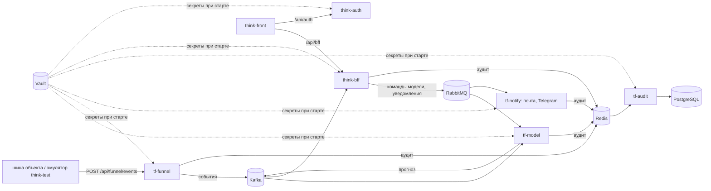

# Think-Faster

Главный репозиторий проекта. Здесь модель прогноза и сервисы данных вокруг неё (приём событий,
уведомления, аудит), исследование нейросети, датасет и сопроводительная документация.

С чего начать эксперту:

1. [docs/документация.md](docs/документация.md), раздел «Кратко для экспертизы» — решение и его цифры
   по критериям ТЗ.
2. [ML/SPEC.md](ML/SPEC.md) — постановка задачи модели и рабочая конфигурация.
3. [ML/results/analytics.md](ML/results/analytics.md) — журнал исследования: что пробовали, что
   оставили, что отбросили и почему.
4. [ML/INTEGRATION.md](ML/INTEGRATION.md) — как модель встроена в контур: топики, команды, ручки.

## Что где лежит

| Папка | Что внутри |
|---|---|
| [ML/service](ML/service) | `tf-model` — сервис модели. Принимает журнал из Kafka, раз в час считает прогноз шести типов, порог, правила, канал «по факту» и рекомендации; принимает решения диспетчера из RabbitMQ; отдаёт HTTP-ручки. Тесты — [ML/service/tests](ML/service/tests) |
| [ML/pipeline](ML/pipeline) | исследование: разметка происшествий, признаки, обучение CatBoost, XGBoost и сети TCN, подбор порога, проверка на отложенном тесте 2026 года |
| [ML/settings](ML/settings) | рабочая конфигурация модели ([operating.json](ML/settings/operating.json) и её схема), график плановых работ, окна испорченных данных |
| [ML/results](ML/results) | журнал исследования и отчёты по моделям, разметке, переобучению |
| [docs/backend/funnel](docs/backend/funnel) | `tf-funnel` — приём событий от шины объекта (Go): проверка, раскладка по потокам Kafka, контроль молчания каналов, архив показаний для окна «Логи» |
| [docs/backend/notify](docs/backend/notify) | `tf-notify` — письма и сообщения в Telegram с повтором и защитой от дублей |
| [docs/backend/audit](docs/backend/audit) | `tf-audit` — журнал действий всех сервисов в PostgreSQL |
| [docs/backend/tfkit](docs/backend/tfkit) | общий пакет Python-сервисов: секреты из Vault, проверка токена, событие аудита |
| [docs/backend/seed](docs/backend/seed) | начальные данные стенда: объекты, датчики, группы, бригады, графики работ |
| [docs/dataset](docs/dataset) | описание датасета, справочники каналов и объектов, пример журнала |
| [docs/common](docs/common) | схемы: архитектура, IDEF0, ER, бизнес-процесс, [права и аудит](docs/common/права-и-аудит.md), [структура бэкенда](docs/common/структура.md) |
| [docs/designs](docs/designs) | референсы интерфейсов, userflow и userstory трёх ролей |
| [docs/analytics](docs/analytics) | первичная обработка журналов аналитиком (описана ниже) |
| [docs/instructions](docs/instructions) | как подключиться к стенду, вопросы и ответы по заданию |
| [docs/ТЗ.md](docs/ТЗ.md) | техническое задание |
| [.github/workflows](.github/workflows) | выкатка модели, приёма данных и аудита на стенд |
| [tasks](tasks) | задачи команды |

## Проект целиком

Think-Faster — сервис прогнозирования инцидентов в инженерных коллекторах (ЛЦТ-2026). Раз в час он
оценивает 78 объектов по журналу событий системы мониторинга и за сутки предупреждает о шести типах
происшествий: пожар, загазованность, подтопление, отказ оборудования, отказ датчика, проникновение.
К тревоге прилагаются основания и рекомендация: что сделать, в какой срок, кого послать. Решение
принимает диспетчер, сервис ничем на объекте не управляет.

| Что | Где |
|---|---|
| Прототип | [thinkfaster.ru](https://thinkfaster.ru) |
| Документация для экспертов: вход, архитектура, решения, методы, соответствие ТЗ, развёртывание, обзор | [think-infra/docs/project](https://github.com/Think-Faster/think-infra/tree/dev/docs/project) |
| Описание системы по сервисам | [think-infra/docs/system](https://github.com/Think-Faster/think-infra/tree/dev/docs/system) |
| Сопроводительная документация по ГОСТ 34.602, модель и исследование | [Think-Faster/docs/документация.md](https://github.com/Think-Faster/Think-Faster/blob/main/docs/документация.md) |

| Репозиторий | Что это | Стек |
|---|---|---|
| [Think-Faster](https://github.com/Think-Faster/Think-Faster) | модель прогноза, приём данных, уведомления, аудит; исследование, датасет, документация | Python, FastAPI, CatBoost, XGBoost, PyTorch; Go |
| [think-front](https://github.com/Think-Faster/think-front) | веб-интерфейс: диспетчер, главный диспетчер, инженер, администратор | React 19, TypeScript, Zustand |
| [think-bff](https://github.com/Think-Faster/think-bff) | API для интерфейса: права, группы, объекты, заявки, прогнозы, настройки модели | .NET 8, ASP.NET Core, EF Core, PostgreSQL |
| [think-auth](https://github.com/Think-Faster/think-auth) | вход и выпуск токенов RS256 | .NET 8, EF Core, PostgreSQL |
| [think-infra](https://github.com/Think-Faster/think-infra) | стенд: Vault, PostgreSQL, Kafka, RabbitMQ, Redis, nginx, почта, Telegram; выкатка | Docker Compose, Bash, GitHub Actions |
| [think-test](https://github.com/Think-Faster/think-test) | эмулятор шины объекта и проверка доступности стенда | Python, Django |



Код, который работает на [thinkfaster.ru](https://thinkfaster.ru): у think-front, think-bff и
think-auth — ветка `prod`; у think-infra — `prod`, документация — `dev`; у Think-Faster и think-test —
`main`.

---

[README.md — обработка журналов и обнаружение аномалий.md](https://github.com/user-attachments/files/32302119/README.md.md)
# Обработка журналов датчиков и обнаружение аномалий

## 1. Описание проекта

В проекте выполняется обработка журналов событий датчиков за несколько лет, их объединение, очистка и классификация значений.

Основная цель — подготовить данные для последующего анализа и автоматически определить аномальные состояния датчиков.

Алгоритм работает с несколькими типами данных:

- числовыми значениями;
- текстовыми состояниями;
- значениями, которые ошибочно были распознаны как даты;
- заранее известными аварийными состояниями;
- нестабильными последовательностями состояний;
- числовыми выбросами.

В результате обработки для каждой записи может быть установлен соответствующий флаг аномалии в столбце `flags`.

---

# 2. Загрузка исходных данных

Для работы используются библиотеки:

```python
import os
import unicodedata
import pandas as pd
```

- `os` используется для работы с файлами и директориями;
- `unicodedata` позволяет нормализовать Unicode-строки;
- `pandas` используется для чтения и обработки таблиц.

Исходные файлы располагаются в директории:

```python
DATA_DIR = '/content'
```

## Поиск файлов

Для поиска файлов используется функция `find_file()`.

Она приводит название файла к единому виду с помощью Unicode-нормализации `NFC` и метода `casefold()`.

Это позволяет корректно искать файлы независимо от некоторых различий в написании символов и регистре.

Если файл не найден, функция выводит список доступных файлов и сообщает об ошибке.

```python
def find_file(pattern, directory=DATA_DIR):

    target = unicodedata.normalize('NFC', pattern).casefold()

    matches = [
        name for name in os.listdir(directory)
        if target in unicodedata.normalize('NFC', name).casefold()
    ]

    if not matches:
        raise FileNotFoundError(
            f'Файл по шаблону "{pattern}" не найден. '
            f'Есть: {sorted(os.listdir(directory))}'
        )

    return os.path.join(directory, matches[0])
```

Для непосредственного чтения CSV-файлов используется функция `read()`:

```python
def read(pattern, **kwargs):

    path = find_file(pattern)

    print('Читаю:', path)

    return pd.read_csv(path, sep=',', **kwargs)
```

После этого загружаются:

- пример журнала событий;
- справочник каналов;
- справочник объектов;
- журналы за 2019, 2020, 2023 и 2026 годы.

---

# 3. Первичная проверка данных

После загрузки таблиц выполняется их первичный просмотр.

Используются:

```python
display(df.head())
display(df.info())
```

`head()` показывает первые строки таблицы.

`info()` позволяет посмотреть:

- количество строк;
- количество столбцов;
- названия столбцов;
- количество непустых значений;
- типы данных;
- примерный объём памяти.

Таким образом, на этом этапе проверяется структура исходных данных и наличие потенциальных проблем с типами столбцов.

---

# 4. Объединение журналов за разные годы

Годовые журналы сначала собираются в словарь:

```python
journals_dict = {
    '2019': journal_2019,
    '2020': journal_2020,
    '2023': journal_2023,
    '2026': journal_2026
}
```

Затем создаётся список `dfs`, куда помещаются копии отдельных таблиц.

Для каждой таблицы добавляется дополнительный столбец `год`:

```python
dfs = []

for year, df in journals_dict.items():

    temp_df = df.copy()
    temp_df['год'] = year

    dfs.append(temp_df)
```

После этого все таблицы объединяются:

```python
df_all_journals = pd.concat(
    dfs,
    ignore_index=True
)
```

В результате получается единый DataFrame `df_all_journals`, содержащий журналы всех рассматриваемых лет.

Столбец `год` позволяет определить, к какому году относится каждая запись.

---

# 5. Анализ значений датчиков

Перед дальнейшей обработкой необходимо понять, какие значения находятся в столбце:

```python
значение_датчика
```

Для этого используется:

```python
display(
    df_all_journals['значение_датчика']
    .value_counts(dropna=False)
)
```

`value_counts()` показывает частоту встречаемости различных значений.

Это позволяет увидеть наиболее распространённые состояния датчиков и обнаружить особенности исходных данных.

---

# 6. Проблема типов данных

Одной из основных особенностей исходного набора данных является то, что значения датчиков находятся в текстовом столбце.

При этом в одном столбце могут одновременно находиться:

- числа;
- текстовые состояния;
- даты;
- пустые значения.

Например:

```text
0.16
Норма
Включен
Обнаружен газ
02.04.2019 07:47:21
```

Поэтому перед поиском аномалий значения необходимо классифицировать.

---

# 7. Классификация значений

Для определения значений, похожих на даты, используется регулярное выражение:

```python
DATE_PATTERN = re.compile(
    r'^\d{2}\.\d{2}\.\d{4}( \d{2}:\d{2}:\d{2})?$'
)
```

Оно предназначено для поиска значений вида:

```text
02.04.2019
```

или:

```text
02.04.2019 07:47:21
```

Функция `convert_sensor_types()` разделяет исходные значения на три категории:

1. `numeric` — числовые значения;
2. `date_artifact` — значения, похожие на даты;
3. `status` — текстовые состояния.

```python
def convert_sensor_types(df, source_col='значение_датчика'):

    df = df.copy()

    raw = df[source_col].astype(str)

    is_date = raw.str.match(DATE_PATTERN)

    numeric = pd.to_numeric(
        raw,
        errors='coerce'
    )

    is_numeric = numeric.notna() & ~is_date

    df['тип_значения'] = np.select(
        [is_date, is_numeric],
        ['date_artifact', 'numeric'],
        default='status'
    )

    df['значение_числовое'] = numeric.where(is_numeric)

    df['значение_dt'] = pd.to_datetime(
        raw.where(is_date),
        errors='coerce'
    )

    df['значение_статус'] = (
        raw
        .where(df['тип_значения'] == 'status')
        .astype('category')
    )

    return df
```

### Зачем это необходимо

Такое разделение позволяет не смешивать разные типы данных при статистическом анализе.

Например, значение:

```text
0.16
```

должно использоваться в расчёте статистики, а:

```text
Норма
```

должно анализироваться как текстовое состояние.

---

# 8. Объединение обработанных значений

После классификации создаётся единый столбец:

```python
значение_обработанное
```

Для этого используется `combine_first()`:

```python
df_all_journals['значение_обработанное'] = (
    df_all_journals['значение_числовое']
    .combine_first(df_all_journals['значение_dt'])
    .combine_first(df_all_journals['значение_статус'])
)
```

Логика следующая:

1. если есть числовое значение — используется оно;
2. если числа нет, используется дата;
3. если даты нет, используется текстовый статус.

В результате все варианты исходного значения представлены в одном столбце.

---

# 9. Удаление временных столбцов

После создания `значение_обработанное` промежуточные столбцы больше не нужны:

```python
df_all_journals = df_all_journals.drop(
    columns=[
        'тип_значения',
        'значение_числовое',
        'значение_dt',
        'значение_статус'
    ]
)
```

Таким образом, в итоговой таблице остаются только необходимые для дальнейшего анализа данные.

---

# 10. Нормализация текстовых значений

В исходных данных могут встречаться разные варианты одного и того же состояния.

Например:

```text
Дв
Да
```

Для исправления таких вариантов создаётся словарь:

```python
status_mapping = {
    "Дв": "Да",
}
```

Также определяются значения, которые считаются неопределёнными:

```python
undefined_values = [
    "Неопределен",
    "Не определено",
    "nan",
    "None",
    ""
]
```

Перед заменой значения очищаются от лишних пробелов:

```python
df_all_journals["значение_нормализованное"] = (
    df_all_journals["значение_датчика"]
    .astype(str)
    .str.strip()
    .replace(status_mapping)
)
```

После этого неопределённые значения заменяются на `NaN`.

Это позволяет привести различные варианты записи одного состояния к единому виду.

---

# 11. Подготовка алгоритма обнаружения аномалий

Перед анализом дата преобразуется в формат `datetime`:

```python
df_all_journals['дата'] = pd.to_datetime(
    df_all_journals['дата'],
    errors='coerce'
)
```

`errors='coerce'` означает, что некорректные даты будут преобразованы в `NaT`, а не вызовут остановку программы.

---

# 12. Параметры алгоритма

Для анализа частых переключений используются:

```python
FLAPPING_WINDOW = 12
FLAPPING_CHANGES = 6
```

Это означает:

- анализируются последние 12 состояний;
- если между ними обнаружено не менее 6 изменений, фиксируется `flapping`.

Для анализа числовых значений используются:

```python
MIN_HISTORY = 30
INITIAL_WINDOW_DAYS = 30
WINDOW_STEP_DAYS = 30
```

Здесь:

- `MIN_HISTORY = 30` — минимальный ориентир по количеству исторических значений;
- `INITIAL_WINDOW_DAYS = 30` — начальное временное окно;
- `WINDOW_STEP_DAYS = 30` — шаг расширения окна.

---

# 13. Обработка заранее известных аварийных состояний

Список известных аварийных состояний задаётся в словаре:

```python
KEY_STATUS_FLAGS = {
    "Обнаружен дым": "smoke",
    "Обнаружен газ": "gas",
    "Затоплен": "flood",
    "Неисправен": "fault",
    "Батарея разряжена": "battery_low",
    "Батарея неисправна": "battery_fault",
    "Обесточен": "power_off",
    "Рычаг сдернут": "lever_alarm",
    "Не замкнут": "contact_open",
}
```

Если текущее значение находится в этом словаре, ему сразу присваивается соответствующий флаг:

```python
if row['значение_датчика'] in KEY_STATUS_FLAGS:

    df_all_journals.loc[index, 'flags'] = (
        KEY_STATUS_FLAGS[row['значение_датчика']]
    )

    continue
```

Например:

```text
Обнаружен газ → gas
Затоплен → flood
Обесточен → power_off
```

Для таких значений дальнейший статистический анализ не выполняется.

---

# 14. Поиск числовых аномалий

Если значение не относится к известным аварийным состояниям, алгоритм проверяет, является ли оно числовым.

Для текущего значения собираются все предыдущие числовые значения этого же канала.

```python
history = group[
    (group['дата'] < row['дата']) &
    (
        group['значение_обработанное'].apply(
            lambda v: type(v) in [int, float]
        )
    )
]['значение_обработанное']
```

Таким образом, текущее значение сравнивается только с историей своего канала.

---

# 15. Первое числовое значение

Если история отсутствует:

```python
if len(history) == 0:
    continue
```

текущее значение пропускается.

Причина заключается в том, что для первого измерения отсутствует база для сравнения.

---

# 16. Выбор исторического окна

Если исторических значений не больше 30, используются последние доступные значения:

```python
if len(history) <= MIN_HISTORY:

    x = history.tail(MIN_HISTORY)
```

Если данных достаточно, алгоритм начинает с временного окна в 30 дней:

```python
window_days = INITIAL_WINDOW_DAYS
```

Если за 30 дней недостаточно данных, окно расширяется:

```text
30 дней
↓
60 дней
↓
90 дней
↓
120 дней
↓
...
```

Расширение происходит до тех пор, пока не будет найдено достаточно исторических значений либо не будет достигнута самая ранняя доступная дата.

Такой механизм позволяет работать как с часто записываемыми, так и с редко записываемыми датчиками.

---

# 17. Расчёт статистического отклонения

Для найденной исторической выборки рассчитываются:

```python
median = x.median()
std = x.std()
```

`median` — медиана исторических значений.

`std` — стандартное отклонение.

После этого рассчитывается относительное отклонение текущего значения:

```python
deviation = (
    abs(row['значение_обработанное'] - median) / std
)
```

Если:

```python
deviation > 3
```

текущее значение получает флаг:

```python
spike
```

То есть `spike` используется для обозначения числового значения, которое существенно отличается от исторических значений этого канала.

---

# 18. Обработка нулевого стандартного отклонения

Если:

```python
std == 0
```

это означает, что исторические значения не имеют разброса.

В таком случае деление на стандартное отклонение невозможно, поэтому:

```python
deviation = 0
```

и флаг `spike` по этому критерию не устанавливается.

---

# 19. Обнаружение `flapping`

Если значение не является числом, выполняется анализ текстовых состояний.

Для этого берутся значения за последние 30 дней:

```python
x = group[
    (group['дата'] >= row['дата'] - pd.Timedelta(days=30)) &
    (group['дата'] < row['дата'])
]['значение_датчика']
```

Если накоплено минимум 12 состояний:

```python
if len(x) >= FLAPPING_WINDOW:
```

используются последние 12:

```python
x = x.tail(FLAPPING_WINDOW)
```

После этого считается количество изменений между соседними состояниями:

```python
changes = (x != x.shift()).sum() - 1
```

Если изменений не менее 6:

```python
if changes >= FLAPPING_CHANGES:
```

устанавливается:

```python
flags = 'flapping'
```

---

# 20. Что означает `flapping`

`flapping` означает частое переключение состояния датчика.

Например, последовательность:

```text
Норма
Тревога
Норма
Тревога
Норма
Тревога
```

содержит большое количество переключений.

Такое поведение может указывать на нестабильность состояния или сигнала датчика.

Алгоритм фиксирует сам факт частого изменения состояния и не определяет его причину.

---

# 21. Итоговая схема обработки

Общую логику можно представить следующим образом:

```text
Загрузка CSV-файлов
        ↓
Объединение журналов разных лет
        ↓
Первичная проверка данных
        ↓
Классификация значений
        ↓
Числа / даты / статусы
        ↓
Создание единого обработанного значения
        ↓
Нормализация текстовых состояний
        ↓
Группировка по каналу
        ↓
 ┌─────────────────────────────┐
 │ Проверка текущего значения  │
 └──────────────┬──────────────┘
                ↓
       Аварийное состояние?
          /            \
        Да              Нет
        ↓                ↓
   Аварийный флаг    Числовое?
                         /    \
                       Да      Нет
                       ↓        ↓
                 Анализ       Анализ
                 истории      состояний
                       ↓        ↓
                    spike    flapping
```

---

# 22. Типы флагов

| Флаг | Значение |
|---|---|
| `smoke` | Обнаружен дым |
| `gas` | Обнаружен газ |
| `flood` | Обнаружено затопление |
| `fault` | Неисправность |
| `battery_low` | Низкий заряд батареи |
| `battery_fault` | Неисправность батареи |
| `power_off` | Отключение питания |
| `lever_alarm` | Срабатывание рычага |
| `contact_open` | Контакт не замкнут |
| `spike` | Числовое значение существенно отличается от исторических |
| `flapping` | Частое переключение текстовых состояний |

---

# 23. Итог

В результате обработки исходные журналы преобразуются в единый набор данных, в котором:

- объединены журналы разных лет;
- каждому событию сопоставлен год;
- значения датчиков классифицированы;
- числовые и текстовые значения разделены логически;
- ошибочные варианты записи состояний нормализованы;
- известные аварийные состояния автоматически помечаются;
- числовые выбросы определяются на основе исторических данных;
- частые переключения состояний определяются отдельно;
- результаты обнаружения сохраняются в столбце `flags`.

Таким образом, алгоритм сочетает **правила на основе заранее известных состояний**, **статистический анализ числовых значений** и **анализ последовательности текстовых состояний**.
