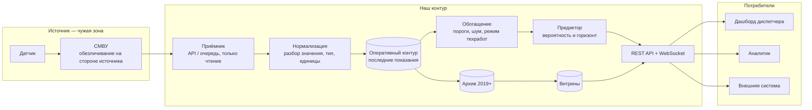

# Как аналитик читает потоковые данные

Черновик Александра от 16.09.2026 — теоретическое представление до реализации. Основание: [TF-5, шаг 4](../../tasks/TF-5.md). Гере: проверить на данных, дополнить реальными полями после [TF-1](../../tasks/TF-1.md) и заменить условные цифры измеренными.

## Коротко

Аналитик **не подключается к потоку датчиков**. Он подключается к нашему сервису по HTTPS с токеном и получает уже разобранные, размеченные и обогащённые события. Шифрование — это TLS на периметре, он снимается на nginx до того, как данные дойдут до кода; расшифровывать руками аналитику нечего. «Реальное время» для аналитика — это задержка до 5 минут от датчика до экрана ([ТЗ, раздел 2.5](../ТЗ.md)).

## 1. Путь одного события



Стрелка «СМВУ → приёмник» — единственная, где мы зависим от чужой системы, и она **только на чтение** ([ТЗ, раздел 2.9](../ТЗ.md)).

### Бюджет задержки

ТЗ даёт 5 минут на весь путь и 5 минут на inference по объекту. Раскладка — целевая, измерить после сборки:

| Участок | Цель | Чем ограничено |
|---|---|---|
| датчик → СМВУ | вне нашего контроля | чужая система |
| СМВУ → приёмник | ≤ 30 с | период опроса или задержка очереди |
| разбор и запись в оперативный контур | ≤ 1 с | одна вставка |
| разметка: пороги, шум, режим техработ | ≤ 1 с | правила, не модель |
| пересчёт признаков и прогноз | ≤ 60 с | цикл предиктора раз в минуту |
| публикация подписчикам | ≤ 1 с | WebSocket |
| **итого** | **≈ 1,5 мин** | запас 3,5 мин до требования ТЗ |

Запас нужен: при пиковой пачке событий (десятки тысяч строк за минуту, такое в журнале есть) очередь разбора вырастет.

## 2. Что происходит со значением по дороге

В исходных данных одно поле `значение_датчика` хранит и число, и состояние — `0.16` и `Норма` лежат в одной колонке. Нормализация раскладывает это на слои, и **каждый слой остаётся доступен**: аналитик должен иметь возможность вернуться к сырому виду.

| Слой | Что это | Пример |
|---|---|---|
| `raw` | строка ровно как пришла | `"0.16"` |
| `parsed` | число или состояние, тип определён | `0.16`, единица `% НКПР` |
| `normalized` | приведено к единой шкале и часовому поясу | `0.16`, `2026-08-01T09:58:46+03:00` |
| `flags` | метки: превышение порога, вид шума, режим техработ | `alarm: false`, `noise_rule: null`, `maintenance_window: false` |
| `context` | что рядом: объект, соседние каналы, открытые прогнозы | `object_id`, `prediction_id` |

Слои `raw` и `parsed` — зона ответственности Геры ([TF-1](../../tasks/TF-1.md)), `flags` — Захара ([TF-3](../../tasks/TF-3.md)).

## 3. Что закрыто и чем

| Что | Как | Основание |
|---|---|---|
| Канал наружу | TLS 1.2+ на nginx, HTTP редиректится на HTTPS | [ТЗ, раздел 2.8](../ТЗ.md) |
| Внутри контура | обычный HTTP между сервисами в закрытой docker-сети, наружу не опубликован | — |
| Кто пришёл | JWT: токен по логину, срок жизни ограничен; LDAP/AD — интеграцией позже | [ТЗ, раздел 2.8](../ТЗ.md) |
| Что можно | роли RBAC: диспетчер, аналитик, администратор, сервисный потребитель | [ТЗ, раздел 2.8](../ТЗ.md) |
| Следы | журнал действий: кто, когда, какой запрос, сколько строк отдали | [ТЗ, раздел 2.8](../ТЗ.md) |
| Персональные данные | обезличивание **на стороне источника**, мы их не принимаем | [ТЗ, раздел 2.4](../ТЗ.md) |

**Чего сознательно нет:** шифрования отдельных полей в БД, сквозного шифрования от датчика до браузера, своей криптографии. ТЗ требует защищённый транспорт, а не зашифрованное хранилище.

Отсюда практический вывод для аналитика: **никаких ключей, паролей и расшифровки на его стороне.** Он открывает `https://…` или делает запрос с заголовком `Authorization: Bearer <токен>` — TLS снимается на входе, дальше приходит обычный JSON.

## 4. Три способа доступа

| Способ | Когда | Что приходит | Задержка |
|---|---|---|---|
| **Дашборд + подписка** | смотреть, что происходит сейчас | карта, карточки событий, уровни риска; новое прилетает само по WebSocket | до 5 мин от датчика |
| **`GET` по API с курсором** | своя выборка, повторяемый разбор, ноутбук | JSON постранично, до 1000 строк за раз | запрос-ответ |
| **Выгрузка файлом** | посчитать в Excel, отдать наружу | CSV / XLSX, по фильтру | формируется по запросу |

### Подписка

Темы вида `объект → тип инженерной системы`: аналитик подписывается только на свой срез, а не на все 11 485 каналов. В сообщении — то же тело, что отдаёт `GET /api/v1/events`, одно событие в сообщении.

Разрыв связи — штатная ситуация. Правило: при обрыве клиент **дочитывает пропуск обычным `GET` по `from` = время последнего полученного события**, потом снова подписывается. Поэтому подписка и выборка отдают одинаковую структуру — иначе клиенту пришлось бы уметь два формата.

### Почему курсор, а не смещение

Поток дописывается прямо во время чтения. `LIMIT 1000 OFFSET 2000` на растущей таблице теряет и дублирует записи: пока клиент листал, впереди вставились новые строки. Курсор — закодированная пара «время последнего события + его идентификатор»; выдача продолжается строго после неё, и вставки впереди на неё не влияют.

Второй довод — скорость: `OFFSET 5000000` заставляет базу пролистать пять миллионов строк, курсор попадает по индексу сразу.

## 5. Сквозной пример: газовый датчик

**Пришло от СМВУ** (в терминах [полей журнала](../dataset/описание.md)):

```
ид_события=1409185555; ид_канала_данных=229519; дата=2026-08-01; время=09:58:46;
тревожное=f; значение_датчика=0.16
```

**После нормализации и разметки** — то, что вернёт `GET /api/v1/events?channel_id=229519&from=2026-08-01T09:00:00%2B03:00`:

```json
{
  "event_id": 1409185555,
  "channel_id": 229519,
  "object_id": 5332,
  "ts": "2026-08-01T09:58:46+03:00",
  "channel_type": "gas",
  "dispatcher_name": "Газовый датчик ПК289+3",
  "raw_value": "0.16",
  "value": 0.16,
  "unit": "% НКПР",
  "state": "norm",
  "alarm_source": false,
  "alarm_threshold": false,
  "flags": {
    "noise_rule": null,
    "noise_score": 0.02,
    "maintenance_window": false
  },
  "prediction_id": null
}
```

Что здесь важно аналитику:

- `alarm_source` — флаг `тревожное` **от системы-источника**, `alarm_threshold` — наш расчёт по порогу из справочника. Это два разных мнения, и они расходятся: [анализ](../dataset/анализ.md) показывает, что доверять только источнику нельзя.
- `flags.maintenance_window` — событие попало в окно техработ. По умолчанию такие события **в выдачу не входят**; чтобы их увидеть, нужен параметр `include_maintenance=true`. Из БД они не удаляются никогда.
- `prediction_id` — если событие попало в обоснование прогноза, отсюда можно перейти к прогнозу и посмотреть, что ещё в него вошло.

**Что увидит аналитик в таблице:** время, объект, канал, значение с единицей, состояние, чьё мнение о тревоге, метка шума, ссылка на прогноз. Ровно те же поля лягут в CSV-выгрузку.

## 6. Чего аналитик не видит

- **Сырого потока «как есть, без обработки»** наружу мы не отдаём: всё проходит нормализацию. Исходная строка сохраняется в `raw_value` — этого достаточно, чтобы проверить разбор.
- Чужих ролей: выборка ограничена правами, и это фиксируется в журнале действий.
- Персональных данных — их нет по условию обезличивания на источнике.
- Внутренних адресов сервисов: наружу открыт только nginx.

## 7. Допущения, которые надо проверить

| Допущение | Чем проверяем |
|---|---|
| Живого потока СМВУ у нас не будет — работаем на проигрывателе журнала, который отдаёт исторические записи с реальными интервалами | подтвердить у капитана до начала Ф2 |
| СМВУ отдаёт те же поля, что в выгрузке | сверить с Приложением 1 ТЗ и дополненным датасетом |
| Часовой пояс данных — московский | в журнале пояс не указан ([описание](../dataset/описание.md)), определить по суточному профилю активности |
| Пиковая нагрузка — десятки тысяч событий в минуту | измерить по самым плотным суткам в архиве |
| 1000 строк на страницу — рабочий размер | замерить время ответа на реальном объёме |
