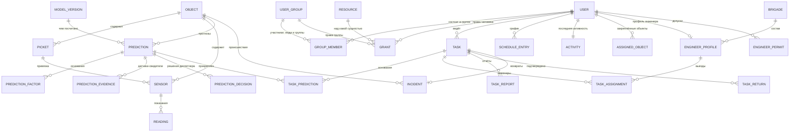

# Домены, сущности и обмен данными

Для Гриши: что за данные ходят в системе, как они сгруппированы, какая сущность что тащит в каждое
окно и что из этого ещё не описано нигде. Собрано из спецификации экранов (постановка для дизайнера,
собиралась с Дашей), из заданий Даше по сайдбару и режимам окон, из [ТЗ](../ТЗ.md),
[структуры бэкенда](../common/структура.md) и [прав и аудита](../common/права-и-аудит.md), а со
стороны модели — из [ML/INTEGRATION.md](../../ML/INTEGRATION.md).

Это предложение по модели данных, а не решение: принятые решения Гриша заносит в `decision.md`.
Схемы и владение таблицами здесь **намеренно не расставлены** — домены описаны так, чтобы их можно
было разложить и по одной общей схеме, и по схеме на сервис.

Четыре развилки уже закрыты, дальше по тексту они считаются решёнными:

| развилка | решение |
|---|---|
| прогноз ↔ заявка | заявка собирает несколько прогнозов: у неё своё основание, прогнозы прикрепляются связью |
| пикет | отдельный справочник с геометрией, а не строка в названии датчика |
| «в сети / не в сети» | токены не хранятся: фиксируется время последней активности пользователя, меньше 5 минут — работает |
| роли и права | роль — это группа; права лежат строками в базе и раздаются группам и людям, в коде их нет |
| схемы БД | остаются за Гришей, документ описывает только домены |

Это согласуется с [правами и аудитом](../common/права-и-аудит.md) §1: токены мы не храним нигде.
JWT живёт в браузере пользователя, межсервисные — в переменных окружения сервисов. Единственное,
что фиксируется, — **время последнего запроса с токеном пользователя**; из него и считается
присутствие (§6.4).

## 0. Карта доменов

| домен | что внутри | кто пишет | кто читает | темп |
|---|---|---|---|---|
| D1. Объекты и топология | объект, пикет, датчик, связи датчиков, слои карт и схем | справочники системы мониторинга | все окна | редко, справочник |
| D2. Показания | поток показаний и состояний датчиков, история | воронка (`tf.ingest.readings`) | карточка датчика, карточка объекта, модель | постоянно, сотни тысяч строк в сутки |
| D3. Прогнозы | прогноз модели, его основания, решение диспетчера по нему, канал «по факту» | ML-сервис, диспетчер | журнал прогнозов, карточка прогноза, статистика, админ-панель | 78 объектов × 6 типов раз в час |
| D4. Заявки и работы | заявка, её основания, назначение инженера, отчёт, происшествие | диспетчер, инженер | дневник, карточка заявки, история, статистика | десятки в сутки |
| D5. Журнал решений и история | кто что решил, возвраты в работу, история происшествий объекта | все сервисы | история происшествий, история объекта, админ-панель | десятки–сотни в час |
| D6. Люди, группы, права, смены | пользователь, дерево групп, права на сущности, график, отметка последней активности, закреплённые объекты, бригады | группа админов, главный диспетчер, BFF | проверка прав на каждом запросе, «диспетчеры в работе», списки, назначения | редко + отметки активности |
| D7. Рабочее пространство | раскладка окон, режимы «нахлёст» и «сегменты» | фронт | только владелец раскладки | на каждое движение окна |
| D8. Админ-панель | версии модели, коэффициенты, переобучение, игнорируемые данные, а также люди, группы и раздача прав | группа админов, главный диспетчер, ML-сервис | админ-панель, ML-сервис, BFF | редко, но всё под аудит |

Правило связей между доменами: **ссылки по идентификатору, без внешних ключей между доменами**.
Прогноз ссылается на объект и датчики, заявка — на прогнозы, отчёт — на заявку; при этом каждый
домен можно вынести в свой сервис, не переписывая остальные.

## 1. D1. Объекты и топология

### 1.1. `object` — объект

| поле | тип | смысл |
|---|---|---|
| `object_id` | int, PK | идентификатор из справочника системы мониторинга |
| `level` | smallint | уровень иерархии: 3 — рабочий объект (78 шт.), 2 — коллектор (16 шт.) |
| `parent_id` | int | родитель; у объекта 3-го уровня это коллектор |
| `kind` | text | `controlHouse`, `guardObject` и т. д. — влияет на набор датчиков и на прогноз проникновения |
| `name` | text | диспетчерское название |
| `address` | text | адрес для карточки и для инженера |
| `geom` | geometry | точка/полигон для слоя 1 и 2 |
| `status` | enum | текущее состояние: `NORMAL`, `WATCH`, `ALARM`, `OFFLINE` — четыре состояния карты |
| `status_at` | timestamptz | когда состояние сменилось |

`status` — производная величина, а не ручное поле: его пересчитывает тот, кто видит и прогнозы, и
происшествия, и тишину по объекту. Хранить рядом стоит, чтобы карта не считала его на каждый запрос.

### 1.2. `picket` — пикет

| поле | тип | смысл |
|---|---|---|
| `picket_id` | bigint, PK | суррогатный ключ |
| `object_id` | int | к какому объекту относится |
| `code` | text | человеческий номер: `24+350`; уникален внутри объекта |
| `ordinal` | int | порядок вдоль трассы — по нему рисуется схема и сортируется список |
| `geom` | geometry | точка на трассе коллектора |

Пикет нужен как сущность, а не как строка: по нему ищут (поиск в истории происшествий), на него
вешают несколько датчиков, и он же даёт геометрию для слоёв 3 и 4. Первичное наполнение — разбор
тегов и названий датчиков из справочника каналов; дальше справочник правится руками.

### 1.3. `sensor` — датчик (канал данных)

| поле | тип | смысл |
|---|---|---|
| `sensor_id` | int, PK | `ид_канала_данных` из справочника |
| `object_id` | int | объект |
| `picket_id` | bigint | пикет, если удалось привязать |
| `system` | text | тип инженерной системы: пожарная, охранная, электрика и т. д. |
| `stype` | text | тип датчика — именно он определяет, в какой счётчик попадёт событие у модели |
| `tag` | text | тег инженерной системы |
| `name` | text | название датчика |
| `state` | enum | `NORMAL`, `WARNING`, `FAULT` — три состояния для слоя датчиков |
| `last_value` | numeric | последнее числовое показание |
| `last_state_text` | text | последнее текстовое состояние («Неисправен», «Затоплен») |
| `last_ts` | timestamptz | время последнего показания — по нему видно, что канал молчит |
| `is_active` | bool | снят с эксплуатации или нет |

### 1.4. `sensor_link` и слои карт

`sensor_link (from_sensor_id, to_sensor_id, kind)` — условные линии связи для внутренней схемы.

Четыре слоя карты (из спецификации экранов) удобно держать одной таблицей `map_layer
(layer_id, level, object_id, kind, geojson, updated_at)`, где `level` = 1 городская карта,
2 карта объекта, 3 слой датчиков, 4 внутренняя схема. Окно запрашивает слой по `object_id` и
`level`, а не собирает геометрию из трёх таблиц.

## 2. D2. Показания

### 2.1. `reading` — показание

| поле | тип | смысл |
|---|---|---|
| `sensor_id` | int | канал |
| `ts` | timestamptz | время события; **зона обязательна**, у модели на этом завязан календарь |
| `value_num` | double | числовое значение, если оно число |
| `value_state` | text | текстовое состояние, если значение не число |
| `source` | enum | `STREAM`, `IMPORT`, `EMULATOR` |
| `received_at` | timestamptz | когда пришло к нам — по разнице с `ts` видно опоздание потока |

Ключ — `(sensor_id, ts)`; дубли по этому ключу отбрасываются (в журнале их много). Партиции по
месяцам, хранение — по ТЗ, но не меньше горизонта, на котором работает модель (100 суток).

Флаг «тревожное» из исходного журнала **не сохраняем как признак тревоги**: его смысл менялся по
годам (у «Обнаружен дым» 7% в 2023-м и 100% в 2026-м). Если он нужен для сверки с источником —
пусть лежит в `raw`-поле, но ни одно окно и ни одно правило на него не опирается.

### 2.2. Что нужно окнам

| окно | что берёт |
|---|---|
| карточка датчика | последние N показаний + агрегат по часам за период |
| карточка объекта, слой датчиков | по одному последнему показанию на датчик |
| карточка прогноза | показания датчиков-свидетелей за окно до момента прогноза |
| экран инженера | текущие показания датчиков заявки, кнопка «обновить» тянет только их |

Для первых двух нужна витрина «последнее показание по датчику» (материализованное представление
или таблица `sensor` выше) — иначе каждое открытие карты превращается в 300 запросов «максимум по
каналу».

## 3. D3. Прогнозы

Модель считает раз в час по каждому объекту и каждому из шести типов: пожар, загазованность,
подтопление, отказ оборудования, отказ датчика, проникновение. Горизонт — 24 часа.

### 3.1. `prediction` — прогноз

| поле | тип | смысл |
|---|---|---|
| `prediction_id` | uuid, PK | |
| `object_id` | int | объект |
| `type` | enum | один из шести типов |
| `hour_end` | timestamptz | конец часа, на который сделан прогноз (момент прогноза) |
| `horizon_hours` | smallint | 24 |
| `score` | double | оценка модели: место в распределении парка, 0…1. **Не вероятность** |
| `threshold` | double | порог этого часа: скользящий квантиль за 90 суток |
| `alarm` | bool | `score >= threshold` после постобработки |
| `probability` | double | калиброванная вероятность — то, что показываем диспетчеру как «вероятность» |
| `confidence` | double | уверенность: согласие моделей, длительность тревоги, число сработавших рядом каналов |
| `since_hours` | int | сколько часов тревога уже горит — отличает новое предупреждение от давно висящего |
| `topic` | text | тема для списка: «Подтопление, объект Альфа» |
| `description` | text | текст для карточки |
| `classification` | text | классификация по справочнику |
| `recommendation` | text | первая оперативная мера — для строки списка; вся рекомендация — в `recommendation` (§3.5) |
| `model_version_id` | text | какой версией модели посчитано |
| `status` | enum | `NEW`, `IN_REVIEW`, `TAKEN`, `REJECTED`, `MUTED`, `CLOSED` |
| `muted_reason` | enum | почему прогноз не показан: бригада на объекте, плановые работы по графику (окно ППР газа, ML/INTEGRATION.md §1.6), режим «маловероятно» после отклонения, игнорируемый период. Непоказанный прогноз не удаляется и идёт в историю главного диспетчера (§10.1) |
| `created_at` | timestamptz | |

**Важно для объёма.** Если писать все расчёты, это 78 × 6 × 24 ≈ 11 тысяч строк в сутки, из которых
тревог — около 250. Предложение: в `prediction` писать **только часы с тревогой и часы смены
состояния**, а полную сетку оценок держать в отдельной таблице `prediction_score
(object_id, type, hour_end, score, threshold)` для статистики и админ-панели. Диспетчер видит
только первую.

### 3.2. `prediction_factor` и `prediction_evidence` — основания

`prediction_factor (prediction_id, feature, value, weight, direction)` — что именно подняло оценку
(«дыма за 24 ч — 3 срабатывания»). Модель отдаёт верхние признаки строки.

`prediction_evidence (prediction_id, sensor_id, picket_id, ts, value)` — конкретные датчики и их
показания, на которые смотреть диспетчеру. Именно отсюда карточка прогноза берёт список датчиков и
подсвечивает их на схеме.

### 3.3. `prediction_decision` — решение диспетчера

| поле | тип | смысл |
|---|---|---|
| `decision_id` | uuid, PK | |
| `prediction_id` | uuid | прогноз |
| `user_id` | uuid | кто решил |
| `action` | enum | `TAKE`, `REJECT`, `MUTE`, `REOPEN` |
| `reason_code` | text | код причины из справочника — обязателен при `REJECT` |
| `comment` | text | обязателен, если причина «другое» |
| `task_id` | uuid | если взято в работу — в какую заявку ушло |
| `decided_at` | timestamptz | |

Эта таблица — **обратный поток в модель**. Правило отклонения (у загазованности и подтопления после
отказа диспетчера объект считается маловероятным до следующего настоящего эпизода) без неё не
работает, и админ-панель «отклонили, а оно случилось» тоже строится по ней. Решения должны уходить
в ML-сервис отдельным топиком, см. §9.

### 3.4. `fact_alert` — канал «по факту»

Прогноз всегда часть эпизодов пропускает. Для них есть второй канал: не «может случиться», а «уже
идёт», опознаётся по первым строкам журнала с небольшой задержкой на фильтр шума.

`fact_alert (id, object_id, type, started_at, announced_at, trigger_sensor_ids[], status, works_mark)`.
`works_mark` — объявление пришло в окно плановых работ по графику: газ от датчиков коллектора в окне
ППР диспетчер видит с пометкой «идёт ППР по графику» и закрывает причиной «известные работы на
объекте». Отказ снятого на поверку газового датчика не показывается, статус `MUTED`, запись в истории.
В интерфейсе он идёт тем же списком, что прогнозы, но отличается меткой источника: у прогноза есть
горизонт и вероятность, у объявления по факту — только задержка объявления.
Рекомендация по факту своя (§3.5, режим `FACT`) и пересчитывается по мере развития эпизода.

### 3.5. `recommendation` и `recommendation_rule` — что делать

ТЗ требует рекомендаций по ТО и ремонту (Ф5-4) и черновика заявки из рекомендации (§8).
Рекомендацию собирает ML-сервис по словарю правил (`ML/settings/recommendations.csv`, разбор —
`ML/results/analytics.md` §61), модель в ней не участвует. Режимов два, и схемы у них разные:
**по факту** — эпизод идёт, что делать сейчас; **прогноз** — эпизода нет, что сделать заранее.

`recommendation` — одна на прогноз или объявление по факту. Если на объекте в один час поднялись
несколько типов, ML-сервис присылает ещё и сводную по объекту: оперативные меры всех типов по
сроку, ТО без повторов.

| поле | тип | смысл |
|---|---|---|
| `recommendation_id` | uuid, PK | |
| `prediction_id` / `fact_alert_id` | uuid | к чему относится; у сводной по объекту — пусто, есть `object_id` и `hour_end` |
| `object_id` | int | |
| `mode` | enum | `FACT`, `FORECAST` |
| `stage` | enum | стадия рецидива `R0`…`R3`: сколько эпизодов того же типа было за 30 суток |
| `pattern` | enum | как ведёт себя сработка: `mass`, `spreading`, `chatter`, `fleeting`, `sustained`, `short`; у прогноза — `standing` |
| `intensity` | jsonb | каналы, сработки, длительность, часы тревоги — числами для карточки |
| `with_types` | enum[] | другие типы на объекте, которые учла рекомендация |
| `items` | jsonb | меры: `rule_id`, вариант, блок (`NOW` — оперативно, `MAINTENANCE` — ТО, `NOTE` — пометка), мера, `work_type`, срок в часах, исполнитель, состав и число людей, обоснование, признак «гипотеза» |
| `visit` | jsonb | один выезд на основные оперативные меры: состав (`NONE`, `SPECIALIST` — 1, `CREW3` — звено из 3, `BRIGADE4` — бригада из 4), людей, срок, исполнители, какие меры он закрывает, `after_check` — ехать, только если проверка без выезда не сняла тревогу; пусто — выезд не нужен |
| `rules_version` | text | версия словаря: первые 10 знаков sha1 файла |
| `created_at` | timestamptz | для «по факту» строк несколько: рекомендация уточняется, пока эпизод идёт |

`recommendation_rule` — копия словаря для интерфейса и админ-панели: `rule_id`, слой (мера,
паттерн, сочетание, повтор, поправка), тип, признак, вариант (`A`, `B`, `C`, `+`), режим, мера,
`work_type`, срок, исполнитель, обоснование, источник, «сверить с РТЭК», версия. Карточка
показывает `rule_id` и обоснование рядом с мерой, чтобы было видно, почему предложено именно это.

Черновик заявки из рекомендации: диспетчер выбирает меру, в `task` переходят `work_type`,
описание и датчики, а связь пишется в `task.recommendation_id` и `task.rule_id`. Состав из `visit`
подсказывает, кого назначать (`task_assignment`): одного специалиста по `specialization` или бригаду
(`engineer_profile.brigade_id`) не меньше указанного числа людей.

## 4. D4. Заявки и работы

### 4.1. `task` — заявка

| поле | тип | смысл |
|---|---|---|
| `task_id` | uuid, PK | внутренний ключ |
| `number` | text, уникальный | человеческий номер заявления, по нему ищут в истории |
| `source_type` | enum | `PREDICTION`, `FACT`, `CALL`, `EXTERNAL` |
| `object_id` | int | объект |
| `picket_id` | bigint | если работа привязана к участку |
| `topic` | text | тема |
| `description` | text | описание |
| `work_type` | enum | тип работы |
| `fault_classification` | enum | классификация неисправности |
| `sensor_ids` | int[] | датчики, о которых речь |
| `recommendation_id`, `rule_id` | uuid, text | из какой рекомендации и по какому правилу собран черновик (§3.5); пусто, если заявка заведена вручную |
| `comment` | text | комментарий диспетчера |
| `dispatcher_id` | uuid | кто ведёт (первый взявший) |
| `status` | enum | см. ниже |
| `priority` | smallint | |
| `created_at`, `taken_at`, `assigned_at`, `completed_at`, `closed_at` | timestamptz | отметки времени, из них считается время реакции и отработки |

Статусы: `NEW → IN_WORK → ASSIGNED → ENGINEER_WORKING → COMPLETED → CLOSED`, из любого активного —
`RETURNED_TO_WORK` (возврат от главного диспетчера) и `CANCELLED`.

Правило «кто первым взял, тот и ведёт»: переход `NEW → IN_WORK` должен быть атомарным
(`update ... where status = 'NEW' returning`), иначе два диспетчера возьмут одну заявку.

### 4.2. `task_prediction` — основания заявки

| поле | тип | смысл |
|---|---|---|
| `task_id` | uuid | заявка |
| `prediction_id` | uuid | прогноз |
| `attached_by` | uuid | кто прикрепил; для первого — тот, кто взял в работу |
| `attached_at` | timestamptz | |
| `detached_at` | timestamptz | ошибочно прикреплённый прогноз откреплён, но связь остаётся в истории |
| `is_primary` | bool | основание, с которого заявка началась |

Так решается ситуация «на одном объекте в один час поднялись два типа»: диспетчер не получает две
заявки, а прикрепляет второй прогноз к уже открытой.

### 4.3. `task_assignment`, `task_report`, `task_return`

`task_assignment (id, task_id, engineer_id, crew_role, assigned_by, assigned_at, status, comment)` —
назначений может быть несколько: первый инженер не доехал, поехал второй. На выезд звена или бригады
пишется строка на каждого человека, `crew_role` — его место в выезде (§6.6).

`task_report (report_id, task_id, engineer_id, actual_state, works_done, result_code, comment,
attachments[], created_at)` — отчёт инженера, ровно та форма, которую диспетчер видит в карточке
заявки.

`task_return (id, task_id, returned_by, target_type, target_user_id, comment, returned_at)` —
возврат в работу от главного диспетчера: конкретному диспетчеру, в общую очередь или как общее
происшествие.

### 4.4. `incident` — подтверждённое происшествие

| поле | тип | смысл |
|---|---|---|
| `incident_id` | uuid, PK | |
| `object_id` | int | |
| `type` | enum | тот же справочник типов, что у прогнозов |
| `started_at` | timestamptz | когда началось по журналу |
| `confirmed_at`, `confirmed_by` | | кто подтвердил: подтверждение делает диспетчер |
| `task_id` | uuid | какой заявкой отрабатывалось |
| `prediction_id` | uuid | каким прогнозом было предсказано, если было |
| `outcome` | text | итог |

Происшествие — отдельная сущность, а не статус заявки: одно происшествие может отрабатываться
несколькими заявками, и по нему же считается, поймала ли его модель.

## 5. D5. Журнал решений и история

Аудит уже описан в [правах и аудите](../common/права-и-аудит.md) — два журнала, список событий,
таблица `audit.events`. Здесь только то, чего там нет.

**Журнал решений** — это не отдельная таблица, а представление поверх `prediction_decision`,
`task`, `task_return` и `task_report`: кто, когда, по какому объекту и что решил. Для окна истории
нужен один запрос, отдающий «веретено» целиком:

| колонка | откуда |
|---|---|
| номер заявки | `task.number` |
| тема | `task.topic` |
| объект, пикет | `task.object_id`, `picket` |
| источник | `task.source_type` + прикреплённые прогнозы |
| диспетчер | `task.dispatcher_id` |
| инженер | последнее `task_assignment` |
| статус и время | `task.status`, отметки времени |
| решение | `prediction_decision.action` + причина |
| отчёт | `task_report.result_code` |
| возвраты | `task_return[]` |

Одно представление обслуживает три окна: историю происшествий у главного диспетчера (с кнопкой
«вернуть в работу»), историю объекта у диспетчера (без кнопок) и блок «история» внутри карточки
заявки. Отличаются только фильтр и права.

## 6. D6. Люди, группы, права, смены

### 6.1. Дерево групп: в группе и люди, и группы

Роли не зашиты в код и не лежат полем у пользователя. **Роль — это группа.** Под инженеров
заводится группа «Инженеры», под диспетчеров — «Диспетчеры», дальше сколько понадобится.

В группу входят и пользователи, и другие группы. «Инженеры северного района» входят в «Инженеры» и
получают всё, что выдано родителю, — отдельно им ничего раздавать не надо.

| таблица | поля | смысл |
|---|---|---|
| `app_user` | `user_id`, `login`, `full_name`, `phone`, `is_active`, `created_by`, `created_at` | человек; поля «роль» у него нет |
| `user_group` | `group_id`, `code`, `name`, `is_system`, `created_by`, `created_at` | группа; `code` — латиницей, чтобы на системные группы можно было сослаться, `is_system` — группу нельзя удалить |
| `group_member` | `group_id`, `member_type`, `member_id`, `added_by`, `added_at` | участник: `member_type` ∈ `USER`, `GROUP` |

Одна таблица на оба вида участников, потому что у группы может быть несколько родителей: «Инженеры
северного района» могут входить и в «Инженеры», и в «Северный район». Это не дерево в строгом
смысле, а направленный граф без циклов, и отсюда правила:

- **Циклы запрещены.** При добавлении группы в группу проверять, не окажется ли новый родитель её
  же потомком. Без проверки первый же обход наследования зациклится.
- **Наследование только вниз.** Участники дочерней группы получают права родителя; наверх права не
  поднимаются.
- Человек состоит в любом числе групп, итоговые права — объединение всех.
- Удаление группы людей не трогает: рвутся её связи `group_member` и снимаются её права.

Чтобы не гонять рекурсию на каждом запросе, держать замыкание `group_closure (ancestor_id,
descendant_id, depth)`: пересчитывается при правке дерева (а меняется оно раз в месяц), читается
одним `JOIN`. На нынешнем объёме хватит и `WITH RECURSIVE`, но тогда с кэшем в BFF.

**Системная группа админов** — единственное, что зашито. Она создаёт пользователей и группы и
раздаёт права на сущности. Иначе систему некому начать: права выдаются правами.

### 6.2. Права: строки в базе, а не константы в коде

Право — это «кому», «над чем», «что делать» и, если нужно, «над каким экземпляром».

`resource (code, name, actions[])` — реестр сущностей, над которыми вообще бывают права: `object`,
`prediction`, `task`, `incident`, `schedule`, `assigned_object`, `user_group`, `model_version` и так
далее. Появился справочник расписания — добавили строку в `resource`, и он сразу виден в
админ-панели: кому что можно с расписанием, выставляется с фронта, в коде не меняется ничего.

| поле `grant` | смысл |
|---|---|
| `grant_id` | uuid, PK |
| `subject_type` | `USER` или `GROUP` — право выдаётся и человеку напрямую, и группе |
| `subject_id` | кому |
| `resource` | код сущности из `resource` |
| `action` | `READ`, `CREATE`, `UPDATE`, `DELETE`, `ASSIGN`, `EXECUTE` — из `resource.actions` |
| `target_id` | конкретный экземпляр или `NULL` — «на весь тип» |
| `granted_by`, `granted_at` | кто выдал и когда; снятие — в аудит |

Проверка одна на всё приложение: `can(user, resource, action, target)` — есть ли строка `grant`, у
которой субъект это сам пользователь или любая группа, где он состоит напрямую или через
вложенность; ресурс и действие совпали; `target_id` равен цели или `NULL`. Ни одного
`if role == 'DISPATCHER'` в коде быть не должно: такая проверка ломает весь смысл модели — заведение
новой группы требовало бы правки кода и выката.

Запретов (deny) нет, права только складываются. Это осознанно: с запретами нужен порядок разрешения
конфликтов, а на таком объёме он не окупается. Случай «всем инженерам, кроме одного» решается
подгруппой, а не запретом.

Права меняются на ходу, поэтому **в токен их класть нельзя**. JWT несёт идентификатор пользователя,
а права BFF читает из базы на каждом запросе с коротким кэшем (порядка 30 секунд) — иначе снятое
право живёт до конца жизни токена.

Чем это пользуется главный диспетчер: он добавляет и убирает людей в конкретных сущностях —
закрепляет за объектом (§6.5), правит график работы (§6.3), меняет состав групп. Каждое такое
действие — обычная запись, разрешённая его же `grant`, а не «зашитая роль главного диспетчера».

### 6.3. Рабочий статус — из графика

`schedule_entry (id, user_id, date_from, date_to, status, source, changed_by, changed_at)`,
где `status` ∈ `WORKING`, `NOT_WORKING`, `ON_LEAVE`. Статус на сейчас — запись, в интервал которой
попадает текущее время; если записи нет, считается `NOT_WORKING`. Правку делает тот, у кого есть право
`schedule` + `UPDATE` (§6.2) — обычно главный диспетчер; каждая правка — в аудит.

### 6.4. Присутствие — по времени последней активности

**Токены не хранятся.** У нас JWT: пользовательский лежит в браузере, межсервисные — в переменных
окружения сервисов. Ни таблицы сессий, ни хэшей токенов в базе нет.

Единственное, что нужно для присутствия, — отметка: с токеном пользователя пришёл запрос, значит,
он сейчас за экраном. Одна строка на пользователя, перезаписывается:

| поле `user_activity` | тип | смысл |
|---|---|---|
| `user_id` | uuid, PK | чей |
| `last_seen_at` | timestamptz | время последнего запроса, прошедшего проверку токена |
| `last_action` | text | что делал в последний раз — не обязательно, но полезно в окне «диспетчеры в работе» |

Правило отображения:

| показываем | условие |
|---|---|
| **в сети** | `last_seen_at` не старше 5 минут |
| **не в сети** | `last_seen_at` старше 5 минут или отметки нет вовсе |

Пять минут — рабочее значение, вынести в настройку, а не зашивать в код.

Откуда берётся отметка: её ставит тот же слой, что проверяет подпись токена (middleware BFF), на
любом запросе пользователя — отдельного «пинга присутствия» с фронта не нужно, он бы показывал
открытую вкладку, а не работающего человека.

Рабочий статус и присутствие — **разные вещи и показываются вместе**: «в отпуске, но в сети» — это
нормальная строка, а «в работе, не в сети полчаса» — повод спросить.

Запись на каждый запрос бьёт по базе: держать отметку в памяти сервиса или в Redis и сбрасывать в
базу не чаще раза в 30 секунд на пользователя. Пережить перезапуск сервиса она не обязана —
максимум, что будет видно, это «не в сети» до первого запроса пользователя.

Выход из системы отметку не трогает: человек просто перестаёт слать запросы и через пять минут
гаснет сам. Если нужно гасить сразу, при выходе достаточно обнулить `last_seen_at`.

### 6.5. Закреплённые объекты

`assigned_object (user_id, object_id, assigned_by, assigned_at, note)` — список объектов, за
которые отвечает диспетчер или техник. Ставит главный диспетчер своим функционалом.

Где используется: в списках диспетчеров и техников колонкой «закреплённые объекты», при возврате
заявки (подсказывать того, за кем объект), в фильтре «мои объекты» в списках прогнозов и заявок,
и при назначении инженера. Само закрепление — **не право доступа**: оно говорит «чьё это», а не «кому можно». Право же
менять закрепления — обычный `grant` на `assigned_object` (§6.2).

### 6.6. Инженеры и бригады

`engineer_profile (user_id, brigade_id, phone, telegram, specialization[], status)` — статус
`AVAILABLE`, `ASSIGNED`, `BUSY`, `UNAVAILABLE`. Загрузка считается по активным `task_assignment`, а
не хранится полем.

`brigade (brigade_id, name, unit, leader_id)` — бригада эксплуатационного подразделения (`unit`,
глоссарий ТЗ) и её бригадир. Бригадир — поле бригады, а не роль человека: сменили бригадира —
правится одна строка.

**Роль инженера.** Колонки «роль» у `app_user` нет и не будет: что человек может делать в системе,
решают группы (§6.1). Но рекомендация теперь говорит, кого посылать (`visit` в §3.5: специалист,
звено из 3, бригада из 4, и чья это работа). Чтобы по ней собрать выезд, в списке инженеров нужны
три вещи. Они разные по смыслу, поэтому и лежат в разных местах:

| что | где | значения | зачем |
|---|---|---|---|
| специальность — чью работу делает | `engineer_profile.specialization[]`, справочник `specialization` | `MAINTENANCE` бригада ТО, `POWER` энергетик, `COMMS` связь и автоматика, `SITE_ENGINEER` инженер участка | совпадает с полем «исполнитель» меры в словаре рекомендаций: мера энергетика уходит энергетику |
| допуски — куда можно спускаться | `engineer_permit` | ОЗП группа 1, 2 или 3; газоопасные работы; группа по электробезопасности | звено и бригада собираются только из людей с действующим допуском |
| место в выезде — кем едет сейчас | `task_assignment.crew_role` | `SOLO`, `LEAD` производитель работ, `INSIDE` в коллекторе, `OBSERVER` наблюдающий, `BELAYER` страхующий | роль в конкретном выезде; в следующем тот же человек может стоять наверху |

`engineer_permit (id, user_id, kind, level, valid_until, document_no, checked_by, checked_at)`,
`kind` ∈ `CONFINED_SPACE` (ОЗП, `level` 1–3), `GAS_HAZARD`, `ELECTRICAL` (`level` 2–5). Группы
ОЗП — по правилам Минтруда № 902н: 1 — работает внутри, 2 — производитель работ, наблюдающий,
замер воздуха, руководство эвакуацией, 3 — организует работы и выдаёт наряд-допуск. Обучение по
группам 1 и 2 повторяется раз в 3 года. Поэтому у допуска есть срок: просроченный допуск из профиля
не удаляется, но человек перестаёт попадать в подбор. За 30 дней до конца срока главный диспетчер
видит предупреждение.

Подбор людей по `visit`:

| состав | кого предлагать |
|---|---|
| `SPECIALIST` | один `AVAILABLE` с нужной специальностью из `visit.исполнители`; первым — закреплённый за объектом (§6.5) |
| `CREW3` | трое, по возможности из одной бригады: `INSIDE` с ОЗП группы 1, `LEAD` и `OBSERVER` с группой 2 |
| `BRIGADE4` | четверо, у всех допуск к газоопасным работам; внутри не больше двоих |

Если людей с допусками не хватает, система не подставляет кого попало. Она пишет диспетчеру, кого
недостаёт («нет второго с ОЗП группы 1»), и предлагает добрать из соседней бригады. Назначить меньше
людей, чем в `visit.людей`, можно, но только с комментарием, и это видно в аудите.

## 7. D7. Рабочее пространство

### 7.1. `workspace` — раскладка пользователя

| поле | тип | смысл |
|---|---|---|
| `workspace_id` | uuid, PK | |
| `user_id` | uuid | владелец |
| `role` | text | роль на момент сохранения |
| `layout_mode` | enum | `FREE` — свободные окна, `GRID` — сегменты |
| `overlap_enabled` | bool | режим «Нахлёст»: по умолчанию включён |
| `segments` | smallint | число сегментов в режиме `GRID`: 4, 6, 8, 10; по умолчанию 6 |
| `updated_at` | timestamptz | |

### 7.2. `window` — окно

| поле | тип | смысл |
|---|---|---|
| `window_id` | text, PK | |
| `workspace_id` | uuid | |
| `window_type` | enum | см. таблицу окон в §8 |
| `context` | jsonb | `object_id`, `prediction_id`, `task_id`, `sensor_id`, `picket_id` — что окно показывает |
| `layout` | jsonb | `x, y, w, h, z` для режима `FREE` |
| `segment_index` | smallint | номер ячейки для режима `GRID` |
| `state` | enum | `OPEN`, `MINIMIZED`, `MAXIMIZED`, `CLOSED` |
| `parent_window_id` | text | откуда открыли |
| `title_override` | text | если пользователь переименовал |

Раскладка сохраняется между сессиями и привязана к пользователю и роли.

### 7.3. Режимы и жесты, о которых надо знать бэкенду

| требование | что нужно от бэкенда |
|---|---|
| «Нахлёст» вкл/выкл | хранить `overlap_enabled`; при выключении фронт сам не даёт класть окна друг на друга |
| зона-мусорка на сайдбаре | ничего, кроме сохранения раскладки: перетащил окно на мусорку, окно подсветилось красным, отпустил — `state = CLOSED` одним запросом на пачку окон |
| сворачивание в полоску | `state = MINIMIZED`; в полоске показываются **ид объекта и тип окна** — оба должны приходить с данными окна, а не собираться на фронте из контекста |
| сегментный режим | `layout_mode = GRID`, `segments` от 4 до 10 шагом 2; смена окон местами — обмен `segment_index` |
| одинаковый размер ячеек | размеры считает фронт; бэкенду хватает номера ячейки |

Массовое закрытие окон и перетаскивание — это десятки изменений раскладки в секунду. Сохранять
раскладку целиком (`PUT /workspaces/{id}`) с задержкой в пару секунд, а не по событию на каждое
движение.

## 8. Что каждое окно берёт и отдаёт

| окно | что запрашивает | какие сущности и поля показывает | действия | на какие события обновляется |
|---|---|---|---|---|
| Общая карта | `bbox`, `zoom`, `layer`, фильтры | `object` (ид, название, статус), слой карты, счётчики прогнозов и происшествий | открыть объект, прогноз, происшествие | `object.status_changed`, `prediction.created` |
| Журнал прогнозов | фильтры (объект, пикет, тип, период, статус), курсор, 10 строк | `prediction`: ид, тема, описание, классификация, вероятность, горизонт, `since_hours`, статус, рекомендация | взять в работу, отклонить (причина + комментарий), открыть карточку | `prediction.created`, `prediction.updated` |
| Карточка прогноза | `prediction_id` | шапка, объект, оценка (вероятность, горизонт), `prediction_factor[]`, `prediction_evidence[]` с показаниями, рекомендация, история решений | взять в работу, отклонить, открыть объект/датчик/заявку | `prediction.updated`, `task.created` |
| Дневник диспетчера | `dispatcher_id`, фильтры, 10 строк | `task`: номер, источник, объект, время, статус, инженер | открыть заявку, отработано, вызвать инженера, создать задачу | `task.updated`, `assignment.updated` |
| Карточка заявки | `task_id` | основание (`task_prediction[]` + описание), объект, датчики, тип работы и классификация, назначенный инженер, отчёт, timeline | прикрепить/открепить прогноз, назначить инженера, завершить, вернуть | `task.updated`, `report.created` |
| Объект | `object_id`, `layer` | карточка объекта, слои 1–4, `sensor[]` со статусами, активные прогнозы, происшествия, история | открыть датчик, прогноз, заявку, лог | `sensor.state_changed`, `prediction.created` |
| Датчик | `sensor_id`, период | `sensor` + `reading[]` за период, пикет, связи | открыть объект, лог, прогноз; завершить/взять в работу/вызвать инженера | `reading.new` (по подписке на датчик) |
| Логи | фильтры, курсор | `audit.events` + технологические события | провалиться в сущность | — |
| Диспетчеры в работе | дата, фильтры | `user` + рабочий статус, присутствие, закреплённые объекты, счётчик отработанного | открыть заявки диспетчера, вернуть в работу, править график и закрепления | `presence.changed`, `schedule.changed` |
| Статистика | период, фильтры | агрегаты: создано прогнозов, взято, отклонено, ложные, завершено заявок, возвращено, время реакции | провалиться в список, из которого посчитано | — |
| История происшествий (главный) | режим поиска: по ид объекта / по пикету / по номеру заявки; 10 строк | «веретено» из §5 | вернуть в работу, открыть заявку, перейти в историю объекта | — |
| История объекта (диспетчер) | `object_id`, опционально `picket_id`; 10 строк | то же «веретено», только чтение | открыть карточку заявки на просмотр | — |
| Список прогнозов | фильтры по объектам и пикетам | то же, что журнал прогнозов | те же, что в журнале (у главного — плюс просмотр чужих решений) | `prediction.created` |
| Выбор исполнителей (из карточки заявки) | `task_id`, `visit` рекомендации | инженеры: ФИО, бригада, специальность, допуски со сроком, статус, закреплённые объекты, загрузка; сверху — кто подходит под `visit`, отдельно — кого не хватает | назначить с ролью в выезде, добрать из другой бригады, назначить меньше с комментарием | `assignment.updated`, `engineer.status_changed` |
| Экран инженера | `task_id` | заявка, адрес, цель, датчики с показаниями, контакты диспетчера, карта с переключением на схему | обновить, завершить, отправить отчёт | `task.updated` |
| Админ-панель | — | см. §10 | смена версии модели, коэффициенты, переобучение, игнорируемые периоды | — |

Во всех списках: **первая страница — 10 записей**, дальше кнопка «подгрузить ещё» внизу; когда
записей больше нет — строка «вы дошли до конца списка». Пагинация курсорная (`cursor` + `limit`),
а не по номеру страницы: списки пополняются сверху в реальном времени, и номера страниц поедут.

## 9. Обмен данными

### 9.1. Потоки

| поток | канал | что в нём |
|---|---|---|
| показания и журнал | `tf.ingest.readings`, `tf.ingest.journal` | события датчиков от воронки |
| справочники | `tf.ingest.reference` | объекты, каналы, изменения состава |
| прогнозы | `tf.forecast.results` | раз в час на объект: шесть типов, оценка, порог, тревога, основания, версия модели |
| решения диспетчера | **нужен новый топик** `tf.dispatch.decisions` | отклонения и взятия в работу, подтверждённые происшествия, окна молчания (бригада на объекте) |
| настройки модели | **нужен новый топик** `tf.dispatch.settings` | смена версии модели, коэффициенты, игнорируемые периоды, запрос переобучения |
| ошибки разбора | `tf.dlq` | что не разобралось |

Первые четыре топика уже заведены в инфраструктуре с правами для пользователя `tf-model`; двух
последних нет — это то, что нужно добавить, чтобы работали правило отклонения и админ-панель.

### 9.2. Фронт и обновление окон

Требование «обновление одного окна не перезагружает приложение» и «при изменении заявки открытые
окна получают событие» закрывается одним каналом на рабочее пространство (SSE или WebSocket).
Сервер шлёт короткие события `{"type": "task.updated", "task_id": "...", "version": 7}`, окно
перезапрашивает свой контекст само. Полные данные в событие не кладутся: у окон разные права и
разные наборы полей.

События: `prediction.created`, `prediction.updated`, `task.created`, `task.updated`,
`assignment.updated`, `report.created`, `incident.created`, `object.status_changed`,
`sensor.state_changed`, `presence.changed`, `schedule.changed`, `model.version_changed`.

### 9.3. Идемпотентность и версии

- У каждой сущности — `version` (или `updated_at`), фронт шлёт его при изменении; расхождение —
  409 и перезапрос. Иначе два диспетчера в двух окнах затрут решения друг друга.
- Действия, создающие сущности (взять в работу, создать заявку, отправить отчёт), принимают
  `Idempotency-Key`: повтор по сети не должен рождать вторую заявку.
- Прогнозы из Kafka дедуплицируются по `(object_id, type, hour_end, model_version_id)`.

## 10. D8. Админ-панель главного диспетчера

Пять блоков, все под аудит; четыре из них меняют поведение модели, пятый — состав людей и их права.

### 10.1. Качество работы диспетчера: отклонили — а оно случилось

Строится по `prediction_decision` и `incident`: берутся прогнозы со статусом `REJECTED` и `MUTED` и
проверяется, не началось ли на этом объекте происшествие того же типа в пределах горизонта.

| колонка | смысл |
|---|---|
| прогноз, объект, тип, вероятность | что отклонили |
| диспетчер, время, причина, комментарий | кто и почему |
| исход | случилось / не случилось; если случилось — ссылка на происшествие и заявку |
| задержка | сколько прошло от отклонения до начала происшествия |
| версия модели | `prediction.model_version_id` по типу: чем посчитан отклонённый прогноз |
| рецидив | стадия рецидива объекта на момент отклонения (R0–R3, ML/results/analytics.md §61) |

Отклонённый прогноз не исчезает: он остаётся в этой истории, и её видит только главный диспетчер
(D8). Если на объекте потом началось происшествие того же типа, строка получает исход «случилось»
и ссылку на происшествие. Повтор на том же объекте после отклонения виден по колонке «рецидив».

Молчание по графику работ (`MUTED`, причина «плановые работы по графику») идёт в ту же историю
отдельной строкой без диспетчера. В свод по диспетчеру оно не входит, а исход «случилось» у него
показывает промах графика. Работы вне графика диспетчер отклоняет с причиной «известные работы на
объекте». Это обычное отклонение, и подтверждённое потом происшествие ложится на диспетчера. Исход
считается по подтверждённым происшествиям (`incident`), а не по журналу: газ из баллона при
проверке журнал пишет как утечку, и верное отклонение проверки выглядело бы ошибкой.

Отдельно от этого — **пропуск модели**: происшествие случилось, а прогноза не было вовсе. Это не
ошибка диспетчера, а качество модели, и в свод по диспетчеру он не входит. В интерфейсе это другая
вкладка того же блока.

Свод по диспетчеру: сколько отклонил, сколько из отклонённого переросло в происшествие, среднее
время реакции. Сравнивать диспетчеров можно только внутри одной версии модели типа (§10.2): у
версий разное число тревог на одну серию отказов, значит и отклонений разное число. Это же —
обратная связь модели: причины отклонений разбираются при переобучении.

### 10.2. Версии модели

`model_version (model_version_id, name, stage, trained_to, registry_ref, metrics jsonb,
is_default, created_at)`. Переключение — запись `is_default` плюс событие в `tf.dispatch.settings`;
ML-сервис подхватывает новую версию со следующего часа. Прогнозы хранят `model_version_id`, так что
после переключения видно, чем считался каждый прогноз.

Версия выбирается **по типу**: `model_version` принадлежит типу, `is_default` — одна строка на
тип. Несколько версий есть только у отказа оборудования, у остальных пяти типов версия одна.
Четыре версии оборудования (ML/results/analytics.md §60, «Версии для главного диспетчера»):

| № | имя | чем отличается |
|---|---|---|
| 1 | тихая, по умолчанию | смесь бустинга и сети; при тех же ложных сигналах ловит больше всех |
| 2 | перевзвод | короткая тревога к каждому отказу; больше всего свежих поимок, но шумнее, если не опустить долю |
| 3 | разрыв в год | между 2 и 4 |
| 4 | липкая | прежний прод; держит тревогу по объекту неделями |

В карточке версии админ-панель показывает её имя и одну строку «чем отличается» — это поле
`about` в `manifest.json` версии.

### 10.3. Коэффициенты

Ползунки — это **доли часов под тревогой по типам** (сколько процентов объекто-часов система имеет
право держать под тревогой) и правило отклонения. Сейчас это файл настроек на стороне модели с
полями `share` и `reject_k` по каждому типу, версией, датой, автором и причиной правки:

| тип | доля | правило отклонения |
|---|---|---|
| пожар | 0,025 | выключено |
| загазованность | 0,026 | k = 0,2 |
| подтопление | 0,018 | k = 0,2 |
| отказ оборудования | 0,059 | выключено |
| отказ датчика | 0,009 | выключено |
| проникновение | 0,005 | выключено |

В интерфейсе ползунок стоит подписывать не долей, а следствием: «примерно N тревог в сутки по парку»
— доля 0,025 у пожара это около 1,7 тревоги в сутки. Пересчёт даёт ML-сервис. Каждая правка —
новая версия настроек, старые хранятся: по ним объясняется, почему поток тревог в прошлом месяце
был другим.

### 10.4. Переобучение и игнорируемые данные

`retrain_job (job_id, requested_by, requested_at, params jsonb, status, started_at, finished_at,
result_model_version_id, log_ref)` — запуск вручную и по расписанию (раз в 30 суток). Переобучение
необязательно: по ТЗ модуль дообучения — по согласованию. Версии 1 и 2 оборудования заморожены и не
переобучаются.

`ignored_range (id, scope, object_id, sensor_id, date_from, date_to, reason, created_by,
created_at)` — периоды брака данных, которые не идут ни в обучение, ни в признаки. Так закрывается
случай 2021 года, когда параллельно работали две системы мониторинга и журнал противоречит сам
себе. `scope` ∈ `ALL`, `OBJECT`, `SENSOR`.

Оба справочника читает ML-сервис через `tf.dispatch.settings`.

### 10.5. Люди, группы и права

Тот же экран закрывает и вопрос «кто что может»: создать пользователя, создать группу, вложить
группу в группу, выдать группе право на сущность, снять право. Модель описана в §6.1 и §6.2;
админ-панели нужен только список из `resource` и его `actions` — новые сущности появляются в ней
сами, без выката.

Отдельной строкой — то, чем главный диспетчер пользуется каждый день: закрепить объект за
человеком или снять закрепление, поправить график работы, перевести человека из группы в группу,
вести бригады, специальности и допуски инженеров со сроками (§6.6).

## 11. Справочники и перечисления

Их надо утвердить до разработки — на них завязаны и фронт, и модель, и статистика.

| справочник | значения |
|---|---|
| тип прогноза и происшествия | пожар, загазованность, подтопление, отказ оборудования, отказ датчика, проникновение |
| статус объекта | `NORMAL`, `WATCH`, `ALARM`, `OFFLINE` |
| состояние датчика | `NORMAL`, `WARNING`, `FAULT` |
| статус прогноза | `NEW`, `IN_REVIEW`, `TAKEN`, `REJECTED`, `MUTED`, `CLOSED` |
| причина отклонения | известные работы на объекте, ложное срабатывание датчика, штатное/сезонное явление, уже отработано другой заявкой, недостаточно данных, другое (комментарий обязателен) |
| источник заявки | прогноз, по факту, звонок, внешняя проблема |
| тип работы | осмотр, замена датчика, ремонт оборудования, откачка воды, проветривание, проверка охраны, прочее |
| режим рекомендации | `FACT`, `FORECAST` |
| блок меры | `NOW` (оперативно), `MAINTENANCE` (ТО и ремонт), `NOTE` (пометка) |
| паттерн сработки | `mass`, `spreading`, `chatter`, `fleeting`, `sustained`, `short`, `standing` |
| стадия рецидива | `R0`, `R1`, `R2`, `R3` |
| состав выезда | `NONE`, `SPECIALIST` (1), `CREW3` (звено: 1 в коллекторе + 2 наверху), `BRIGADE4` (бригада: 2 + 2, газоопасные работы) |
| специальность инженера | `MAINTENANCE` (бригада ТО), `POWER` (энергетик), `COMMS` (связь и автоматика), `SITE_ENGINEER` (инженер участка) |
| вид допуска | `CONFINED_SPACE` (ОЗП, группа 1–3), `GAS_HAZARD` (газоопасные работы), `ELECTRICAL` (электробезопасность, группа 2–5) |
| роль в выезде | `SOLO`, `LEAD` (производитель работ), `INSIDE` (в коллекторе), `OBSERVER` (наблюдающий), `BELAYER` (страхующий) |
| классификация неисправности | датчик, питание, насос/вентиляция, конструктив, связь, ложная |
| результат отчёта | подтверждено и устранено, подтверждено, требуется повторный выезд, не подтверждено, передано смежникам |
| статус заявки | `NEW`, `IN_WORK`, `ASSIGNED`, `ENGINEER_WORKING`, `COMPLETED`, `CLOSED`, `RETURNED_TO_WORK`, `CANCELLED` |
| рабочий статус | `WORKING`, `NOT_WORKING`, `ON_LEAVE` |
| присутствие | в сети, не в сети |
| участник группы | `USER`, `GROUP` |
| действие над сущностью | `READ`, `CREATE`, `UPDATE`, `DELETE`, `ASSIGN`, `EXECUTE` |

## 12. Что ещё не описано и требует решения

1. **Номер заявления** — формат и кто его выдаёт (сквозной счётчик, год-номер, префикс объекта).
   По нему ищут в истории, значит, он должен быть человекочитаемым и уникальным навсегда.
2. **Право на прикрепление прогноза к чужой заявке** — может ли диспетчер прикрепить прогноз к
   заявке коллеги или только главный.
3. **Что считать «ложным срабатыванием»** в статистике: отклонённый прогноз или отработанная
   заявка с результатом «не подтверждено». Это разные числа, а в окне статистики строка одна.
4. **Хранение показаний**: сколько держим сырой поток и нужны ли агрегаты по часам для графиков.
5. **Дубли окон** — открывать второе окно того же объекта или активировать существующее
   (пункт из чек-листа спецификации экранов, на бэкенд влияет только тем, сохраняем ли дубль в
   раскладке).
6. **Отметки о работах бригады** — их нет ни в журнале, ни в топиках, а без них не выполняется
   требование «прогноз молчит, пока на объекте бригада». Источник — наряды и заявки на ТО; проще
   всего брать из самой системы: заявка со статусом `ENGINEER_WORKING` и есть такая отметка.
7. **Видимость против права** — даёт ли `READ` на `object` весь список объектов или только
   закреплённые. Если нужны оба поведения, это два разных действия (`READ` и `READ_ALL`), и решать
   надо до первой раздачи прав: переделывать потом больно.
8. **Часовой пояс потока** — в исходном журнале время без зоны; в обмене зону надо зафиксировать
   явно, иначе календарные признаки модели съедут на час.
