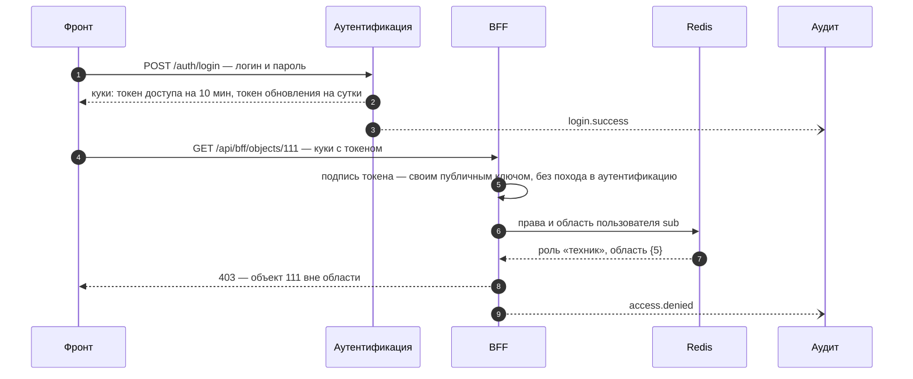

# Права доступа и аудит

Концепт для обсуждения с Гришей: как разделить учётки и права между сервисом аутентификации и BFF, как это может лежать в базе — в нескольких вариантах — и что писать в аудит. Опирается на [ТЗ §11](../ТЗ.md#28-нефункциональные-требования-11) (RBAC, LDAP/AD, журналирование всех действий пользователей), [ответ 15](../instructions/вопросы-и-ответы.md) (три уровня ролей и дерево объектов) и [разбор встречи 18.09](структура.md).

Это предложение, а не решение: принятые решения Гриша заносит в `decision.md`.

## Коротко

- **Сервис аутентификации отвечает на вопрос «кто это».** Хранит ид учётки, логин и хэш пароля, выпускает токены. О группах и правах ничего не знает.
- **BFF отвечает на вопрос «можно ли ему это и где».** Хранит профили, группы, роли, права и область видимости в дереве объектов.
- **В токене пользователя — только ид и логин.** Права BFF берёт из своей базы с кешем на минуту: перевели человека в другую группу — через минуту это работает, токены перевыпускать не нужно.
- **В токене техучётки — список разрешённых ей действий (`scope`).** Принимающий сервис проверяет его сам, без базы. Это ответ на открытый вопрос встречи, как разграничить права техучёток.
- **Аудит — два журнала.** Журнал запросов: каждый запрос, коротко, хранится недолго. Журнал действий: вход, отказы, заявки, решения, смена прав — подробно и долго.

## 1. Кто за что отвечает

| сервис | хранит | не хранит | проверяет |
|---|---|---|---|
| аутентификация | учётки: ид, логин, хэш пароля, вид учётки, `scope` техучёток | группы, права, ФИО, почту, токены | логин и пароль при входе, токен обновления |
| BFF | профили (ФИО, почта, чат в Telegram), группы, роли, права, область видимости, дерево объектов | пароли | право на действие и попадание объекта в область |
| dispatch, funnel, ML, notify | ничего о пользователях | — | подпись токена и `scope` техучётки |
| аудит | журнал запросов и журнал действий | — | — |

Ид пользователя (`sub`) выдаёт сервис аутентификации. BFF ссылается на него в своих таблицах без внешнего ключа: схемы принадлежат разным сервисам, и связывать их на уровне базы нельзя.



## 2. Что лежит в токенах

Токен доступа пользователя:

```json
{
  "iss": "tf-auth",
  "sub": "3f6c2a9e-8d1b-4c7a-9b0e-2f4d6a8c1e57",
  "typ": "access",
  "kind": "user",
  "login": "ivanov",
  "iat": 1789801200,
  "exp": 1789801800,
  "jti": "5b1e0c7d"
}
```

Токен техучётки:

```json
{
  "iss": "tf-auth",
  "sub": "0b7e4d21-6a3f-4e8c-a1d9-7c2b5e8f0a14",
  "typ": "access",
  "kind": "service",
  "login": "svc-bff",
  "scope": "notify.send audit.write",
  "iat": 1789801200,
  "exp": 1821337200
}
```

- `login` в токене — чтобы в аудите сразу было видно, кто это, без запроса в аутентификацию.
- Ролей и групп в токене пользователя нет сознательно: сервис аутентификации про группы не знает, а права, зашитые в токен, менялись бы только после его перевыпуска.
- `scope` есть только у техучёток: их права меняются редко, а принимающему сервису так не нужна своя база прав.
- Токен обновления отличается `typ: refresh` и сроком в сутки. При обновлении сервис аутентификации смотрит, не заблокирована ли учётка, — так блокировка срабатывает не позже чем через 10 минут, хотя токены нигде не хранятся.

## 3. Роли и права

### Действия пользователей

| код | что разрешает |
|---|---|
| `object.read` | видеть объекты, датчики и показания в своей области |
| `alert.read` | видеть тревоги и прогнозы |
| `ticket.read` | видеть заявки |
| `ticket.comment` | комментировать заявку, отметить «камеру посмотрел», подтвердить факт на объекте |
| `ticket.take` | взять заявку в работу — «кто первый, тот и ведёт» |
| `ticket.decide` | вынести решение с причиной из справочника и закрыть заявку |
| `ticket.create` | создать заявку вручную, например превентивную по прогнозу |
| `threshold.edit` | менять пороги датчиков |
| `markup.export` | выгружать разметку решений для дообучения модели |
| `user.manage` | заводить пользователей и группы, менять состав и область групп |
| `audit.read` | читать журнал аудита |

### Матрица ролей

| действие | техник | диспетчер района | центральный диспетчер | администратор |
|---|:-:|:-:|:-:|:-:|
| `object.read` | ✓ | ✓ | ✓ | ✓ |
| `alert.read` | ✓ | ✓ | ✓ | |
| `ticket.read` | ✓ | ✓ | ✓ | |
| `ticket.comment` | ✓ | ✓ | ✓ | |
| `ticket.take` | | ✓ | ✓ | |
| `ticket.decide` | | ✓ | ✓ | |
| `ticket.create` | | ✓ | ✓ | |
| `threshold.edit` | | | ✓ | |
| `markup.export` | | | ✓ | |
| `user.manage` | | | | ✓ |
| `audit.read` | | | | ✓ |
| **область** | один комплекс | несколько комплексов | всё предприятие | всё предприятие |

- Техник видит свой комплекс и может отметиться в заявке, но решение не выносит: по ответу 15 подтверждение на объекте делается на том же уровне, что и создание инцидента, то есть диспетчером.
- Дежурный инженер с планшетом — не отдельная роль, у него роль диспетчера (тот же ответ 15).
- Администратор нужен, чтобы кто-то заводил людей и группы; заявки он не ведёт. Он назван в самом вопросе 15, но среди трёх уровней ответа его нет.

### Действия техучёток

| код | кто вызывает | кто проверяет |
|---|---|---|
| `telemetry.push` | шина данных объекта (у нас — эмулятор) | funnel |
| `alert.push` | funnel, ML | dispatch |
| `ticket.push` | dispatch | BFF |
| `notify.send` | dispatch по плану или BFF — см. раздел 7 | notify |
| `audit.write` | все сервисы | аудит |

## 4. Область видимости: дерево объектов

В [справочнике объектов](../dataset/справочник_объектов_диспетчер.csv) три уровня: район `5773` «Район по эксплуатации» → 16 комплексов → 78 объектов (49 диспетчерских `controlHouse` и 29 охраняемых `guardObject`). Каналы датчиков привязаны к объектам через `ид_объект`.

Правило одно: **доступ к узлу дерева даёт доступ ко всему, что под ним.** Группе назначается набор узлов, и этого хватает для всех трёх уровней:

| группа | роль | узлы | что видит |
|---|---|---|---|
| Техники объекта Альфа | техник | `5` | комплекс «объект Альфа» и 5 объектов под ним: `5122` «ДУ объект Альфа», `5123` «ДП объект Альфа» и другие |
| Диспетчеры района Север | диспетчер района | `5`, `6`, `7` | комплексы Альфа, Бета, Гамма и 13 объектов под ними |
| Центральная диспетчерская | центральный диспетчер | `5773` | всё предприятие |

Район в данных один, поэтому для показа разницы между уровнями «район» — это набор комплексов. Когда появятся настоящие районы, группе диспетчеров назначается узел района, и больше ничего менять не нужно.

Проверять «объект внутри области» быстрее всего по заранее посчитанному пути от корня: у объекта `5122` путь `{5773, 5, 5122}`, он пересекается с областью `{5}` — значит, доступ есть. Путь считается один раз при загрузке справочника.

## 5. Таблицы

SQL ниже — для PostgreSQL и показывает, к какой структуре прийти. Сами таблицы по-прежнему генерирует миграция по классам в коде (разбор встречи, раздел 10).

### 5.1. Сервис аутентификации

**Вариант А — минимум, как на встрече.** Логин и хэш пароля, больше ничего.

```sql
create table auth.accounts (
    id            uuid primary key default gen_random_uuid(),
    login         text not null unique,
    password_hash text not null
);
```

Работает, но заблокировать человека можно, только удалив учётку, а техучётку от пользователя не отличить.

**Вариант Б — с признаками учётки. Предлагаю его.**

```sql
create table auth.accounts (
    id                  uuid primary key default gen_random_uuid(),
    login               text not null unique,
    password_hash       text,                          -- argon2id; пусто у техучёток
    kind                text not null default 'user'
                        check (kind in ('user', 'service')),
    scope               text[] not null default '{}',  -- права техучётки: {notify.send, audit.write}
    is_active           boolean not null default true, -- смотрим при каждом обновлении токена
    failed_logins       smallint not null default 0,
    locked_until        timestamptz,                   -- после 5 неудачных попыток — на 15 минут
    password_changed_at timestamptz,
    created_at          timestamptz not null default now()
);
```

**Вариант В — учётка отдельно от способа входа.** Нужен, когда появится вход через AD: у одной учётки может быть и пароль, и привязка к каталогу.

```sql
create table auth.accounts (
    id         uuid primary key default gen_random_uuid(),
    login      text not null unique,
    kind       text not null default 'user',
    scope      text[] not null default '{}',
    is_active  boolean not null default true,
    created_at timestamptz not null default now()
);

create table auth.credentials (
    account_id  uuid not null references auth.accounts on delete cascade,
    method      text not null check (method in ('password', 'ldap')),
    secret      text,         -- хэш пароля для password
    external_id text,         -- DN или objectGUID учётки в AD для ldap
    primary key (account_id, method)
);
```

ТЗ требует поддержки LDAP/AD, но каталога заказчика у нас нет. Разумно начать с варианта Б и перейти на В, если дойдёт до подключения AD: переход — одна миграция.

### 5.2. BFF: общая часть

Дерево объектов и профили нужны при любом варианте прав:

```sql
create table bff.objects (
    id        bigint primary key,       -- ид_объект из справочника
    parent_id bigint,
    level     smallint not null,
    kind      text not null,            -- district, controlHouse, guardObject
    name      text not null,
    path      bigint[] not null         -- от корня до себя: {5773, 5, 5122}
);
create index on bff.objects using gin (path);

create table bff.user_profiles (
    user_id          uuid primary key,  -- sub из сервиса аутентификации
    full_name        text not null,
    email            text,
    telegram_chat_id bigint,            -- куда слать уведомления в Telegram
    created_at       timestamptz not null default now()
);
```

### 5.3. BFF: группы, роли и права

**Вариант 1 — группа и есть роль.** Как сказал Гриша на встрече: группа — строка со списком пользователей, права вешаются прямо на неё.

```sql
create table bff.groups (
    id   serial primary key,
    name text not null unique
);
create table bff.group_permissions (
    group_id   int  not null references bff.groups on delete cascade,
    permission text not null,           -- 'ticket.decide'
    primary key (group_id, permission)
);
create table bff.group_members (
    group_id int  not null references bff.groups on delete cascade,
    user_id  uuid not null,
    primary key (group_id, user_id)
);
create table bff.group_objects (
    group_id  int    not null references bff.groups on delete cascade,
    object_id bigint not null references bff.objects,
    primary key (group_id, object_id)
);
```

Плюс: четыре таблицы, всё видно сразу. Минус: у пяти районных групп одинаковый набор прав повторяется пять раз, и поменять права диспетчера района — значит поправить каждую группу. Опечатку в коде действия база не поймает.

**Вариант 2 — роль отдельно от группы. Предлагаю его.** Роль отвечает на вопрос «что можно», группа — «кому и где».

```sql
create table bff.permissions (
    code        text primary key,       -- 'ticket.decide'
    description text not null
);
create table bff.roles (
    id   smallint primary key,
    code text not null unique,          -- technician, district_dispatcher, central_dispatcher, admin
    name text not null                  -- «Техник»
);
create table bff.role_permissions (
    role_id    smallint not null references bff.roles,
    permission text     not null references bff.permissions,
    primary key (role_id, permission)
);
create table bff.groups (
    id           serial   primary key,
    name         text     not null unique,  -- «Диспетчеры района Север»
    role_id      smallint not null references bff.roles,
    external_ref text,                      -- группа в AD, когда подключим каталог
    created_at   timestamptz not null default now()
);
create table bff.group_members (
    group_id int  not null references bff.groups on delete cascade,
    user_id  uuid not null,
    added_by uuid,
    added_at timestamptz not null default now(),
    primary key (group_id, user_id)
);
create table bff.group_objects (
    group_id  int    not null references bff.groups on delete cascade,
    object_id bigint not null references bff.objects,
    primary key (group_id, object_id)
);
```

Плюс: права роли правятся в одном месте, коды действий защищены внешним ключом — опечатка не пройдёт. Пользователь может состоять в нескольких группах, например быть техником двух комплексов. Минус: на две таблицы больше.

**Вариант 3 — компактный, на массивах PostgreSQL.**

```sql
create table bff.roles (
    code        text primary key,       -- technician
    name        text not null,
    permissions text[] not null         -- {object.read, alert.read, ticket.read, ticket.comment}
);
create table bff.groups (
    id         serial   primary key,
    name       text     not null unique,
    role_code  text     not null references bff.roles,
    object_ids bigint[] not null        -- {5, 6, 7}
);
create table bff.group_members (
    group_id int  not null references bff.groups on delete cascade,
    user_id  uuid not null,
    primary key (group_id, user_id)
);
```

Плюс: три таблицы, быстрее всего сделать. Минус: база не проверяет ни коды действий, ни ид объектов внутри массивов, а ORM, которые генерируют таблицы по классам, работают с массивами хуже, чем с обычными связями.

**Вариант 4 — задел под ABAC.** Поверх варианта 2 права вешаются не только на роль, но и на конкретный объект: у объекта или датчика появляется владелец. На встрече это описали как «колонки с ид групп и их правами в таблице датчиков»; отдельная таблица удобнее колонок, потому что владельцев бывает несколько.

```sql
create table bff.object_acl (
    object_id  bigint not null references bff.objects,
    group_id   int    not null references bff.groups on delete cascade,
    permission text   not null references bff.permissions,
    primary key (object_id, group_id, permission)
);
```

Сейчас не нужен: трёх уровней и дерева объектов хватает (ответ 15).

| вариант | таблиц на права | где меняются права роли | база проверяет коды и объекты | сложность |
|---|:-:|---|:-:|---|
| 1. группа = роль | 4 | в каждой группе | частично: объекты да, коды нет | низкая |
| 2. роль + группа | 6 | в одном месте | да | средняя |
| 3. массивы | 3 | в одном месте | нет | низкая |
| 4. ABAC поверх 2 | 7 | в роли и на объекте | да | высокая |

### 5.4. Как BFF проверяет право

Один запрос для варианта 2 — может ли пользователь выполнить действие над объектом:

```sql
select exists (
    select 1
    from bff.group_members    gm
    join bff.groups           g  on g.id = gm.group_id
    join bff.role_permissions rp on rp.role_id = g.role_id
                                and rp.permission = :permission
    join bff.group_objects    go on go.group_id = g.id
    join bff.objects          o  on o.id = :object_id
    where gm.user_id = :user_id
      and go.object_id = any (o.path)
);
```

Для списков — все объекты, которые видит пользователь, — те же соединения отдают узлы области, а объекты выбираются условием `path && :узлы`.

Итог по пользователю — права и узлы области — BFF кладёт в Redis на 60 секунд. Когда администратор меняет состав или область группы, кеш её участников сбрасывается сразу.

### 5.5. Пример: три пользователя и их запросы

Данные для варианта 2 (ид пользователей сокращены):

```sql
insert into bff.roles values
    (1, 'technician',          'Техник'),
    (2, 'district_dispatcher', 'Диспетчер района'),
    (3, 'central_dispatcher',  'Центральный диспетчер'),
    (4, 'admin',               'Администратор');

insert into bff.groups (id, name, role_id) values
    (10, 'Техники объекта Альфа',     1),
    (20, 'Диспетчеры района Север',   2),
    (30, 'Центральная диспетчерская', 3);

insert into bff.group_objects values
    (10, 5),
    (20, 5), (20, 6), (20, 7),
    (30, 5773);

insert into bff.group_members (group_id, user_id) values
    (10, '3f6c…'),  -- Иванов, техник
    (20, '9a41…'),  -- Петрова, диспетчер района
    (30, 'c7d2…');  -- Сидоров, центральный диспетчер
```

Заявка `1042` — по тревоге на объекте `5122` «ДУ объект Альфа».

| кто | запрос | ответ | почему | журнал действий |
|---|---|:-:|---|---|
| Иванов, техник | `GET /api/bff/objects/5122` | 200 | `5122` под комплексом `5` | — (только журнал запросов) |
| Иванов | `GET /api/bff/objects/111` | 403 | «ДП объект Бета» под комплексом `6`, его нет в области | `access.denied` |
| Иванов | `POST /api/bff/tickets/1042/take` | 403 | объект в области, но у техника нет `ticket.take` | `access.denied` |
| Петрова, диспетчер района | `POST /api/bff/tickets/1042/take` | 200 | право есть, объект заявки в районе | `ticket.taken` |
| Петрова | `POST /api/bff/tickets/1042/decision` | 200 | право есть, заявку ведёт она | `ticket.decided` с причиной |
| Сидоров, центральный | `PATCH /api/bff/sensors/196771/threshold` | 200 | `threshold.edit` есть только у центрального | `threshold.changed`: было и стало |
| BFF, техучётка `svc-bff` | `POST notify/mail` | 200 | в `scope` есть `notify.send` | `notify.sent` |

## 6. Аудит

ТЗ требует «журналирование всех действий пользователей» (§11). В задачах Ф4 проверка такая: пройти сценарий диспетчера, найти в аудите все его шаги и убедиться, что рабочая учётка не может править журнал.

### 6.1. Два журнала

| | журнал запросов | журнал действий |
|---|---|---|
| что | каждый запрос в каждый сервис | значимые события: вход, отказы, заявки, решения, смена прав, рассылки |
| кто пишет | модуль безопасности, сам, строкой на запрос | код сервиса, там, где событие случилось |
| подробность | метод, маршрут, код ответа, время ответа, кто | кто, над чем, результат, подробности: было и стало, причина |
| объём | тысячи строк в час | десятки–сотни в час |
| хранить | 90 дней | не меньше года — это история решений диспетчеров |

Журнал запросов отвечает на вопрос «кто и куда стучался», журнал действий — «кто что сделал и решил». Ценность у них разная, поэтому и хранить их одинаково либо дорого, либо бесполезно.

Оценка объёма: 20 одновременных пользователей по запросу в 5 секунд за 8-часовую смену — около 115 тысяч строк журнала запросов в сутки. Для PostgreSQL с партициями по месяцам это немного.

### 6.2. Какие события пишем в журнал действий

| событие | кто пишет | что в подробностях |
|---|---|---|
| `login.success` | аутентификация | способ входа |
| `login.failure` | аутентификация | причина: неверный пароль, нет такого логина, учётка заблокирована; логин, как его ввели |
| `account.locked` | аутентификация | число неудачных попыток, до какого времени |
| `token.refreshed` | аутентификация | — |
| `token.refused` | любой сервис | подпись не сошлась, чужой издатель, не хватает `scope` — похоже на атаку, пишем всегда |
| `access.denied` | любой сервис | какое право требовалось, объект, причина: нет права или объект вне области |
| `ticket.created` | BFF | источник: тревога, прогноз ML, вручную; объект; вероятность |
| `ticket.taken` | BFF | — |
| `ticket.commented` | BFF | комментарий, отметка «камеру посмотрел» |
| `ticket.decided` | BFF | решение, код причины из справочника, комментарий |
| `threshold.changed` | BFF | датчик, было, стало |
| `markup.exported` | BFF | период, число строк |
| `user.created`, `user.blocked` | аутентификация | кто сделал |
| `group.changed` | BFF | состав или область: было, стало |
| `role.changed` | BFF | права роли: было, стало |
| `notify.sent`, `notify.failed` | notify | канал (почта или Telegram), число адресатов, тема, заявка, причина отказа |
| `telemetry.rejected` | funnel | почему не принята пачка показаний |

Протухший токен доступа в журнал действий **не пишем**. Фронт обновляет токен каждые 10 минут у каждого пользователя — это штатная работа, а не событие; на встрече заметили, что таких записей будет очень много. Они остаются в журнале запросов строками с кодом 401.

### 6.3. Чего не пишем никогда

- пароли, даже неверные, и токены целиком — только `jti`;
- куки и заголовок `Authorization`;
- тела запросов целиком — только поля, перечисленные в таблице выше;
- текст писем и сообщений в Telegram — только тему и число адресатов.

### 6.4. Таблицы

```sql
create table audit.events (
    id          bigint generated always as identity,
    occurred_at timestamptz not null,           -- когда случилось, по часам сервиса
    received_at timestamptz not null default now(),
    service     text not null,                  -- auth, bff, dispatch, funnel, ml, notify
    event_type  text not null,                  -- ticket.decided
    outcome     text not null check (outcome in ('success', 'denied', 'error')),
    actor_kind  text not null check (actor_kind in ('user', 'service', 'anonymous')),
    actor_id    uuid,                           -- sub из токена
    actor_login text,                           -- логин на момент события
    request_id  text,                           -- X-Request-ID от nginx: связывает цепочку вызовов
    ip          inet,
    object_type text,                           -- ticket, sensor, group
    object_id   text,
    area_id     bigint,                         -- узел дерева объектов, к которому относится событие
    details     jsonb not null default '{}',
    primary key (id, occurred_at)
) partition by range (occurred_at);

create index on audit.events using brin (occurred_at);
create index on audit.events (actor_id, occurred_at);
create index on audit.events (object_type, object_id);

create table audit.requests (
    occurred_at timestamptz not null,
    service     text     not null,
    method      text     not null,
    route       text     not null,             -- шаблон маршрута: /tickets/{id}/take
    status      smallint not null,
    duration_ms integer  not null,
    actor_kind  text     not null,
    actor_id    uuid,
    request_id  text,
    ip          inet
) partition by range (occurred_at);

create index on audit.requests using brin (occurred_at);
```

- Партиции по месяцам, как в [плане](../../tasks/plan.md): месяц журнала запросов, которому вышел срок, удаляется целиком одной командой `drop table`, без медленного `delete`.
- В журнале запросов пишется шаблон маршрута, а не адрес с параметрами: так в журнал не попадут значения из строки запроса.
- `area_id` пригодится, если диспетчер района будет смотреть аудит своего района: область проверяется так же, как для объектов.

### 6.5. Как события доезжают до аудита

**Вариант А — HTTP.** Сервис шлёт пачку событий `POST /audit/events` с токеном техучётки (`audit.write`). Просто, но если аудит лёг, каждому сервису приходится копить события у себя.

**Вариант Б — поток в Redis. Предлагаю его.** Сервис кладёт событие в поток Redis (`XADD audit …`) и сразу работает дальше; сервис аудита читает поток группой потребителей и пишет в базу пачками. Лёг аудит — события ждут в Redis и доедут, когда он поднимется. Redis в контуре уже запланирован ([задачи Ф1](../../tasks/todo.md)), ему нужно только включить сохранение на диск (AOF).

В обоих вариантах `request_id` проставляет nginx (`$request_id`), и каждый сервис передаёт его дальше в заголовке `X-Request-ID`. Тогда одна тревога прослеживается по всей цепочке: funnel → dispatch → BFF → notify.

### 6.6. Защита журнала

- Сервисы не ходят в базу аудита напрямую: пишет только сервис аудита.
- Его учётка в базе может добавлять и читать, но не менять и не удалять:

  ```sql
  grant usage on schema audit to audit_writer;
  grant insert, select on all tables in schema audit to audit_writer;
  revoke update, delete, truncate on all tables in schema audit from audit_writer;
  ```

- Старые партиции удаляет только административная учётка — тот же конфигурационный контейнер, что прогоняет миграции.
- Если понадобится доказать, что журнал не правили задним числом, в каждую строку `audit.events` добавляется хэш предыдущей строки: подмена любой записи рвёт цепочку. Для хакатона это лишнее, но на защите можно упомянуть.

### 6.7. Пример: сценарий диспетчера в журнале действий

Тревога газового датчика на объекте «ДУ объект Альфа», Петрова закрывает её как ложное срабатывание:

| время | сервис | событие | кто | подробности |
|---|---|---|---|---|
| 03:12:40 | BFF | `ticket.created` | `svc-dispatch` | заявка 1042, источник — тревога |
| 03:12:41 | notify | `notify.sent` | `svc-bff` | почта, 3 адресата |
| 03:12:41 | notify | `notify.sent` | `svc-bff` | Telegram, 3 адресата |
| 03:13:58 | BFF | `access.denied` | `ivanov` | нужно `ticket.take`, у техника его нет |
| 03:14:05 | BFF | `ticket.taken` | `petrova` | — |
| 03:21:30 | BFF | `ticket.decided` | `petrova` | ложное срабатывание, пар из люка |

Последняя запись целиком:

```json
{
  "occurred_at": "2026-09-25T03:21:30+03:00",
  "service": "bff",
  "event_type": "ticket.decided",
  "outcome": "success",
  "actor_kind": "user",
  "actor_id": "9a41d3c8-2b7e-4f15-8c6a-0e3b9d7f2a64",
  "actor_login": "petrova",
  "request_id": "e81b07c4f2a9",
  "ip": "10.0.12.7",
  "object_type": "ticket",
  "object_id": "1042",
  "area_id": 5122,
  "details": {
    "decision": "ложное срабатывание",
    "reason_code": "steam",
    "comment": "пар из люка, по камере подтвердила"
  }
}
```

## 7. Что нужно решить

- Какие варианты таблиц берём. Предлагаю Б для аутентификации и 2 для BFF.
- Права техника: хватит ли просмотра и комментария или ему тоже нужно брать заявки в работу.
- Кто рассылает уведомления. В [плане](../../tasks/plan.md) — dispatch, но адреса групп лежат в BFF, поэтому естественнее рассылать из BFF.
- Срок токенов техучёток. На встрече решили — год, но утёкший токен тогда год и работает, а отозвать его можно только сменой ключей. Можно выпускать на месяц и перевыпускать автоматически.
- Роль аналитика. В сценариях ТЗ (§12) он есть, в ответе 15 — нет.
- Сроки хранения журналов. 90 дней и год — предложение, в ТЗ сроков нет.
