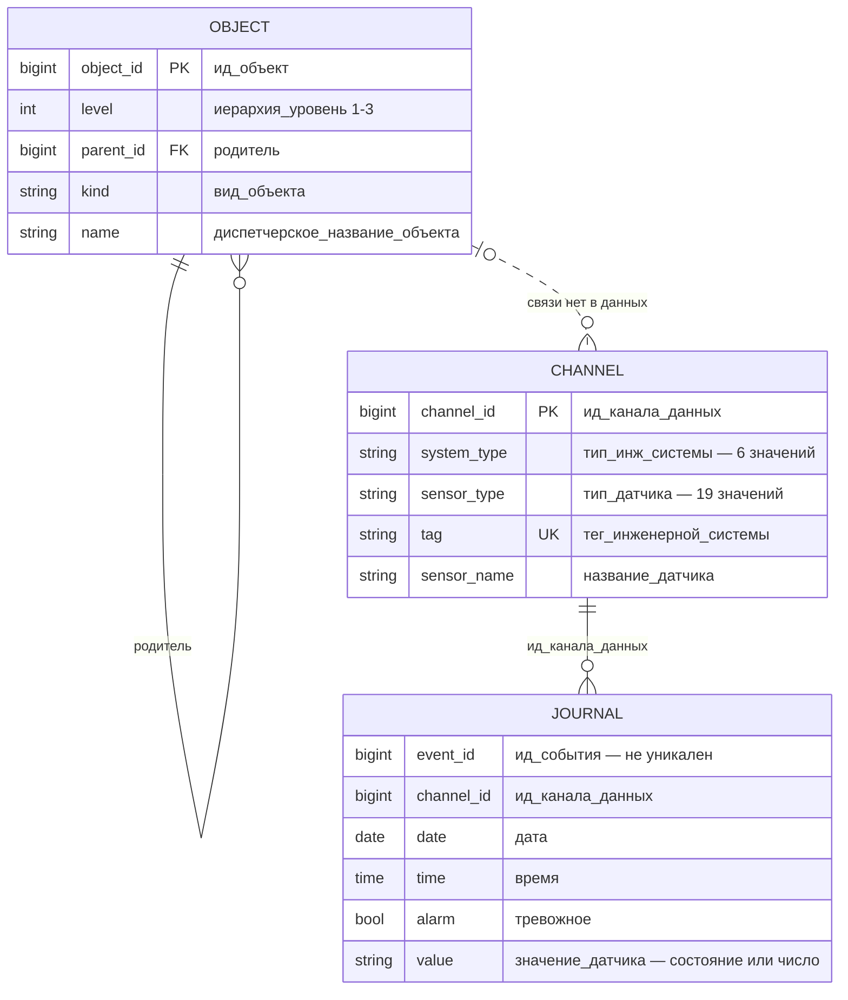
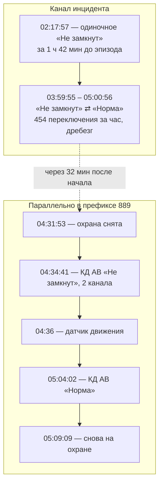
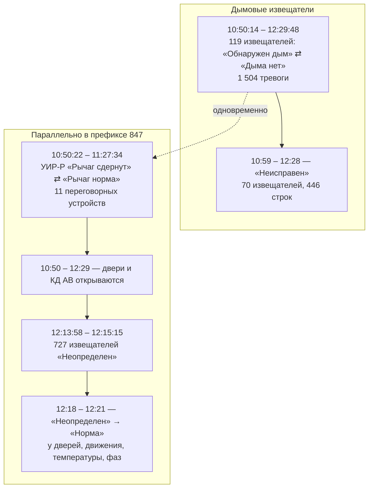
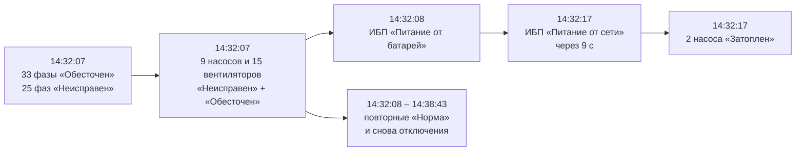

# Первичный анализ датасета

Обзор полного журнала за 01.01.2019 — 30.06.2026: 313,5 млн строк, 12 627 каналов. Выполнен 15.09.2026.

Состав и формат файлов — в [описание.md](описание.md). Все цифры можно пересчитать запросами из [запросы.sql](запросы.sql).

> Это **стартовая точка** для [TF-1](../../tasks/TF-1.md) (структура, шумы, прецеденты, справочник, ER-диаграммы случаев) и [TF-3](../../tasks/TF-3.md) (алгоритм порогов, отсев шума). Всё, что помечено как **гипотеза**, проверяем **на данных**: вопросов организаторам не задаём (решение от 16.09), поэтому непроверенное честно помечаем в документации.

## Главное

1. **Журнал пишет события, а не равномерный ряд.** Дискретные каналы пишут при смене состояния, газ — примерно раз в 7 секунд, температура — примерно раз в 1,5 часа. Поэтому если канал молчит, это ещё не значит, что он сломался.
2. **88% строк — газ и движение.** Газовые датчики дают 71% журнала, датчики движения — 16%. Тревожных строк всего 0,79%.
3. **Флаг `тревожное` — ненадёжная разметка.** Одно и то же состояние в одни годы помечено тревогой, в другие нет: «Обнаружен дым» в 2023 г. помечен тревогой в 7% случаев, в 2026 г. — в 100%. Использовать флаг как «правду» для обучения нельзя.
4. **Тревоги сильно сконцентрированы.** 100 каналов из 10 823 дали 57,6% всех тревожных строк. Один неисправный шлейф — 77 дымовых извещателей `847-1.1.58.*` — за 48 дней 2021 г. дал 1,04 млн тревог. Это 42% всех тревог за 7,5 лет.
5. **У числовых показаний флаг тревоги не выставлен ни разу.** Пороги газа и температуры в журнале видны только через текстовые состояния того же канала: «Обнаружен газ», «Температура выше 40ºC», «В норме от +3 до +40».
6. **Много массовых событий.** «Неопределен» в 64,5% случаев приходит пачкой: 20 и больше каналов одного префикса в одну минуту. У «Обнаружен дым» 74% эпизодов идут вместе с 10 и больше соседними извещателями. Это кандидаты в системный шум.
7. **Связи «канал → объект» нет.** 1 142 канала из журнала отсутствуют в справочнике, это 9,4 млн строк и 6% тревог. Поле `ид_события` не уникально.
8. **Потеря данных:** 06–10.04.2024 журнал почти пустой, 07–08.04.2024 и 01.06.2026 записей нет совсем.

## Схема данных

## Объём и деградация

**Число каналов растёт, это не деградация.** Первое появление каналов в журнале по годам: 2019 — 5 622, 2020 — +1 784, 2021 — +1 521, 2022 — +2 456, 2023 — +117, 2024 — +14, 2025 — +1 111. До 2022 г. сеть покрыта частично.

**Объём по месяцам** — от 1,1 млн строк (01.2019) до 5,5 млн (04.2026). Заметные провалы и всплески:

| Период | Что видно | Причина |
|---|---|---|
| 05.2021 | 827 795 тревог за месяц при обычных 10–30 тыс. | зацикленная неисправность одного шлейфа, см. [Н3](#кандидаты-в-шум) |
| 02.2020 | 101 129 тревог | не разбиралось |
| 09.2022 — 10.2023 | 2,0–3,0 млн строк в месяц против 4–5 млн | не разбиралось |
| 06–10.04.2024 | 07 и 08 числа записей нет, 06 и 09 — меньше 5 тыс. строк | **потеря данных** |
| 01.06.2026 | нет записей | **потеря данных** |

**Замолчавшие каналы:** 1 180 каналов не пишут с начала 2026 г., из них 1 134 — с начала 2025 г.

**Частота записи по типам** (март 2026, медиана интервала между записями канала):

| Тип | Медиана | 90-й перцентиль |
|---|---:|---:|
| Газовый датчик | 7 с | 2 мин |
| Датчик движения | 4 с | 78 с |
| Состояние УИР-Р | 27 с | 7 мин |
| КД Дверь | 26 с | 3,2 ч |
| Состояние насоса | 3 мин | 46 мин |
| Датчик дыма | 4 мин | 4,2 сут |
| Датчик температуры | 1,6 ч | 2,2 сут |
| Состояние фазы | 2,4 ч | 2,3 сут |

Правило «канал замолчал» задавать **по типу**. Газ, который молчит 10 минут, — подозрительно; дымовой извещатель, который молчит сутки, — норма.

**Предварительный вывод:** для модели брать 2022–2026 гг., когда сеть покрыта почти полностью, и исключать 06–10.04.2024. Прецеденты можно искать за все годы.

## Целостность

| Проверка | Результат |
|---|---|
| Строки журнала с каналом, которого нет в справочнике | **9 439 854** строки (3,0%), **1 142** канала, 151 740 тревог. Последняя запись 18.03.2026 |
| Каналы справочника без записей | 0 |
| Повторы `ид_события` | 6 007 323 ID встречаются больше одного раза. 3 792 870 из них — в разных годовых файлах, это **разные события** с одним ID. 545 185 ID — полные дубли строк |
| Строки, совпадающие по каналу, времени, флагу и значению | 955 591 лишняя строка, включая полные дубли |
| Несколько состояний канала в одну секунду | 584 855 пар «канал + время» только за 2026 г. Порядок внутри секунды — по `ид_события` |
| Непарсящиеся даты | 1 строка — повтор заголовка внутри `ext-journal-2025.csv` |

> Уникального ключа у журнала нет. Для работы — `(ид_канала_данных, дата, время, ид_события)`.

## Состояния и флаг тревоги

Одно поле `значение_датчика` хранит и состояние, и число. **Смысл состояния зависит от типа датчика.** Например, «Не замкнут» у КД Люк — тревога в 99,9% случаев, у КД Дверь — в 1,7%, у датчика движения — в 0,2%.

| Состояние | Доля строк с флагом тревоги по типам |
|---|---|
| **Неисправен** | 89–100%: дым, насос, вентилятор, фаза, ИБП, ручной извещатель, КД АВ/Люк, температура, газ. **Ниже:** движение 65%, УИР-Р 40%, КД Дверь 18% |
| **Отключено устройство** | ~100% у большинства. **Ниже:** газ 89%, дым 86%, УИР-Р 77%, КД Дверь 50%, движение 31% |
| **Не замкнут** | затопление 99,8%, КД Люк 99,9%, 9-секционный люк 100%, КД АВ 96%, стекло 91%. **Ниже:** тепловой 60%, ручной 36%, дым 15%, УИР-Р 11%, КД Дверь 1,7%, движение 0,2% |
| **Обесточен** | насос 89%, вентилятор 90%. Фаза — **0%**: это обычное состояние |
| **Затоплен** (насос) | 86% |
| **Работают все насосы в АНС** | 99,5% |
| **Питание от батарей** (ИБП) | 99%; «Батарея разряжена» — 90%; «Батарея неисправна» — **0%** |
| **Обнаружен дым** | 26%, сильно зависит от года — см. ниже |
| **Обнаружен газ** | 57% |
| **Температура ниже 3ºC / выше 40ºC / Не определено** | 88% / 77% / 89% |
| **Рычаг сдернут** | УИР-Р 13%, ручной извещатель 10% |
| **Обнаружено движение** | 0,8% |
| **Много неисправных устройств** (охрана) | 99,6% |
| Норма, Неопределен, Включен, Выключен, Есть питание, Питание от сети, Дыма нет, Движения нет, Вызов, Разговор, Рычаг норма, На охране, Снято с охраны, В норме от +3 до +40, **все числа** | 0% |

**Флаг меняет смысл со временем.** Доля «Обнаружен дым» с флагом тревоги по годам: 2019 — 34%, 2020 — 50%, 2021 — 15%, 2022 — 12%, 2023 — 7%, 2024 — 10%, 2025 — 30%, 2026 — 100%. По префиксам разброс от 11% до 100%. **Гипотеза:** менялись настройки системы или режимы объектов (на охране / снято). **Как проверить на данных:** сопоставить долю тревог у «Обнаружен дым» с состоянием «На охране» / «Снято с охраны» того же префикса в то же время; если связи нет — дело в настройках системы, и тогда флаг тем более не разметка.

### Числовые каналы

| Тип | Строк | Диапазон основной массы | Подозрительные значения |
|---|---:|---|---|
| Газовый датчик | 223 065 444 | 99,1% в 0–0,5, медиана 0,01. Единица измерения не указана | < 0: 1,68 млн строк на 45 каналах, минимум −10,23. Ровно 327,68 — 5 строк: похоже на код ошибки 32768/100 |
| Датчик температуры | 1 064 234 | 98,7% в −40…+80 °C, медиана 18 | ≤ −100: 8 332 строки на 382 каналах, чаще всего **−127**, минимум **−3276**. От +81 до +819: 2 913 строк, чаще всего 128. 999 и 928 — 14 строк |
| ИБП | 4 721 | 0–100, медиана 5 | смысл числа не ясен |

**Пороги, заданные самой системой:**

- **температура:** текстовые состояния «Температура ниже 3ºC», «В норме от +3 до +40», «Температура выше 40ºC» — норма **+3…+40 °C**. У 590 из 600 температурных каналов есть и числа, и эти состояния.
- **газ:** в 2025–2026 гг. в окне ±5 минут вокруг «Обнаружен газ» медиана показаний того же канала — **0,88** против общей медианы 0,01, максимум 27,66. Порог выводится из данных — это [TF-3, шаг 2](../../tasks/TF-3.md).

## Кандидаты в шум

Эпизод — подряд идущие тревожные строки одного канала с одним значением и паузой не больше 1 часа.

| # | Вид | Правило обнаружения (черновик) | Масштаб | Пример |
|---|---|---|---|---|
| Н1 | **Импульсы движения** | «Обнаружено движение» → «Движения нет» того же канала за ≤ 10 с | 25,5 млн пар, 16% журнала. Медиана длительности 3,9 с, тревогой помечено 0,8% | любой датчик движения |
| Н2 | **Массовое «Неопределен»** | ≥ 20 каналов одного префикса получают «Неопределен» в одну минуту | 64,5% всех «Неопределен». 25 940 минут с ≥ 50 каналами, максимум 1 449 каналов. Затем «Норма» с медианой через 20 с | [случай 2](#случай-2-массовое-обнаружен-дым-847-05032026) в 12:13 |
| Н3 | **Дребезг и зацикленная неисправность** | > N смен состояния канала за час; «Неисправен» повторяется много раз за эпизод | «Неисправен» у дыма — 78 строк на эпизод, у температуры — 199. Шлейф `847-1.1.58.*` за 21.04–08.06.2021 выдал 1 035 645 «Неисправен» — до 13,8 тыс. на каждый из 77 извещателей | [случай 1](#случай-1-затопление-889-05052024): 454 переключения за час |
| Н4 | **Хронически шумные каналы** | доля канала в тревогах за период выше порога | 100 каналов = 57,6% тревог. Лидер — `228541` «ОД АВ ПК247+3», 46 248 тревог за 67 дней | `228571` ТЕМП ПК275+9 — 40 078 «Неисправен» |
| Н5 | **Значения-заглушки** | температура вне −40…+80, газ < 0 или = 327,68 | температура — 13,7 тыс. строк, газ — 1,68 млн | −127, −3276, 999, 327,68 |
| Н6 | **Дубли** | совпадают канал, время, флаг и значение | 955 591 строка | — |
| Н7 | **Скачок питания** | ≥ 10 эпизодов «Обесточен» / «Питание от батарей» / «Неисправен» в одном префиксе за минуту | 10 619 таких минут | [случай 3](#случай-3-скачок-питания-645-16092025) |
| Н8 | **Массовое «Обнаружен дым»** | ≥ 10 извещателей одного префикса за ±10 мин | 74% эпизодов дыма. Одиночных — 10%. В 53 из 106 крупных пачек за 30 мин до них было событие питания | [случай 2](#случай-2-массовое-обнаружен-дым-847-05032026) |
| Н9 | **Нулевая дата** | значение «Состояние охраны» = `01.01.1970 …` | 80 465 строк | — |

> Н8 — **гипотеза**. Пачка может быть и реальным задымлением, и проверкой извещателей при ТО. **Как проверить на данных:** сравнить пачки по времени суток и дню недели (ТО — рабочее время), по наличию параллельных УИР-Р и открытых дверей (люди на объекте), по событиям питания за 30 минут до. Если пачки в рабочее время идут с людьми на объекте, а ночные — без, гипотеза подтверждается.

## Инциденты по годам

Число эпизодов по состояниям, которые похожи на реальные события:

| Год | Затоплен (насос) | Датчик затопления | Обнаружен дым | Обнаружен газ | Темп. > 40 °C | ИБП на батареях | Обесточен (насос, вентилятор) | Рычаг сдернут | Люки: все тревоги |
|---|---:|---:|---:|---:|---:|---:|---:|---:|---:|
| 2019 | 12 110 | 48 | 968 | 1 186 | 106 | 974 | 10 503 | 560 | 351 |
| 2020 | 7 405 | 58 | 3 489 | 670 | 187 | 913 | 17 580 | 335 | 357 |
| 2021 | 8 430 | 47 | 1 536 | 683 | 327 | 2 197 | 18 893 | 184 | 359 |
| 2022 | 6 277 | 124 | 2 329 | 728 | 51 | 2 330 | 19 665 | 248 | 380 |
| 2023 | 4 736 | 133 | 817 | 592 | 136 | 1 779 | 17 265 | 79 | 389 |
| 2024 | 4 260 | 125 | 1 221 | 483 | 129 | 1 701 | 17 599 | 229 | 454 |
| 2025 | 5 388 | 105 | 5 110 | 712 | 333 | 1 348 | 23 265 | 649 | 373 |
| 2026 (янв–июн) | 4 043 | 63 | 9 288 | 525 | 20 | 914 | 19 138 | 1 612 | 260 |

Большинство эпизодов — одна строка: у «Затоплен» 48 455 из 50 916. Сколько из них настоящие инциденты, по журналу не понять — в данных нет подтверждений диспетчера и нарядов. **Прецеденты для [TF-1](../../tasks/TF-1.md) отбирать через параллельные события**, как в случаях ниже.

## Что происходит параллельно: три случая

Параллельными считаются события каналов **того же префикса тега** в том же окне времени. Префикс объединяет сотни каналов, поэтому совпадение по времени — ещё не причинная связь. Эти случаи — образец для ER-диаграмм [TF-1](../../tasks/TF-1.md).

### Случай 1. Затопление, 889, 05.05.2024

Канал `268814` «Затопление ПК0», тег `889-1.1.201.8.`.

**Как читать.** Через полчаса после начала тревоги на объект пришли люди: сняли охрану, открыли двери, сработал датчик движения. Дребезг затопления прекратился в 05:00, через 4 минуты закрыли двери, ещё через 5 минут объект поставили на охрану. **Выезд виден в данных** через охрану, двери и движение — это признак реакции на инцидент. Температура за 24 часа до события: +8…+9 °C, предвестников не видно.

### Случай 2. Массовое «Обнаружен дым», 847, 05.03.2026

Префикс `847`, шлейфы `847-1.1.58.*` и `847-1.1.59.*`, пикеты ПК253–ПК302.

**Как читать.** Дневное время. Тревоги дыма синхронны с использованием переговорных устройств УИР-Р, то есть на объекте работают люди. Около 12:14 весь префикс переинициализирован: массовое «Неопределен» → «Норма». **Гипотеза:** плановая проверка извещателей или работы с пылью. Кандидат в ложное срабатывание **Н8**. **Как проверить на данных:** посмотреть, повторяются ли такие пачки на том же префиксе с регулярностью (раз в месяц, квартал) и всегда ли в рабочее время с параллельными УИР-Р.

### Случай 3. Скачок питания, 645, 16.09.2025

Префикс `645`.

**Как читать.** Питание пропало примерно на 10 секунд и за одну секунду дало десятки тревог «Неисправен» и «Обесточен». Сразу после возврата питания два насоса сообщили «Затоплен». **Гипотеза:** «Затоплен» — побочный эффект перезапуска, а не подтопление. Такие пачки нужно сворачивать в одно событие «скачок питания» (**Н7**), а не показывать диспетчеру 50 тревог.

## Открытые вопросы

Задать их некому — вопросы организаторам не задаём (решение от 16.09). Поэтому список работает иначе: что можем — проверяем на данных, остальное идёт в раздел «Чего мы не знаем» сопроводительной документации. План проверок — в [tasks/plan.md](../../tasks/plan.md).

1. **Канал → объект.** Как связать тег `847-…` с объектом из дерева? Нужна таблица соответствия или правило разбора тега.
2. **1 142 канала без справочника** — 9,4 млн строк. Можно ли получить их описание?
3. **Флаг `тревожное`.** По какому правилу он ставится и почему доля тревог у «Обнаружен дым» менялась от 7% до 100% по годам?
4. **Единица газовых датчиков** и смысл отрицательных значений.
5. **Числа у ИБП** (0–100, медиана 5) — что это?
6. **«Затоплен» у насоса** — это затопление приямка, авария насоса или режим работы? Почему 95% эпизодов состоят из одной строки?
7. **Подтверждённые инциденты.** Есть ли журнал диспетчера или нарядов, чтобы отличить реальные события от ложных? Без него прецеденты размечаются только косвенно.
8. **Часовой пояс** журнала.
9. **Обезличивание.** Объекты обезличены, а в `название_датчика` встречаются реальные топонимы: Коммунарка, Ясенево, Зюзино, Коньково. По ТЗ данные обезличиваются на стороне источника ([ТЗ, раздел 2.4](../ТЗ.md)). В интерфейсе и презентации такие названия не показывать.
10. **Потеря данных 06–10.04.2024 и 01.06.2026** — сбой выгрузки или реальная остановка системы?
