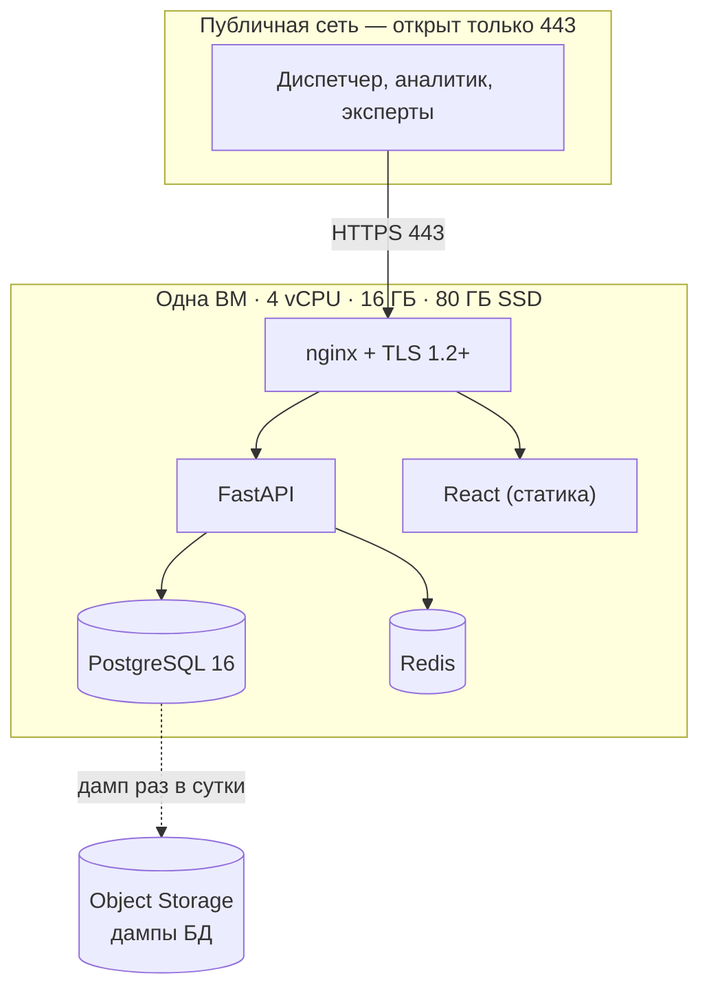

# Yandex Cloud: стенд проекта, деньги и работа с ним

Один файл на всё: что берём в облаке, сколько это стоит, как подключиться, как выкатить и что делать, если стенд упал. Тарифы взяты из документации Yandex Cloud **17.09.2026**, регион Россия, цены в рублях с НДС. Основание — [TF-8](../../tasks/TF-8.md).

> 🔴 **Грант — 5 000 ₽.** Это весь бюджет проекта. Стенд сдаётся ссылкой 29.09 ([ТЗ, раздел 9](../ТЗ.md)) — если деньги кончатся раньше, сдавать будет нечего.

## 1. Главное правило

**Виртуалка включается только на время работы и демо. В остальное время — выключена.**

Включённая ВМ — это ~300 ₽ в сутки. Выключенная — ~38 ₽ в сутки (за диск). Разница за 13 дней: 3 897 ₽ против 1 452 ₽, то есть весь грант или треть гранта.

Выключенная ВМ не тарифицируется по vCPU и RAM — это ~85% её стоимости. Но платить всё равно придётся за:

| Что | Тарифицируется, когда ВМ выключена | Ставка |
|---|---|---|
| Диск | **Да, всегда** | 0,0199 ₽/ГБ·час |
| Статический публичный IP | **Да**, ещё и дороже: 0,26352 + 0,34038 | 0,6039 ₽/час |
| Динамический публичный IP | Нет | 0,26352 ₽/час |
| Снимки и образы | **Да** | 0,0051 ₽/ГБ·час |
| vCPU и RAM | Нет | — |

Отсюда два следствия:

1. **Берём динамический IP, не статический.** Статический про запас — 0,6 ₽/час = 188 ₽ за 13 дней впустую. Минус: при каждом включении адрес меняется, поэтому смотрим его в консоли, а на демо вешаем домен.
2. **Диск берём минимально достаточный.** 100 ГБ SSD — 621 ₽ за 13 дней, даже если ВМ ни разу не запустится. 80 ГБ — 497 ₽.

## 2. Тарифы, по которым считаем

Проверено 17.09.2026, все ставки за час.

| Ресурс | Ставка |
|---|---|
| Intel Ice Lake, 100% vCPU | 1,24 ₽ |
| Intel Ice Lake, 50% vCPU | 0,75 ₽ |
| Intel Ice Lake, 20% vCPU | 0,52 ₽ |
| Intel Ice Lake, RAM | 0,33 ₽/ГБ |
| AMD Zen 4, 100% vCPU / RAM | 1,26 ₽ / 0,3381 ₽/ГБ |
| **Прерываемая** ВМ AMD Zen 4, 100% vCPU / RAM | **0,35 ₽ / 0,0845 ₽/ГБ** |
| Быстрый диск (SSD) | 0,0199 ₽/ГБ |
| Публичный IP (активный) | 0,26352 ₽ |
| Исходящий трафик | **до 100 ГБ/мес бесплатно**, далее 1,42 ₽/ГБ |
| Object Storage, стандартное хранилище | **до 720 ГБ·ч/мес бесплатно** (≈1 ГБ постоянно), далее 0,0033 ₽/ГБ·ч |
| Managed PostgreSQL, Cascade Lake 100% vCPU | 2,08 ₽ |
| Managed PostgreSQL, RAM | 0,5072 ₽/ГБ |
| Managed PostgreSQL, сетевой SSD / HDD | 0,0218 ₽/ГБ / 0,0052 ₽/ГБ |

**Прерываемая ВМ** втрое дешевле обычной, но облако может остановить её в любой момент и живёт она не дольше 24 часов. Годится для разовых расчётов и обучения модели, **не годится** для стенда, который должен быть живым в день сдачи.

## 3. Что берём и что не берём

| Слой | Решение | Почему |
|---|---|---|
| PostgreSQL 16 | **контейнер на нашей ВМ** | Managed PG — 2 vCPU + 8 ГБ + 20 ГБ = **8,65 ₽/час**, то есть 2 700 ₽ за 13 дней круглосуточно. Больше половины гранта за одну базу |
| Redis | **контейнер на нашей ВМ** | то же самое, плюс нагрузка у нас копеечная |
| Бэкенд, фронт, nginx | **Docker Compose на той же ВМ** | один хост — один счёт, и ровно то же окружение, что локально |
| Обучение модели | **локально**, у Захара | LightGBM на табличных признаках учится минуты на ноутбуке. DataSphere здесь не нужен |
| Полная история 313,5 млн строк | **не в облако** | в PostgreSQL с индексами это ~40+ ГБ. Держим локально в DuckDB/Parquet, в облако кладём 2025–2026 (~86 млн строк) |
| Бэкапы | **Object Storage** | сжатый дамп 1–2 ГБ, первый гигабайт бесплатно, дальше ~2,4 ₽ за ГБ в месяц |
| Публичный адрес | **динамический IP** | статический тарифицируется и при выключенной ВМ |
| Сертификат TLS | **Let's Encrypt на nginx** | TLS 1.2+ обязателен по [ТЗ, раздел 2.8](../ТЗ.md) |

**Сознательно не берём:** Managed PostgreSQL, Managed Redis, DataSphere, Serverless Containers, Application Load Balancer, DDoS Protection (от 28 060 ₽/мес — в шесть раз больше всего гранта).

## 4. Конфигурация стенда

**ВМ:** Intel Ice Lake, 4 × 100% vCPU, 16 ГБ RAM, 80 ГБ SSD, Ubuntu 22.04 LTS, динамический публичный IP.



Внутри ВМ сервисы общаются по внутренней docker-сети, наружу опубликован только nginx — то же разделение, что в [записке о потоке для аналитика](../analytics/поток-для-аналитика.md).

Наружу открыты только 443 и SSH по ключу. Вход — по персональным ключам, без общего пользователя. Секреты лежат на ВМ в `.env`, в репозитории — только `.env.example`.

## 5. Расчёт бюджета

13 дней от 17.09 до 29.09 = **312 часов**.

**Отвергнутый вариант 1:** Managed PostgreSQL + отдельная ВМ, круглосуточно — 15,03 ₽/час × 312 = **4 690 ₽**. Грант кончается ровно в день сдачи, без запаса на ошибки.

**Отвергнутый вариант 2:** наша ВМ круглосуточно — 12,49 ₽/час × 312 = **3 897 ₽**, 78% гранта за стенд, которым ночью никто не пользуется.

**Принятый вариант — одна ВМ, включаемая по требованию:**

| Статья | Расчёт | Итого |
|---|---|---|
| Диск 80 ГБ (тарифицируется всегда) | 80 × 0,0199 × 312 ч | **497 ₽** |
| vCPU + RAM при работе | (4 × 1,24 + 16 × 0,33) × 65 ч | **683 ₽** |
| Публичный IP при работе | 0,26352 × 65 ч | **17 ₽** |
| Демо-сутки 28–29.09 круглосуточно | 10,50 × 24 ч | **252 ₽** |
| Object Storage, бэкапы 2 ГБ | сверх бесплатного гигабайта | **~3 ₽** |
| Исходящий трафик | в пределах 100 ГБ/мес | **0 ₽** |
| **Всего** | | **≈ 1 452 ₽** |

Это **29% гранта**. Остаток ~3 500 ₽ — запас на переделки, вторую ВМ под эксперименты и на то, что в дни сдачи стенд придётся держать поднятым дольше.

Здесь 65 часов — это 5 часов работы в день. Если ВМ забыть выключенной, тот же период стоит 3 897 ₽ вместо 1 452 ₽.

## 6. Как работать со стендом

**Доступ.** Прислать мне свой публичный SSH-ключ (`~/.ssh/id_ed25519.pub`, если ключа нет — `ssh-keygen -t ed25519`). В ответ получите логин, текущий IP ВМ и, если нужно, доступ в консоль облака.

**Включить и выключить ВМ:**

```
yc compute instance start --name think-faster
yc compute instance stop  --name think-faster
```

Адрес после включения меняется — смотреть `yc compute instance get --name think-faster`.

**Посмотреть, что происходит:**

```
docker compose ps
docker compose logs -f --tail=100 api
docker compose restart api
```

**Выкатить изменения:**

```
git pull && docker compose up -d --build
```

**Откатиться:** `git checkout <предыдущий коммит>` и та же команда сборки. Перед выкаткой в день демо — сначала проверить локально.

**Нельзя:** удалять ресурсы в консоли, менять группы безопасности, класть секреты в репозиторий, выкатывать напрямую в день сдачи без проверки, привязывать личную карту к аккаунту.

**Перед демо 29.09:** ВМ включена заранее, `https://` открывается, сертификат не просрочен, база отвечает, бэкап снят, на остатке гранта хватает на сутки работы.

## 7. Если стенд упал

Сначала спросить в чате, не выключил ли кто-то ВМ намеренно — это самая частая причина.

| Симптом | Что делать |
|---|---|
| Сайт не открывается | проверить, включена ли ВМ: `yc compute instance get --name think-faster` |
| ВМ включена, сайт молчит | `docker compose ps`, поднять упавший контейнер `docker compose up -d` |
| Сервис отвечает ошибкой | `docker compose logs --tail=200 api` |
| Кончилось место | `df -h`, чистка `docker system prune -a`, старые дампы из `/var/backups` |
| База не отвечает | `docker compose logs db`, при повреждении — восстановление из дампа в Object Storage |
| Не пускает по SSH | сменился IP после перезапуска — взять актуальный в консоли |
| Кончился грант | переходим на план Б: локальный запуск по Docker Compose, демо с ноутбука |

Порядок звонков: сначала мне, потом Грише (сервисы на ВМ). Карту к аккаунту не привязывать даже в панике.

## 8. Контроль расхода

- [ ] В консоли Yandex Cloud: **Биллинг → Бюджеты** — бюджет на 5 000 ₽ с оповещениями на 50%, 80% и 90%.
- [ ] Смотреть расход раз в день, записывать остаток в таблицу ниже.
- [ ] Если за сутки ушло больше 400 ₽ — разбираться в тот же день.

| Дата | Остаток гранта | Заметка |
|---|---|---|
| 17.09 | 5 000 ₽ | стенд ещё не поднят |

## 9. Что не выяснено

- [ ] Статус заявки на грант: одобрена или ещё нет, до какого числа действует.
- [ ] Чей платёжный аккаунт и кто владелец — от этого зависит, кто сможет чинить стенд в ночь перед сдачей.
- [ ] Что происходит при исчерпании гранта: ресурсы останавливаются или начинается списание с карты. **Пока не выяснено — карту не привязывать.**
- [ ] Цена стандартного (HDD) диска в Compute Cloud: в таблице тарифов на момент проверки была видна только SSD-строка. Если HDD доступен, диск под архив выйдет вчетверо дешевле.
