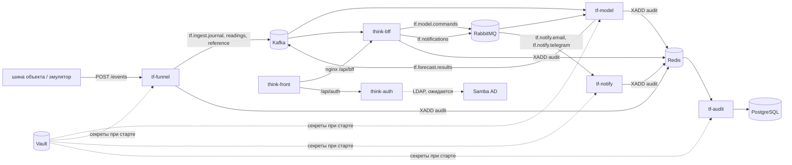

# Think-Faster: сервис прогнозирования инцидентов инженерных коллекторов

Сопроводительная документация (ТЗ §14, §19). Состояние на 26.09.2026.

Структура — по ГОСТ 34.602 и РД 50-34.698 в том объёме, который требует ТЗ §14. Документ
описывает систему целиком и ссылается на рабочие документы репозитория, где лежат подробности и
все числа: `ML/SPEC.md` (постановка и рабочая конфигурация модели), `ML/results/analytics.md`
(журнал исследования, разделы 1–63), `ML/INTEGRATION.md` (встраивание модели в контур),
`docs/common/структура.md` и `docs/common/права-и-аудит.md` (бэкенд, права, аудит),
`docs/backend/домены-и-сущности.md` (сущности бэкенда). Ссылка вида «раздел 42» ведёт в журнал
исследования, «INTEGRATION §9» — в документ встраивания.

## Соответствие требованиям ТЗ §14

| требование ТЗ §14 | где в документе |
|---|---|
| методы, необходимые для использования решения, доступны и подробно описаны | 4, 5; ручки и форматы — 3.4–3.6 |
| перечень всех использованных библиотек и компонентов | 9 |
| решение — отдельный сервис, может стать самостоятельной системой или её компонентом; число внешних интеграций соответствует задачам | 3.1, 3.2 |
| сложные технические и логические детали сопровождаются комментариями | 4, 5, 6; в коде — комментарии со ссылками на разделы журнала исследования |
| открытый неоткомпилированный код без обфускации | 8.1 |
| используемые методы обработки данных | 4 |
| условия и ограничения внутри решения | 7 |
| инструкции по компиляции, сборке и установке | 8 |
| функциональная и компонентная архитектура | 2, 3 |
| 149-ФЗ и 152-ФЗ | 10 |

---

## 1. Общие сведения

### 1.1 Назначение

Сервис прогнозирует инциденты на объектах инженерных коллекторов Москвы по журналу событий
системы мониторинга и поддерживает решения диспетчера: что проверить, кого послать и что внести в
план ТО. Заказчик по ТЗ — Департамент ЖКХ города Москвы, эксплуатирующая организация —
АО «Москоллектор».

| | решение |
|---|---|
| единица прогноза | объект 3-го уровня (78 объектов) × час; коллектор — объект 2-го уровня (16 коллекторов) |
| что прогнозируется | начнётся ли в ближайшие 24 ч эпизод одного из шести типов: пожар, загазованность, подтопление, отказ оборудования, отказ датчика, проникновение |
| выход | по каждому объекту и типу: оценка, порог, тревога, основания, датчики-свидетели, рекомендация (3.4) |
| такт | раз в час; пересчёт всего парка — около 3 с |
| что уже идёт | отдельный канал «по факту»: происшествие, которое прогноз не дал, объявляется по самому событию (4.9) |
| кто решает | диспетчер. Сервис не заменяет его, не принимает окончательных решений, не управляет оборудованием (ТЗ §5) |

Загазованность — шестой тип сверх ТЗ. Реакция на газ своя (вентиляция, а не пожарный расчёт), а
в пожар газ добавил бы 600 эпизодов к 2 554 пожарным за 2022–2025 годы. Если заказчик против, газ
сливается с пожаром на этапе разметки, витрина при этом не меняется.

### 1.2 Состав системы и репозитории

| репозиторий | что в нём |
|---|---|
| `Think-Faster` (этот) | модель и исследование (`ML/`); сервисы `tf-model` (`ML/service`), `tf-funnel`, `tf-notify`, `tf-audit` и общий пакет `tfkit` (`docs/backend/`); стенд (`docs/backend/compose.yml`, `stand.yml`); ТЗ и проектные документы (`docs/`) |
| `think-infra` | Kafka, RabbitMQ, Redis, Vault, PostgreSQL, nginx, Samba AD — развёртывание контура на сервере |
| `think-auth` | сервис аутентификации: учётки, пароли, выпуск токенов RS256 |
| `think-bff` | BFF: профили, группы, роли, права, область видимости, заявки |
| `think-front` | интерфейс диспетчера и главного диспетчера |
| `think-test` | эмулятор потока событий для стенда |

### 1.3 Сокращения и термины

| термин | значение |
|---|---|
| объект | объект 3-го уровня справочника: часть коллектора со своим набором датчиков, единица прогноза |
| эпизод | серия триггеров одного типа на одном объекте с паузой не больше 1 ч; начало эпизода — момент инцидента |
| триггер | строка журнала, которая по смыслу относится к типу: «Обнаружен дым», «Затоплен» и т. д. |
| шум Н7, Н8, Н10 | размеченные, но не входящие в цель события: Н7 — «Затоплен» сразу после события питания, Н8 — массовый дым (10 и больше извещателей за ±10 мин), Н10 — газ в окне планового ППР по графику |
| витрина | таблица признаков объект × час (306 признаков) |
| доля | доля часов под тревогой по типу — рабочая настройка порога |
| ложные часы | часы тревоги, за которыми в пределах 24 ч эпизод не начался; основная мера сравнения моделей |
| свежая поимка | эпизод пойман тревогой, которая горит меньше 7 суток; длинная тревога ловит эпизоды, но диспетчер её не отличает от статуса объекта |
| зерно | один из нескольких прогонов обучения одной модели с разным начальным случайным состоянием |
| TCN | temporal convolutional network, свёрточная сеть по часовым рядам |
| главный диспетчер | центральный диспетчер (права-и-аудит §3): ведёт настройки модели и видит историю отклонённых прогнозов |
| ППР | планово-предупредительный ремонт |
| DLQ | очередь или топик для сообщений, которые нельзя обработать |
| техучётка | техническая учётная запись сервиса |

---

## 2. Функциональная архитектура

### 2.1 Роли

Роли и права — `docs/common/права-и-аудит.md` §3.

| роль | область | что делает в системе |
|---|---|---|
| техник | один комплекс | видит объекты, тревоги, заявки; отмечается в заявке, решений не выносит |
| диспетчер района | несколько комплексов | работает с очередью прогнозов и заявками: берёт, отклоняет с причиной, глушит, подтверждает происшествие |
| центральный (главный) диспетчер | всё предприятие | то же плюс настройки модели: доли, версии модели, график работ, игнорируемые периоды, переобучение; история отклонённых и заглушённых прогнозов |
| администратор | всё предприятие | пользователи, группы, права, журнал аудита; заявок не ведёт |

### 2.2 Сценарии

**Диспетчер: прогноз.**

1. Раз в час модель пересчитывает все объекты. По объекту, где оценка типа выше порога, в очереди
   прогнозов появляется карточка «объект × тип».
2. В карточке:
   - тип и сколько часов уже горит тревога;
   - основания — признаки, на которых держится оценка;
   - датчики-свидетели с временем и значением (по ним подсвечивается пикет);
   - рекомендация: меры, срок, кого послать и сколько людей.
3. Диспетчер выбирает одно из действий:
   - **взять** — создаётся заявка;
   - **отклонить** с причиной из справочника, например «известные работы на объекте»;
   - **заглушить** до указанного срока;
   - позже **подтвердить**, что происшествие случилось.
4. Решение уходит в модель и в журнал аудита. У газа и подтопления отклонение переводит объект по
   этому типу в режим «маловероятно» до следующего настоящего эпизода (4.8).

**Диспетчер: происшествие уже идёт.** Канал «по факту» объявляет эпизод, который прогноз не дал,
на 10-й минуте. По объявлению BFF создаёт заявку и рассылает уведомление ответственным группам на
почту и в Telegram. По мере развития эпизода рекомендация обновляется. Если на объекте идёт ППР по
графику, объявление приходит с пометкой «идёт ППР по графику».

**Главный диспетчер: настройки без переобучения.** Все настройки — таблицы. Каждая правка создаёт
новую версию, модель применяет её со следующего часа и пишет изменение в аудит (6.3):

- доля часов под тревогой и коэффициент отклонения по каждому типу. Ползунок показывает следствие:
  «примерно N тревог в сутки по парку»;
- рабочая версия модели по типу. Несколько версий сейчас есть только у отказа оборудования (6.2);
- график плановых работ: объект, вид работ, типы, окно. В окне прогноз этих типов не показывается
  и уходит в историю со статусом `MUTED`;
- игнорируемые периоды брака данных: по парку, по объекту или по каналу;
- запуск переобучения, если оно включено.

**Главный диспетчер: аудит отклонений.** История отклонённых и заглушённых прогнозов видна только
главному диспетчеру. Там же видно, какие из них переросли в происшествие в пределах горизонта. Она
разделена на решения дежурных диспетчеров и молчание по графику работ (6.6).

**Администратор.** Заводит пользователей и группы, задаёт область видимости, читает журнал аудита.

**Аналитик.** Воспроизводит обучение и оценку по `ML/SPEC.md` §10, собирает пакет модели (8.3),
сравнивает версии на ретропрогоне.

### 2.3 Что решает сервис, а что — человек

| решает сервис | решает человек |
|---|---|
| оценку и тревогу по типу на 24 ч вперёд | брать ли тревогу в работу, ехать ли |
| порог по доле, которую задал главный диспетчер | какую долю держать: сколько тревог в сутки служба готова разбирать |
| объявление по факту по правилам фильтра шума | подтвердилось ли происшествие |
| молчание в окне графика работ | что внести в график и что считать плановой работой |
| рекомендацию по словарю правил | кого посылать на самом деле; словарь сверяется с регламентами заказчика |
| — | переключение версии модели, запуск переобучения |

Модель ничем не управляет и в системы заказчика не пишет: она только читает поток событий, а
команды получает от своего BFF (ТЗ §13, «только чтение»).

---

## 3. Компонентная архитектура

### 3.1 Состав контура



| компонент | назначение | вход | выход |
|---|---|---|---|
| `tf-funnel` | приём пакетов событий от шины объекта, проверка, раскладка по топикам, контроль молчания каналов | `POST /events` с токеном `telemetry.push` | `tf.ingest.journal`, `tf.ingest.readings`, `tf.ingest.reference` |
| `tf-model` | горячий журнал, признаки, прогноз шести типов, порог, правила, канал «по факту», рекомендации | `tf.ingest.*`, команды `tf.model.commands` | `tf.forecast.results`, `tf.dlq`, аудит, ручки `/api/ml` |
| `tf-notify` | доставка уведомлений по почте и в Telegram | `tf.notify.email`, `tf.notify.telegram`, ручки `/mail`, `/telegram` | письма, сообщения, аудит |
| `tf-audit` | запись журнала аудита и чтение его для BFF | потоки Redis `audit`, `audit:requests` | `audit.events` в PostgreSQL, `GET /events` |
| `tfkit` | общий пакет сервисов: секреты из Vault, проверка токенов, событие аудита | — | — |
| `think-auth` | вход, выпуск токенов RS256, публичный ключ `/.well-known/jwks` | логин и пароль | куки с токенами |
| `think-bff` | права, область видимости, заявки, решения диспетчера, настройки модели | запросы фронта, `tf.forecast.results` | команды модели, уведомления |
| `think-front` | рабочее место диспетчера и главного диспетчера | — | — |
| Kafka 4.0 | поток событий и прогнозов | — | — |
| RabbitMQ 4.1 | команды модели и уведомления с подтверждением, повтором и DLQ | — | — |
| Redis 7 | поток аудита, защита уведомлений от повтора | — | — |
| Vault | все секреты, KV v2 `secret/tf/<сервис>` | — | — |
| PostgreSQL 16 | данные BFF и аутентификации, схема `audit` | — | — |
| nginx | единая точка входа, маршруты `/api/auth/`, `/api/bff/`, фронт | — | — |
| Samba AD | корпоративный каталог для LDAP/AD (ТЗ §11) | — | — |

Модель, воронка, уведомления и аудит — отдельные контейнеры со своими техучётками и своими
путями в Vault. Каждый из них можно вынуть из контура и поставить к другой системе мониторинга:
вход у модели — журнал «канал, время, значение», выход — сообщение §3.4 в топик. Внешних
интеграций у контура две: шина данных объекта (вход) и почтовый сервер с Telegram (выход).

### 3.2 Топики и очереди

| где | имя | кто пишет | кто читает | что |
|---|---|---|---|---|
| Kafka | `tf.ingest.journal` | funnel | модель, BFF | тревожные события и текстовые состояния, хранение 30 суток |
| Kafka | `tf.ingest.readings` | funnel | модель | числовые показания, 7 суток |
| Kafka | `tf.ingest.reference` | funnel | модель | справочники и состояние каналов (`silent`/`ok`), compact |
| Kafka | `tf.forecast.results` | модель | BFF | прогноз по объекту за час и объявления по факту, 7 суток |
| Kafka | `tf.dlq` | все | — | неразобранное, 14 суток |
| RabbitMQ | `tf.model.commands` | BFF | модель | решения диспетчера и настройки (3.5) |
| RabbitMQ | `tf.notifications` → `tf.notify.email`, `tf.notify.telegram` | BFF | notify | уведомления (3.6) |
| RabbitMQ | `tf.dlx` → `tf.dlq` | брокер | — | отвергнутые сообщения |
| Redis | `audit`, `audit:requests`, `audit:dead` | все сервисы | аудит | события аудита (6.6) |

Предел сообщения — 1 МБ (ТЗ). Ключ сообщений прогноза — `object_id`, чтобы прогнозы одного
объекта шли по порядку. Ключ событий — номер канала: порядок внутри канала сохраняется.

### 3.3 Сервис модели `tf-model`

Один процесс, четыре потока (INTEGRATION §13.1):

| поток | что делает |
|---|---|
| приём | события `tf.ingest.*` → горячий журнал DuckDB на томе: 100 суток по всем объектам и вся история состояния охраны; чистка 4.1 применяется при записи |
| такт | раз в час, через 120 с после границы часа по московскому времени: признаки парка → шесть типов → порог → правила и молчание → рекомендации → сообщение в `tf.forecast.results` |
| команды | решения диспетчера и настройки из `tf.model.commands`; подтверждение — только после записи состояния на том |
| API | ручки ниже, каждая доступна и с префиксом `/api/ml`, и без него |

Номер последнего посчитанного часа хранится на томе: перезапуск посреди часа повтора не
порождает. Опоздание потока — не повод не считать. Прогноз считается на том, что дошло к границе
часа, и час помечается как посчитанный на неполных данных (раздел 54).

| ручка | кто вызывает | право | что отдаёт |
|---|---|---|---|
| `GET /health` | nginx, Docker | без токена | `{ok, clock, last_hour}` |
| `GET /status` | админ-панель | `alert.read` | версии модели по типам, версии настроек, пороги, свежесть потока, счётчики приёма |
| `GET /estimate?type=&share=` | ползунок доли | `threshold.edit` | сколько тревог в сутки по парку даст эта доля |
| `GET /forecast?object_id=` | BFF | техучётка `ml.read` | последний расчёт по объекту |
| `GET /history?object_id=&type=&from=&to=` | BFF | техучётка `ml.read` | оценки, порог и статус по часам: `ALARM`, `MUTED`, `REJECTED` |

**Два режима часов.** `TF_MODEL_CLOCK=live` — такт по настоящему времени.
`TF_MODEL_CLOCK=replay:<начало>:<секунд на час>` — сервис проигрывает тестовый 2026 год. Рядом с
прогнозом видно, что случилось на объекте потом: это требование ТЗ §18 «сравнение прогнозных и
реальных значений». Сообщения несут `clock: "replay"`, и BFF заявок по ним не создаёт.

### 3.4 Сообщение прогноза `tf.forecast.results`

Одно сообщение — один объект и один час, шесть типов внутри (INTEGRATION §2.3):

```json
{
  "schema": 1, "object_id": 5122, "hour_end": "2026-09-23T07:00:00+03:00",
  "horizon_hours": 24, "model_version": "export-2026-09-23",
  "types": {
    "fire": {"score": 0.981, "threshold": 0.975, "alarm": true, "confidence": 0.31, "since_hours": 4,
             "reasons": [{"feature": "smoke_24h", "value": 3.0}],
             "evidence": [{"sensor_id": 41233, "ts": "2026-09-23T06:12:00+03:00", "value": "Обнаружен дым"}],
             "recommendation": {"mode": "прогноз", "now": ["…"], "visit": {"состав": "специалист", "людей": 1, "срок_ч": 24}}},
    "gas": {"score": 0.402, "threshold": 0.974, "alarm": false}
  }
}
```

- `score` — ранговая оценка 0…1, место объекта в распределении оценок парка, а не вероятность.
- `threshold` — квантиль оценок парка за 90 суток на долю из настроек.
- `since_hours` — сколько часов горит тревога: по нему новое предупреждение отличается от
  висящего неделями.
- `model_version` — чем посчитан прогноз; без него нельзя разбирать отклонения после смены версии.
- Канал «по факту» пишет в тот же топик с `kind: fact` и рекомендацией в режиме `факт`.

### 3.5 Команды модели `tf.model.commands`

Общий конверт (INTEGRATION §13.3):

```json
{"schema": 1, "command_id": "uuid", "kind": "decision.reject",
 "issued_at": "2026-09-26T08:14:00+03:00", "issued_by": {"sub": "…", "login": "petrova"},
 "request_id": "e81b07c4f2a9", "payload": {}}
```

| вид | что делает модель |
|---|---|
| `decision.take` | учитывает в статистике |
| `decision.reject` | правило отклонения у газа и подтопления, у остальных типов — только история |
| `decision.mute` | молчание пары объект-тип до срока |
| `decision.reopen` | снимает отклонение |
| `decision.confirmed` | метка «случилось» для аудита отклонений |
| `settings.operating` | новые доли и коэффициенты отклонения со следующего часа |
| `settings.works` | новые окна графика работ со следующего часа |
| `settings.gaps` | игнорируемые периоды; ставит флаг «нужно переобучение» |
| `model.switch` | другая версия модели типа со следующего часа, порог — по ретропрогону новой версии |
| `retrain.request` | задача в очередь переобучения, если оно включено |

Команды настроек несут полный снимок таблицы с номером версии, а не разницу. У RabbitMQ нет
повтора истории, поэтому BFF сверяет номера версий по `/status` и при расхождении отправляет
снимок заново. Команда с уже виденным `command_id` подтверждается без действия. Сломанное
сообщение уходит в DLQ, временная ошибка — повтор до пяти раз.

### 3.6 Уведомление `tf.notifications`

```json
{"schema": 1, "notice_id": "uuid", "ticket_id": 1042, "kind": "fact",
 "subject": "Загазованность: объект 5122", "text": "…",
 "to": {"emails": ["…"], "chat_ids": [123]}, "request_id": "e81b07c4f2a9"}
```

Публикует только BFF: адреса групп живут у него, модель адресатов не знает. Порядок доставки — 6.5.

### 3.7 Воронка показаний `tf-funnel`

`POST /events` (за nginx — `/api/funnel/events`) принимает до 10 000 событий в полях журнала:

- тревожное событие или текстовое состояние идёт в `journal`, число — в `readings`. Каждое событие
  попадает ровно в один топик, модель ничего не считает дважды;
- ответ 202 перечисляет отвергнутые события с причиной. Если не принято ни одно — 422. Если лежит
  Kafka — 503 с `Retry-After: 5`: шина повторяет пакет, повтор модель отбрасывает по ключу журнала;
- канал, который слышали хотя бы трижды, считается молчащим, если нового события нет дольше
  `max(60 мин, 4 × обычный интервал канала)`. Переход пишется в `tf.ingest.reference`;
- на стенде воронка сама забирает события у эмулятора (`TF_FUNNEL_PULL`).

Подробно — INTEGRATION §13.9.

---

## 4. Методы обработки данных

### 4.1 Источники и чистка

Вход — журнал событий (`ид_события`, `ид_канала_данных`, `дата`, `время`, `тревожное`,
`значение_датчика`) и два справочника: каналов и объектов. Журналы 2019 — июнь 2026, после чистки
253 млн событий. Чистка (`ML/pipeline/events.py`, та же в сервисе):

1. дубли «канал + время + значение» схлопываются;
2. у канала «Состояние охраны» выбрасываются значения-даты. `01.01.1970 03:00:00` — не сбой, а код
   постановки и снятия охраны: он стоит в ту же секунду, что «На охране» и «Снято с охраны»;
3. каналы, которых нет в справочнике, выбрасываются;
4. число идёт в `num`, текстовое состояние — в `state`. Газ — % объёма метана: от 0 до 15 —
   показание, ниже нуля и выше 15 — отказ датчика;
5. флаг `тревожное` не используется: его смысл меняется по годам (7% у «Обнаружен дым» в 2023-м,
   100% в 2026-м);
6. 2021 год исключён из обучения: в нём параллельно работали две системы мониторинга, и журнал
   противоречит сам себе. Часы потерь данных (`2024-04-06 … 2024-04-10`, `2026-06-01`) не входят в
   витрину, если их задевает окно признаков или горизонт.

### 4.2 Разметка

Подтверждённых инцидентов в данных нет, поэтому разметка косвенная (`ML/pipeline/labels.py`,
SPEC §3):

- **Триггер → эпизод.** Эпизод — триггеры одного типа на одном объекте с паузой не больше 1 ч.
- **Шум размечается, но в цель не входит.**
  - Н8 — массовый дым: 10 и больше извещателей объекта за ±10 мин.
  - Н7 — «Затоплен» в пределах 60 с после события питания в коллекторе: в 94–100% случаев это та
    же секунда.
  - Н10 — газ и отказ газового датчика в окне ППР по графику организатора (раздел 62).
- **Проникновение** — дверь или люк открылись под охраной, за ними сработало движение, а охрану в
  течение 15 мин не сняли. Если сняли, это персонал. Постановка и снятие в одну секунду — мигание,
  такие пары выбрасываются, иначе разметка зависит от порядка строк.
- **След выезда.** В том же коллекторе «охрана снята → дверь → движение» с шагом до 30 мин. Эпизод
  считается подтверждённым, если выезд начался в пределах 2 ч. Окно выбрано по приросту доли
  выездов над фоном; фон — тот же момент неделей раньше и позже.
- **Справочник состояний** читается как словарь «состояние → тревожное». Колонка типа в нём с
  журналом не совпадает. «Батарея неисправна» из меток убрана (раздел 58).

### 4.3 Признаки

306 признаков на объект × час (`features.py`, порядок — `manifest.json`):

- счётчики состояний в окнах 1 ч / 6 ч / 24 ч / 7 сут: дым, газ, температура, двери, движение,
  питание, насосы, «Неисправен», «Неопределен», дребезг;
- газ и температура: максимум, среднее, тренд, часы без показаний;
- эпизоды и триггеры по типам, шум Н7/Н8 — по объекту и по коллектору; часы с прошлого эпизода
  (до 90 суток);
- выезды бригады в коллекторе, вход персонала под охраной, режим охраны и время с его смены;
- календарь: час, день недели, сезон, праздники, 9 мая, дни до праздника;
- состав объекта: число каналов по типам датчиков.

**Без заглядывания в будущее.** Часть разметки смотрит немного вперёд: Н8 — на 10 мин, персонал —
на 15, след выезда — на 30. Такое событие попадает в признаки в момент, когда о нём можно знать, а
не в момент его начала. `check.py` пересчитывает признаки и цели случайных объекто-часов прямыми
запросами к журналу и сверяет с витриной. Ретропрогон 2026 года (раздел 49) повторяет витрину по
обрезанному журналу на 100%.

**Вариант A′.** Эпизоды шума Н10 не идут в счётчики эпизодов. Сервис считает признаки ровно так, и
срез сервиса на час совпадает со строкой витрины `work_pa` во всех 306 столбцах (INTEGRATION §13.6).

### 4.4 Разбиение и меры

| выборка | годы | для чего |
|---|---|---|
| обучение | 2022–2024 | обучение; каждый третий час, соседние почти одинаковы |
| проверка | 2025 | подбор параметров, выбор эпохи, доли, веса смеси |
| тест | 2026, январь — июнь | один прогон, ничего не подбирается |

Инцидентов мало — от 0,1% до 9% объекто-часов по типам. Поэтому точность и ROC-AUC не годятся.

- **Основная мера — ложные часы при равной полноте** (раздел 34). Модели сравниваются так: сколько
  часов ложной тревоги нужно, чтобы поймать ту же долю эпизодов. Число сигналов как мера отброшено:
  оно вознаграждает гладкую оценку.
- **Рядом — свежие поимки** (раздел 40): постоянная тревога ловит эпизоды, но диспетчер её не
  отличает от статуса объекта.
- **PR-AUC** — для быстрых сравнений и выбора эпохи сети.
- **Шум зерна.** Всё, что меньше ±0,03 PR-AUC или разброса по зёрнам в часах, не различается
  (раздел 57). Любой выигрыш должен держаться и на проверке, и на тесте.
- **Отраслевая мера нагрузки** — EEMUA 191 / ISA 18.2 (раздел 11).

### 4.5 Модели

Своя модель каждому типу. Оценка типа — среднее рангов 5 зёрен (раздел 34):

| тип | модель | параметры |
|---|---|---|
| пожар | CatBoost ×5 | подбор по ложным часам на 2024 |
| загазованность | CatBoost ×5 | умолчания; переобучен на разметке A′ (раздел 62) |
| подтопление | CatBoost ×5 | подбор по PR-AUC |
| отказ оборудования | версия 1: CatBoost ×5 с весом 0,75 + TCN ×3 с весом 0,25 | раздел 60, версии — 6.2 |
| отказ датчика | XGBoost ×5 | подбор по PR-AUC (Optuna) |
| проникновение | CatBoost ×5 | умолчания |

Бустинг учится на витрине, TCN — на часовых рядах (раздел 5). Выгрузка — 30 моделей на всех годах
2022 — июнь 2026 плюс версии оборудования, с `manifest.json`: признаки, годы, число деревьев, вход
сети. На тесте выгрузка не хуже рабочих прогонов (раздел 39).

Отдельно обучена модель отказа датчика в постановке канал × сутки (`sensor.py`): какой из исправных
датчиков откажет за 7 суток. Её единица — канал, а не объект, поэтому в сообщение прогноза она не
входит.

### 4.6 Порог

- **Бюджет ложных часов делится между типами по отдаче** (раздел 35). Минимум полноты — 30% каждому
  типу, пожару и газу 60%. Раздача по отдаче ловит на 35–77% больше, чем один порог на всех.
- **Рабочие доли** (`ML/settings/operating.json`): пожар 0,025, газ 0,026, подтопление 0,018,
  отказ оборудования 0,059, отказ датчика 0,009, проникновение 0,005 (раздел 46).
- **Скользящая калибровка** (разделы 32, 37). Порог — квантиль оценок парка за последние 90 суток,
  пересчёт каждый час. Держится доля часов под тревогой, а не значение оценки. Фиксированное число
  промахивается в 0–4,4 раза от обещанного, скользящее держит 0,7–1,5.
- С каждой новой моделью порог пересчитывается: история оценок принадлежит модели. Пока история
  новой модели не накопилась, порог берётся из её оценок на 2025 годе (шкала в пакете, 8.3).

### 4.7 Постобработка

| правило | что делает | раздел |
|---|---|---|
| склейка 6 ч | повтор тревоги по той же паре объект-тип в течение 6 ч — та же тревога: меньше сообщений и выездов, часы под тревогой те же | 27, 36 |
| отклонение диспетчером | только газ и подтопление. После отклонения тревога горит, только если оценка в верхней пятой части обычной доли (k = 0,2), до следующего настоящего эпизода. У остальных типов отклонение пропусков добавляет больше, чем убирает ложных, и пишется только в историю | 43, 44, 46 |
| молчание по графику работ | в окне строки графика прогноз её типов — `MUTED` с номером строки; снимает 45–59% ложных часов газа без потерь | 62 |
| сглаживание, короткий бюджет деревьев, предел длины тревоги, вторая ступень при бюджете 80 тыс. | не ставятся | 29, 36, 41, 43 |

### 4.8 Итог на тесте 2026

Бюджет 80 тыс. ложных часов на проверке. Заранее поймано 2 428 эпизодов из 3 931 (62%), 4,9 ложного
сигнала в сутки на 78 объектов, упреждение 24 ч. Остальное объявляет канал «по факту». Больший
бюджет свежих поимок не прибавляет, растут только постоянные тревоги (раздел 40). Где модель
не дотягивает — раздел 7.

### 4.9 Канал «по факту»

Происшествие, которое прогноз не дал, объявляется по самому событию (`factalert.py`, `fact.py`
сервиса, разделы 10 и 15):

- решение принимается на 10-й минуте эпизода по уже пришедшим событиям, без заглядывания вперёд;
- шум Н7/Н8 отфильтровывается в реальном времени;
- полнота — 99,8% эпизодов;
- вместе с прогнозом канал убирает 70–80% ложных без потери эпизодов (раздел 15, прежняя база);
- эпизоды Н10 канал не отбрасывает: газ в окне ППР приходит с пометкой (Н28).

### 4.10 Рекомендации

Меры по ТО и ремонту собираются по словарю правил, модель в них не участвует (`recommend.py`,
`settings/recommendations.csv`, раздел 61):

- 70 правил (113 строк) в пяти слоях: мера признака, паттерн сработки, сочетание типов, стадия
  рецидива, поправка;
- режимы «прогноз» и «по факту» разведены;
- кого посылать — по виду работ и нормам охраны труда: без выезда, специалист, звено из 3,
  бригада из 4;
- сводная рекомендация по объекту собирается из блоков по типам, ТО — без повторов;
- версия словаря идёт в сообщении, правка строки меняет версию;
- 41 строка ждёт сверки с регламентами заказчика.

### 4.11 Уверенность и основания

- **Основания** — топ признаков строки по важности моделей выгрузки, среднее по зёрнам (ТЗ §5).
- **Уверенность** (`confidence.py`, раздел 6): калиброванная вероятность (изотоническая регрессия на
  проверке), согласие семейств, длительность тревоги, число сработавших рядом каналов.
- **Сбой данных.** Если семейство датчиков объекта молчит, уверенность типов, которые на нём
  держатся, снижается: пожар — дым, загазованность — газ (раздел 55).

---

## 5. Полный цикл исследования нейросети

Сеть в проекте одна: TCN по часовым рядам объекта. В эксплуатации она работает у отказа
оборудования. Ниже — путь от первой попытки до четырёх версий для главного диспетчера, с тем, что
отброшено и почему. Числа — в разделах журнала исследования.

### 5.1 Зачем сеть

Бустинг видит витрину — агрегаты по окнам: сколько было, максимум, тренд. Он не видит порядок
событий внутри окна, ритм и форму ряда. У отказа оборудования (насосы, питание, вентиляция)
поломке часто предшествует рисунок во времени: учащение, перемежающиеся сбои, реакция на
соседний объект. Гипотеза: сеть по самим часовым рядам увидит то, чего нет в агрегатах.

### 5.2 Вход

| | значение |
|---|---|
| окно | 168 ч (7 суток) до момента прогноза |
| каналы | 66 часовых рядов объекта (те же счётчики, что в витрине) + те же 66, усреднённые по коллектору |
| преобразование | nan → 0, знаковый `log1p`, float16; иначе оценка расходится с обучением на третьем знаке |
| статика | состав объекта, календарь текущего часа, часы с прошлого эпизода по шести типам, счётчики эпизодов за 30 и 90 суток |
| выход | 6 логитов, по одному на тип, горизонт 24 ч |

Ряды всех объектов целиком лежат в памяти видеокарты (около 0,7–0,8 ГБ в fp16), окна режутся
индексами прямо на GPU. Загрузчики данных не нужны: подготовки батча на процессоре нет. Строки
обучения, проверки и теста те же, что у витрины, поэтому оценки сети и бустинга можно смешивать.

### 5.3 Архитектура

`ML/pipeline/seqmodel.py`, класс `Net`:

1. вход — свёртка 1×1 из 132 каналов в ширину 128;
2. 7 остаточных блоков. В каждом:
   - причинная свёртка с ядром 3 и шагом 1, 2, 4, …, 64 — видит только прошлое;
   - GroupNorm (8 групп), GELU, dropout 0,2, свёртка 1×1;
   - сложение со входом блока;
3. охват — 1 + 2·(2⁷ − 1) = 255 ч, больше окна;
4. голова — последний шаг, среднее по времени и статика → 256 → GELU → dropout → 6 выходов.

Одна сеть на все типы: общая часть учится на всех эпизодах, а у отказа оборудования их больше
всего (51 тыс. эпизодных строк на проверке). Около 559 тыс. параметров.

### 5.4 Обучение

| | значение |
|---|---|
| потеря | бинарная кросс-энтропия по шести выходам, вес положительных `√(neg/pos)`, ограничен [1, 10] |
| оптимизатор | AdamW, шаг 1e-3, weight decay 1e-2, OneCycle с разогревом 10%, обрезка градиента 1,0 |
| точность | bf16 (autocast) |
| батч | 1024 окна, 400 тыс. окон на эпоху |
| выбор эпохи | лучшая по PR-AUC проверки 2025 (каждый третий час); лучшая эпоха — со 2-й по 7-ю, дальше переобучение (раздел 57) |
| зёрна | 5 у рабочей сети; 3 у версий оборудования |
| прогон вперёд | `--cutoff`: обучение до даты минус горизонт, без выбора эпохи, прогноз следующего отрезка |
| железо | RTX 3050 Laptop 4 ГБ; эпоха базовой сети — 111 с обучения, вместе с оценкой на проверке около 6 мин; 12 эпох одного зерна — около 1,5 ч |

В эксплуатации сеть считается на процессоре: torch той же версии, что при обучении, сборка для CPU.

### 5.5 Этапы

| этап | вопрос | что вышло | решение | раздел |
|---|---|---|---|---|
| 1 | сеть против бустинга по PR-AUC, одно зерно | проигрывает у большинства типов | отброшена | `results/models.md` |
| 2 | пересчёт в ложных часах, 5 зёрен | у отказа оборудования при равных ложных часах +5% пойманных на проверке и +7,5% на тесте, свежих +17–18%; у остальных типов вровень или хуже | кандидат на отказ оборудования | 42 |
| 3 | прогон вперёд с переобучением раз в 30 суток: сеть против CatBoost | сеть лучше при любой стратегии: +47…+72 поимки, +80…+327 свежих. Ежемесячное переобучение сети даёт +25 поимок, но −200 свежих (83% → 65% свежих из пойманных). Дообучение на свежем окне и окно в год хуже | сеть в выгрузку; раз в 30 суток пересчитывается порог, сеть переобучается реже | 48 |
| 4 | ретропрогон 2026 с сетью | вход сети из обрезанного журнала сходится: Δp ≤ 0,004, ранговая корреляция 1,000. В суточном снимке 07:00 сеть и бустинг равны | вход сети переносится в сервис как есть | 49 |
| 5 | сколько зёрен | у оборудования 5 зёрен стоят 3–4% поимок и снимают 27–42% ложных сигналов | 5 зёрен, при нехватке счёта — 3 | 52 |
| 6 | перебор формы | разброс по зёрнам ±0,03 PR-AUC; ни одна из семи конфигураций базу не обошла | форма не меняется; окно 72 ч — запасной вариант, в 20 раз дешевле при −2% поимок | 57 |
| 7 | новая разметка по справочнику состояний | все разницы внутри разброса зёрен | переобучено, качество то же | 58 |
| 8 | липкая тревога | чем ближе конец данных обучения к тесту, тем дольше стоит тревога и меньше свежих поимок: 1 420 при данных до 2024 года против 1 106 до 2026-го | четыре версии оборудования (6.2), по умолчанию смесь | 60 |
| 9 | вход по варианту A′ | сервис видит признаки A′; модели других типов на A′ ловят то же | шкалы считаются на входах сервиса | 62 |
| 10 | рычаги сети: доп. горизонты как подсказка в потере, вектор объекта, своя сеть на тип, потолок веса положительных 3 | идёт 26.09, очереди на видеокарте | итог — раздел 63 | 63 |

**Липкость подробнее (раздел 60).** Сеть, обученная по самый конец данных, держит тревогу сплошь
на объектах в плотной серии (12+ эпизодов за месяц). Нелипкая сеть перевзводит тревогу к каждому
эпизоду. Проверено:

- **опыт H.** Липкость даёт близость данных обучения к тесту, а не их объём. При равных двух годах
  сеть на 2024–2025 держит тревогу в длинных сериях 44% часов, на 2022–2023 — 9%. Старые данные
  липкость разбавляют;
- **рецепты:**
  - вес 0,3 для часов внутри идущей серии (`--ongoing-w 0.3`) — +93 свежих;
  - разрыв 365 суток перед датой обучения — +138;
  - разрыв 730 суток (опыт G) — по липкости почти как замороженная сеть;
- **на рабочей доле 0,059** выигрыш в свежих при равных ложных сигналах почти исчезает.
  Нелипкая сеть даёт больше подтверждённых сигналов и вдвое меньше ложных часов;
- **смесь рангов** CatBoost 0,75 + TCN 0,25 обходит и бустинг, и прежний прод по всем мерам. На
  тесте при равных ложных сигналах она ловит 1 185 эпизодов, из них 1 102 свежих, при 158 ложных
  сигналах. У бустинга — 1 162 / 994 при 172, у прежнего прода — 1 182 / 929 при 166. Вес выбран на
  проверке 2025.

### 5.6 Что отброшено

| вариант | почему |
|---|---|
| окно 336 ч, 8 блоков | в 6,4 раза дороже, выигрыша нет (0,503 против 0,505–0,528) |
| ширина 192 | в 2,6 раза дороже, отказ датчика ниже всех зёрен базы |
| ширина 96 | отказ датчика ниже всех зёрен базы |
| dropout 0,1 и 0,35 | ниже зёрен базы |
| шаг 5e-4 | выигрыша нет |
| окно 72 ч в эксплуатации | −2% поимок в одну сторону на обоих годах; оставлено запасным |
| ежемесячное переобучение сети | теряет свежие поимки (раздел 48) |
| дообучение поверх прошлой сети на окне 30 суток; окно обучения в год | хуже по обеим мерам: оборудованию нужна вся история |
| разрыв 90 суток, 12 эпох, отдельная обработка хронических объектов, память объекта, сдвиг серий | не прибавляют (раздел 60) |
| сеть у пожара, газа, подтопления, датчика, проникновения | вровень или хуже бустинга; у проникновения выигрыш на тесте не повторяется на проверке |
| одинаковый вес сети во всех типах | +148 ложных сигналов при тех же поимках |
| 12 эпох по умолчанию | лучшая эпоха 2–7, дальше переобучение; введён потолок эпох |

### 5.7 Как повторить

```bash
cd ML/pipeline
python seqmodel.py --epochs 12 --seed 1                         # зерно 1; так же 0, 2, 3, 4
python tcnmix.py "$MIX5" main_h24/tcn,main_h24/tcn_s1,…         # смесь с бустингом (раздел 42)
python seqmodel.py --epochs 3 --cutoff 2026-01-31 --tag all_s0  # прогон вперёд (раздел 48)
python rollcmp.py "$MIXT" cat:all mix tcn:frozen:0,1,2 tcn:all:0,1,2
python seqmodel.py --score-val …                                # шкала сети для пакета (8.3)
python export.py --equipment-version 1                          # версия оборудования (6.2)
```

---

## 6. Особые решения проекта

Здесь то, что отличает проект от типового «модель + дашборд». По каждому решению: какую задачу
оно решает, что сделано и на каких числах основано.

### 6.1 Простота интерфейса

Основа — UX-исследование семи московских диспетчерских систем
(`docs/designs/TF-2-референсы-интерфейсов.md`): из них выбрано пять экранов — главный, карта,
события и инциденты, карточка объекта, работы и ТОиР. Требование ТЗ §16: элемент на экране, только
если он нужен для задачи пользователя. Как это выполнено:

- **Окна по правам.** Интерфейс — сетка окон (`think-front`). Окно без права на чтение
  пользователю не показывается вовсе, а не выводится серым. По умолчанию открыты два окна:
  «Очередь прогнозов» и «Карточка прогноза». Остальные открываются по мере надобности:
  - «Очередь заявок» и «Карточка заявки»;
  - «Происшествия», «Объекты и датчики», «Люди»;
  - «Настройки модели»;
  - «Пользователи и группы», «Конфигурация доступа».

  Раскладка запоминается у пользователя.
- **Короткий список.** Одновременно открыто 8–9 карточек, в 99% часов не больше 21 (раздел 56).
  Страница в 10 записей закрывает две трети часов, сложная пагинация не нужна.
- **Одна тревога — одна карточка.** Тревога живёт часами и сутками, а модель пишет каждый час.
  Склейка по объекту, типу и непрерывности часов не даёт истории заполниться копиями.
- **Возраст тревоги в карточке** (`since_hours`): без него диспетчер не отличит новую тревогу от
  висящей третью неделю.
- **Основание, а не только число.** В карточке признаки-основания, датчики-свидетели и готовая
  рекомендация: что сделать, в какой срок, кого послать и сколько людей.
- **Честная точность.** Модель работает с объектом, а не с пикетом. Пикет интерфейс подставляет по
  датчикам-свидетелям, а прогноза «по пикету» не обещает.
- **Ползунок с человеческим следствием.** Главный диспетчер двигает не абстрактную долю, а видит
  «примерно N тревог в сутки по парку» (`/api/ml/estimate`). Доля выше 0,1 ползунком случайно не
  выставляется.
- **Скрытие по паре объект + тип с автовозвратом.** Семь объектов дают половину карточек и
  60–66% поимок, поэтому скрывать их по объекту целиком нельзя.
- **Четыре действия диспетчера**: взять, отклонить с причиной, заглушить до срока, подтвердить.
  Причина выбирается из справочника, а не пишется текстом.

### 6.2 Выбор моделей

- **Мера выбора — ложные часы при равной полноте, а не PR-AUC и не число сигналов** (раздел 34).
  PR-AUC не видит, что тревога горит сутками. Число сигналов вознаграждает гладкую оценку, а
  диспетчеру важны часы тревоги и то, сколько эпизодов поймано заранее.
- **Своя модель каждому типу** — из CatBoost, XGBoost, LightGBM и TCN по этой мере, на средних
  5 зёрен. Одно зерно меняет результат до 2,5 раза у проникновения.
- **Сеть там, где она сильнее.** TCN взята только у отказа оборудования: там она выигрывает на
  обоих годах и выдержала прогон вперёд. У остальных типов не взята (5.5).
- **Версии для главного диспетчера вместо одного «лучшего».** У отказа оборудования выбор модели —
  это выбор поведения: липкая тревога держит одну длинную серию, перевзводная поднимает тревогу к
  каждому эпизоду. Это вопрос того, как служба работает, а не качества. Главный диспетчер
  переключает версию сам:

  | № | имя | модели | переобучение |
  |---|---|---|---|
  | 1 | тихая, по умолчанию | CatBoost ×5 (вес 0,75) + TCN ×3 на данных 2022–2023 (вес 0,25) | нет |
  | 2 | перевзвод | TCN ×3, данные 2022–2023 | нет |
  | 3 | разрыв в 2 года | TCN ×3, вся история кроме последних 730 суток | раз в 30 суток с разрывом |
  | 4 | липкая | TCN ×5 на всей истории | раз в 30 суток |

  По умолчанию стоит версия 1. При рабочей доле 0,059 на тесте ложных сигналов у неё почти столько
  же, сколько у чистого бустинга (176 против 173, около 7 в неделю), а поймано 1 202 против 1 167 и
  свежих 1 104 против 999. Остальным типам версии не нужны: у пожара сеть не лучше, у газа и
  подтопления хуже, у отказа датчика +4 поимки стоят +1,1 ложного сигнала в неделю.
- **Порог — скользящая доля, а не число.** Главный диспетчер задаёт, сколько тревог служба готова
  разбирать, а не значение оценки. После смены модели порог пересчитывается сам.

### 6.3 Таблицы главного диспетчера вместо переобучения

Типовой путь — переобучать модель, когда меняются условия. Здесь поведение меняется таблицами,
которые главный диспетчер заполняет в «Настройках модели». Переобучение необязательно: по ТЗ
модуль дообучения — по согласованию (§8).

| таблица | что меняет | нужно ли переобучение |
|---|---|---|
| доли и коэффициенты отклонения (`operating.json`) | сколько тревог по каждому типу | нет |
| график плановых работ (`works_2026.csv` — первая версия, ППР газовых датчиков) | где прогноз молчит (`MUTED`) и какие эпизоды не считаются | нет, действует со следующего часа |
| игнорируемые периоды | какие часы не идут в признаки, порог и обучение | да: брак данных портит то, чему модель научилась |
| версия модели по типу | чем считается тип | нет, порог пересчитывается |

Как это устроено:

- каждая правка — новая версия с автором, временем и причиной;
- старые версии хранятся: по ним объясняется, почему поток тревог в прошлом месяце был другим;
- прошлые `MUTED` сохраняют ссылку на строку графика, даже если строку потом удалили.

Проверено на графике ППР (раздел 62):

- 44% часов тревоги прежней модели газа на тесте приходились на окна проверок;
- молчание по графику снимает 45–59% ложных часов без потерь;
- прежняя модель с молчанием работает и без переобучения. Переобученная на разметке A′ ловит на
  тесте 14 эпизодов из 32 против 11 и не чувствительна к сдвигу работ от графика, поэтому она
  поставлена в выгрузку.

Работы, которых нет в графике, закрывает отклонение диспетчера с причиной «известные работы на
объекте» под аудитом. Других графиков сервис не ждёт.

### 6.4 Встраивание SSO

Единый вход: пользователь входит один раз, и все сервисы принимают его токен без обращения к
сервису аутентификации.

- **Один токен.** `think-auth` выпускает токен доступа RS256 на 10 минут и токен обновления на
  сутки, оба в куках. В токене только `sub` и логин. Права BFF берёт из своей базы с кешем на
  минуту: человека перевели в другую группу — через минуту это работает, перевыпускать токены не
  нужно.
- **Проверка на месте.** Каждый сервис проверяет подпись публичным ключом сам, через `tfkit`:
  - ключ берётся из Vault, если его там нет — с `/.well-known/jwks`, кэш на час;
  - проверяются срок, аудитория `api`, издатель, тип `access`.
- **Техучётки** сервисов несут `scope` — список разрешённых действий. Пока `think-auth` его не
  кладёт, техучётка опознаётся по `sub` из списка `service_subs` в Vault.
- **Оба варианта полей.** Токены `think-auth` пока отличаются от концепта: `token_type` вместо
  `typ`, издатель `auth-service` вместо `tf-auth`. `tfkit` принимает оба варианта, и сервисы не
  ломаются, когда токены приведут к концепту.
- **Каталог.** Для входа через корпоративный каталог (ТЗ §11, LDAP/AD) в `think-infra` развёрнут
  Samba AD. Метод входа `ldap` в сервисе аутентификации — следующий шаг (INTEGRATION §12.2, Н32).
- **Аудит без шума.** Чужой или поддельный токен — 401 и событие `token.refused`, нет права —
  403 и `access.denied`. Протухший токен — 401 без события: фронт обновляет токен каждые
  10 минут, иначе журнал забился бы.

### 6.5 Уведомления по факту

Два канала вместо одного:

- прогноз предупреждает заранее;
- канал «по факту» объявляет то, что уже идёт.

Вместе они закрывают поток происшествий почти полностью и убирают 70–80% ложных (4.9).
Уведомление уходит по факту события, а не по расписанию и не по каждому часу прогноза.

1. Модель объявляет эпизод на 10-й минуте, если он не шум Н7/Н8, и пишет его в
   `tf.forecast.results` с `kind: fact` и рекомендацией «по факту».
2. BFF создаёт заявку и публикует уведомление в `tf.notifications`. Адреса групп знает только BFF.
3. `tf-notify` доставляет письмо и сообщение в Telegram:
   - каждую очередь читает своя учётка брокера;
   - при сбое — повтор с паузой 5, 15, 30, 60 с, на пятой доставке — в DLQ и событие
     `notify.failed`;
   - отправленное помнится по адресату (`notice_id`, Redis): повтор после обрыва шлёт только тем,
     кому не ушло;
   - письмо уходит пачками по числу адресатов, которое принимает почтовый сервер;
   - в журнал попадают канал, тема, число адресатов и отказов, код ошибки без адреса; текст письма
     не пишется.
4. По мере развития эпизода рекомендация обновляется: на 10-й минуте сработка «мгновенная», через
   час может стать «затяжной», и мера меняется с удалённой проверки на замену датчика.

### 6.6 Аудит отклонений и журнал действий

**Вопрос главного диспетчера** — «отклонили, а оно случилось». Как он закрыт:

- каждое отклонение и заглушение пишется в аудит вместе с оценкой модели на тот момент
  (`forecast.rejected`, `forecast.muted`);
- если за ним в пределах горизонта случился эпизод того же типа, пишется `forecast.recurred`;
- «случилось» считается по подтверждённым происшествиям, а не по журналу. Газ из баллона при
  проверке журнал пишет так же, как утечку, и каждое верное отклонение проверки выглядело бы
  ошибкой;
- молчание по графику работ в свод по диспетчеру не входит. Если в окне случилось происшествие,
  виден промах графика и автор его строки, а не дежурный;
- сравнение идёт только внутри одной версии модели: версии оборудования ставят разное число тревог
  на одну серию;
- историю видит только главный диспетчер, в журнал прогнозов диспетчера района она не попадает.

**Журнал действий** — `docs/backend/audit`, по концепту `права-и-аудит.md` §6:

- сервисы пишут события в поток Redis `audit`. Если Redis недоступен — в файл на томе, досылка на
  каждом такте. Работа сервиса из-за аудита не останавливается;
- сервис аудита пишет пачками в PostgreSQL и подтверждает только после commit. Зависшее у упавшего
  экземпляра забирает через минуту. Строка, которую нельзя записать, уходит в `audit:dead` и не
  держит остальные;
- таблицы разбиты на партиции по месяцам. Правка, удаление и очистка строк запрещены триггером
  всем, включая владельца. Роль записи может только добавлять и читать;
- поля `password`, `token`, `authorization`, `cookie`, `text`, `body` на любой глубине вырезаются.
  Это последний рубеж на случай, если сервис по ошибке их прислал.

Каталог событий модели и уведомлений — INTEGRATION §13.4.

### 6.7 Секреты только в Vault

- Паролей и ключей нет ни в git, ни в образах, ни в окружении контейнеров. Каждый сервис при старте
  читает свои пути `secret/tf/<сервис>` токеном своей роли. Токен лежит файлом, смонтированным
  только в этот контейнер.
- Роль сервиса видит только свои пути. Например, модель — `kafka`, `rabbit`, `auth`, `model`.
- Vault в обычном режиме после перезапуска запечатан. Сервисы ждут распечатывания до
  `TF_VAULT_WAIT` секунд и раз в минуту пишут об этом в лог, а не падают сразу. Отказ 403 и 404 не
  ждётся: это ошибка роли или пути.
- Без Vault сервис стартует только в режиме `TF_ENV=dev` — на стенде.

### 6.8 Сбои данных без остановки

- **Опоздание потока.** В часовой мере час несвежести стоит 1–2% поимок, три часа — около 5%,
  12 часов — 7–8%. В суточном снимке 07:00 опоздание не стоит ничего (раздел 54). Прогноз не
  останавливается, в сообщении помечается несвежесть.
- **Молчание семейства датчиков** бьёт только по своему типу: худший случай, дым, — 3% поимок парка.
  Прогноз считается, молчащее семейство помечается, уверенность снижается.
- **Короткий горячий журнал** дороже любого сбоя канала: история эпизодов объекта держит четверть
  поимок. Поэтому хранится 100 суток по всем объектам и вся история охраны (раздел 55).

---

## 7. Условия и ограничения

### 7.1 Качество

- **Свой минимум полноты** — 30% по типу, 60% пожару и газу; ТЗ цифр не задаёт. На тесте 2026 он
  не держится у газа (57%) и проникновения (16%). Проникновение — поддержка проверки факта доступа,
  а не самостоятельный прогноз.
- **Разметка косвенная.** Подтверждённых инцидентов в данных нет, эпизод — это серия триггеров.
  Часть эпизодов — проверки и работы, которых нет ни в журнале, ни в графике.
- **Оценка — не вероятность**, а ранг в распределении оценок парка. Калиброванная вероятность идёт
  отдельно, в уверенности.
- **Место — объект, не пикет.** Пикет подставляется по датчикам-свидетелям.
- **Горизонт 24 ч.** Происшествия, у которых нет предвестника, ловит только канал «по факту».
- **Полнота падает к лету** у всех семейств (раздел 49). Причина — постоянная доля часов под
  тревогой при растущем числе эпизодов, а не старение модели.
- **Внешние данные** — погода, качество воздуха, конденсат, расширенный календарь — не дали
  прироста ни у одного типа (разделы 1, 2, 5, 23, 34) и не используются.

### 7.2 Работа

- **Нужна история.** Признакам нужно 100 суток журнала, порогу — 90 суток оценок. Первая история
  порога берётся из шкалы пакета (оценки модели на 2025 году), дальше копится своя.
- **Замолчавший объект не прогнозируется.** Ложных тревог на нём нет, но нет и предупреждений,
  хотя на пятую часть таких часов впереди приходится эпизод. Молчание объекта закрывает контроль
  связи в воронке, а не прогноз (раздел 51).
- **Работы вне графика** модель не видит. Нарядов и заявок на ТО в журнале нет, такие работы
  закрывает отклонение диспетчера.
- **Время** — московское, явно, независимо от зоны контейнера. В журнале время без зоны.
- **Перезапуск после питания.** 69% эпизодов газа и 26% отказов оборудования приходятся на первые
  10 минут после возврата питания. Считать ли их шумом — решение заказчика. Интерфейсу нужна
  пометка «после восстановления питания» (раздел 45).
- **Переобучение** — только у версий 3 и 4 оборудования и только если оно включено
  (`TF_MODEL_RETRAIN`). Версии 1 и 2 заморожены. Без журнала в контуре переобучение выключено.
- **Модель отказа датчика канал × сутки** в сообщение прогноза не входит. Если она нужна в работе,
  ей нужен свой топик и своя ручка.

### 7.3 Контур на 26.09

Что в чужих частях контура ещё не сделано и как наша сторона к этому подстроена — таблица
несостыковок INTEGRATION §12.2. Главное:

| что | как обходится сейчас |
|---|---|
| в nginx нет маршрутов `/api/ml`, `/api/funnel` и заголовка `X-Request-ID` | ручки модели отвечают и с префиксом, и без него |
| Vault слушает порт 8200 на хосте без TLS; в `master` ещё dev-режим | сервисы ждут распечатывания; токены ролей — файлами |
| Samba AD публикует порты каталога на хост, пароль администратора по умолчанию; вход через каталог не подключён | сообщено владельцу инфраструктуры |
| PostgreSQL в другой сети, схем `ml` и `audit` нет | аудит подключается к хосту; схема — `schema.sql` |
| в BFF нет решения «подтверждено» | метка ждёт команды `decision.confirmed` |
| BFF не читает `tf.ingest.readings` | последнее показание датчика в карточку пока не приходит |
| живой запуск стенда | compose-файлы проверены `docker compose config`, запуск ждёт Docker на машине сборки |

---

## 8. Сборка и установка

### 8.1 Исходный код

Весь код открыт и лежит в репозиториях из 1.2 как исходные тексты: Python — модель, воронка,
уведомления, аудит; C# — BFF и аутентификация; TypeScript — интерфейс. Ничего не компилируется в
закрытый вид и не обфусцируется. Python не компилируется вовсе. Образы собираются из исходников
`Dockerfile`-ами из репозитория. Сложные места кода прокомментированы со ссылкой на раздел журнала
исследования, где объяснено, почему сделано так.

### 8.2 Исследовательская среда

Нужны Python 3.12, видеокарта NVIDIA с CUDA 12.4 (числа получены на RTX 3050 Laptop 4 ГБ) и
журналы датасета. Журналы (15 ГБ) и рабочая база в git не лежат.

```bash
python -m venv .venv && . .venv/bin/activate
pip install -r ML/requirements.txt              # torch 2.5.1+cu124 и остальное, версии закреплены
export TF_JOURNAL=<папка с ext-journal-*.csv>
export TF_WORK=<рабочая папка>                  # по умолчанию ML/work
cd ML/pipeline
python events.py && python labels.py && python features.py && python check.py 10
```

Обучение смеси, подбор долей, выгрузка и ретропрогон — `ML/SPEC.md` §10. Выгрузка моделей для
работы:

```bash
python export.py                                # 30 моделей на всех годах → work/export
python export.py --check                        # то же на 2022–2025 против рабочих прогонов
python export.py --equipment-version 1          # версии оборудования → work/export_equipment_v1
```

### 8.3 Пакет модели для контейнера

Сервис не читает исследовательскую папку. `ML/service/bundle.py` один раз собирает всё нужное для
прогноза в одну папку; модели при этом не обучаются:

```bash
cd ML/service
python bundle.py <папка> --export ../work/export --work ../work_pa            # собрать
python bundle.py <папка> --check --export ../work/export --work ../work_pa    # проверить
```

В пакете:

- модели выгрузки и версии оборудования;
- `manifest.json`, описание признаков, важность признаков;
- шкала каждого зерна — его оценки на витрине 2025 года по входам сервиса;
- час каждой строки 2025 года для первой истории порога;
- первая версия таблиц главного диспетчера.

`--check` на контрольном часе 2026-01-04 12:00 сверяет:

- признаки среза сервиса со строкой витрины — должно совпасть во всех столбцах;
- оценки пакета с оценками выгрузки по каждому типу и версии.

Код выхода 0 — все расхождения меньше 1e-6. Папка монтируется в контейнер только для чтения.

### 8.4 Образы

Из корня репозитория:

```bash
docker build -f ML/service/Dockerfile -t tf-model .
docker build -f docs/backend/funnel/Dockerfile -t tf-funnel docs/backend
docker build -f docs/backend/notify/Dockerfile -t tf-notify docs/backend
docker build -f docs/backend/audit/Dockerfile -t tf-audit docs/backend
```

Основа — `python:3.12-slim`, версии пакетов закреплены. Процессы работают не от root. Секретов и
моделей в образах нет. Проверка жизни — `/health`.

### 8.5 Стенд

Стенд повторяет состав `think-infra`. Redis, RabbitMQ и Kafka подключаются из клона `think-infra`
без правок: те же пользователи, топики, ACL и политики очередей. Сверху добавляются dev-Vault с
записью секретов и выпуском токенов ролей, PostgreSQL с прогоном схемы аудита и эмулятор потока.

```bash
cp docs/backend/stand.env.example docs/backend/stand.env      # тестовые значения, в git не попадает
docker network create think-fast-net
docker compose -f docs/backend/stand.yml --env-file docs/backend/stand.env up -d
docker compose -f docs/backend/compose.yml --env-file docs/backend/stand.env up -d --build
```

Цепочка стенда: эмулятор → воронка → `tf.ingest.*` → модель → `tf.forecast.results`. Уведомление
по факту на стенде без BFF проверяется публикацией в `tf.notifications` под учёткой `tf-bff`.
`TF_MODEL_BUNDLE_DIR` — папка пакета из 8.3.

Ограничения стенда:

- dev-Vault держит секреты в памяти: после его перезапуска нужно снова `up tf-vault-seed`;
- без публичного ключа аутентификации ручки с токеном отвечают 503, а `/health` и поток данных
  работают.

### 8.6 Секреты в Vault

| путь | поля | кто читает |
|---|---|---|
| `secret/tf/kafka` | `model_password`, `funnel_password` | модель, воронка |
| `secret/tf/rabbit` | `model_password`, `email_password`, `telegram_password` | модель, уведомления |
| `secret/tf/auth` | `public_key` | все |
| `secret/tf/notify` | `smtp_user`, `smtp_password`, `telegram_bot_token`, `service_subs` | уведомления |
| `secret/tf/model` | `service_subs` | модель |
| `secret/tf/audit` | `db_password`, `service_subs` | аудит |
| `secret/tf/funnel` | `service_subs` | воронка |

Порядок на сервере:

1. Администратор включает `secret/` как KV v2 и записывает значения.
2. Заводит четыре политики с доступом только к путям своего сервиса.
3. Выпускает токены ролей и кладёт их файлами в `TF_VAULT_TOKENS/<сервис>.token`.

После каждого перезапуска Vault его распечатывают ключами. Сервисы в это время ждут
(`TF_VAULT_WAIT`, по умолчанию 900 с).

### 8.7 Перенос на сервер

Порядок жёсткий: сначала всё поднимается и проверяется на стенде, потом переносится на сервер
вместе с владельцем инфраструктуры и по его схеме (INTEGRATION §12.3, этап 8):

- том с пакетом модели;
- секреты в Vault по 8.6;
- тот же `docs/backend/compose.yml` во внешней сети `think-fast-net`;
- маршруты nginx `/api/ml/`, `/api/funnel/`.

Готово, когда модель отвечает через nginx по `/api/ml/health`.

### 8.8 Проверки

```bash
cd docs/backend/tfkit  && python -m pytest -p no:cacheprovider      # 19 тестов
cd docs/backend/funnel && python -m pytest -p no:cacheprovider      # 54
cd docs/backend/notify && TF_NOTIFY_ENV_FILE= python -m pytest -p no:cacheprovider   # 32
cd docs/backend/audit  && python -m pytest -p no:cacheprovider      # 22, живая база — по TF_AUDIT_TEST_DB
cd ML/service && TF_ENV=dev CUDA_VISIBLE_DEVICES= python -m pytest -p no:cacheprovider tests   # 91
```

Тесты не ходят в сеть: Kafka, RabbitMQ, Redis, почта и Telegram подменены. Сквозная проверка
модели — 48 часов журнала 2026 через такт сервиса дают те же оценки и тревоги, что ретропрогон
`retro.py` на тех же часах, с командой `settings.works`, которая глушит газ на объекте со
следующего часа (INTEGRATION §10.2).

Резервное копирование:

- PostgreSQL — скрипт резервного копирования `think-infra`;
- Vault — снимки raft, хранятся последние 14;
- пакет модели восстанавливается копированием тома;
- состояние модели — номер часа, история оценок, настройки — на томе `/work`.

Восстановление после сбоя (ТЗ: не больше 4 ч) — подъём контейнеров с тех же томов. Модель при
старте досчитывает пропущенный час.

---

## 9. Перечень библиотек и компонентов

Версии — те, что закреплены в `requirements.txt` и `Dockerfile`, и те, с которыми получены числа.

### 9.1 Модель и исследование (Python 3.12)

| библиотека | версия | лицензия | зачем |
|---|---|---|---|
| PyTorch | 2.5.1 (CUDA 12.4 для обучения, CPU в образе) | BSD-3-Clause | TCN |
| CatBoost | 1.2.10 | Apache-2.0 | модели пяти типов |
| XGBoost | 3.4.1 | Apache-2.0 | отказ датчика |
| LightGBM | 4.7.0 | MIT | сравнение семейств |
| Optuna | 5.0.0 | MIT | подбор гиперпараметров |
| scikit-learn | 1.9.1 | BSD-3-Clause | метрики, изотоническая калибровка |
| DuckDB | 1.5.5 | MIT | рабочая база журнала и горячий журнал сервиса |
| Polars | 1.44.2 | MIT | сборка витрины |
| PyArrow | 25.0.1 | Apache-2.0 | parquet |
| NumPy | 2.5.3 | BSD-3-Clause | ряды и шкалы |

### 9.2 Сервисы (Python 3.12)

| библиотека | версия | лицензия | где |
|---|---|---|---|
| FastAPI | 0.141.1 | MIT | все четыре сервиса |
| Starlette | 1.6.0 | BSD-3-Clause | через FastAPI |
| Uvicorn | 0.54.0 (notify — 0.53.0) | BSD-3-Clause | все |
| Pydantic | 2.13.5 | MIT | notify, через FastAPI |
| pydantic-settings | 2.15.0 | MIT | notify |
| python-dotenv | 1.2.3 | BSD-3-Clause | notify, только dev |
| confluent-kafka | 2.15.1 | Apache-2.0 | модель, воронка |
| pika | 1.4.4 | BSD-3-Clause | модель, notify |
| redis-py | 8.1.0 | MIT | все |
| PyJWT | 2.15.0 (notify — 2.14.0) | MIT | `tfkit` |
| cryptography | 50.0.1 | Apache-2.0 или BSD-3-Clause | `tfkit` |
| psycopg[binary] | 3.3.6 | LGPL-3.0 | аудит |
| httpx | 0.28.1 | BSD-3-Clause | notify, тесты |
| pytest | 9.1.1 | MIT | тесты |

### 9.3 Инфраструктура

| компонент | версия | лицензия | замечание |
|---|---|---|---|
| Apache Kafka | 4.0.0 | Apache-2.0 | |
| RabbitMQ | 4.1 (management-alpine) | MPL-2.0 | |
| Redis | 7 (alpine) | с 7.4 — RSALv2 / SSPLv1 | тег плавающий. Свободная замена с тем же протоколом — Valkey (BSD-3-Clause) |
| HashiCorp Vault | 1.20.0 | BUSL-1.1 | внутреннее использование разрешено. Свободная замена с тем же API — OpenBao (MPL-2.0) |
| PostgreSQL | 16 | PostgreSQL License | ТЗ: 12 и выше |
| nginx | 1.29 (alpine) | BSD-2-Clause | |
| Samba AD | на Debian 13 | GPL-3.0 | каталог LDAP/AD |
| Python (образ) | 3.12-slim | PSF-2.0 | |

### 9.4 BFF и аутентификация (.NET 8)

| библиотека | версия | лицензия |
|---|---|---|
| Entity Framework Core, Npgsql.EntityFrameworkCore.PostgreSQL | 8.0.x / 8.0.10–8.0.11 | MIT / PostgreSQL License |
| Serilog.AspNetCore | 8.0.3 | Apache-2.0 |
| Swashbuckle.AspNetCore | 6.6–6.7 | MIT |
| System.IdentityModel.Tokens.Jwt | 6.35 / 7.6.2 | MIT |
| Konscious.Security.Cryptography.Argon2 | 1.3.1 | MIT |
| StackExchange.Redis | 3.3.0 | MIT |
| Newtonsoft.Json | 13.0.4 | MIT |

### 9.5 Интерфейс

| библиотека | версия | лицензия |
|---|---|---|
| React, React DOM | 19.3 | MIT |
| React Router | 7.18.4 | MIT |
| axios | 1.20 | MIT |
| zustand | 5.0.15 | MIT |
| react-scripts | 5.0.1 | MIT |
| Testing Library | — | MIT |

Лицензии с ограничениями:

- **psycopg** — LGPL-3.0: библиотека подключается как пакет без изменений, код сервиса аудита
  открывать не обязывает;
- **Vault** — BUSL-1.1 и **Redis 7.4+** — RSALv2 / SSPLv1: разрешают внутреннее использование и
  запрещают продавать их как услугу. Если заказчику нужна только свободная лицензия, замена —
  OpenBao и Valkey, код сервисов при этом не меняется.

---

## 10. Безопасность и персональные данные

### 10.1 149-ФЗ

Сервис — информационная система, которая обрабатывает технологическую информацию заказчика: журнал
событий датчиков и справочники объектов. Что сделано для защиты информации:

- **Доступ** — только по токену: RBAC и область видимости в BFF (ТЗ §11). Сервисы проверяют токен
  сами, техучётки — только своё действие.
- **Целостность журнала действий** — правка и удаление запрещены триггером всем, включая владельца
  базы. Каждое событие имеет свой идентификатор, повторы отбрасываются.
- **Секреты** — только в Vault, у каждого сервиса своя роль с доступом к своим путям (6.7).
- **Системы заказчика** — только чтение (ТЗ §13). Модель читает поток и ничем не управляет.
- **Шифрование при передаче** (TLS 1.2+) — на nginx. Внутри сети контура брокеры работают без TLS;
  Vault на хосте без TLS отмечен в 7.3.

### 10.2 152-ФЗ

Данные датчиков персональных данных не содержат: канал, время, значение, объект. Персональные
данные есть только у пользователей системы — ФИО, почта, чат в Telegram. Они хранятся в одном
месте — в BFF (права-и-аудит §1). Что не хранится и не пишется:

| что | где соблюдается |
|---|---|
| пароли | хранит только сервис аутентификации в виде хэша Argon2; в журналы, логи и события аудита не пишутся |
| токены | в журнал аудита попадает только `jti`, сам токен — нет; токены нигде не хранятся |
| текст писем и сообщений | в аудит не пишется, только тема, канал и число адресатов |
| адреса получателей | в журнале уведомлений — число адресатов и код ошибки SMTP без адреса |
| значения датчиков | в журнале отказов воронки не пишутся, только число и причины |
| персональные данные в модели | нет: модель знает объекты и каналы, а не людей; в сообщениях прогноза нет пользователей |
| кто принял решение | в команде модели — `sub` и логин, в аудите — `actor_login`; ФИО не передаётся |

Последний рубеж — сервис аудита: поля `password`, `token`, `authorization`, `cookie`, `text` и
`body` вырезаются из события на любой глубине, даже если сервис их прислал по ошибке. Предложенные
сроки хранения: журнал запросов — 90 дней, журнал действий — не меньше года, это история решений
диспетчеров. В ТЗ сроков нет, они согласуются с заказчиком.
