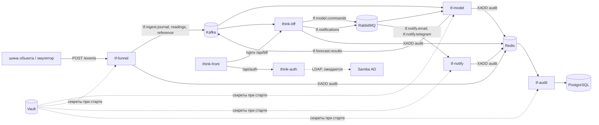

# Think-Faster: сервис прогнозирования инцидентов инженерных коллекторов

Сопроводительная документация (ТЗ §14, §19). Состояние на 26.09.2026.

Как читать документ:

- **«Кратко для экспертизы»** — решение и его цифры по критериям ТЗ §17 и §18. Каждый пункт
  ссылается на раздел, где он разобран подробно.
- **Разделы 1–8** — описание системы простым языком: что делает, как устроена, как считается
  прогноз, как исследовалась нейросеть, какие решения отличают проект, где границы применимости,
  как соблюдены 149-ФЗ и 152-ФЗ.
- **Приложения А–Г** — инженерные подробности: форматы сообщений, топики и ручки, сборка и
  установка, перечень библиотек, команды для повторения исследования.

Структура — по ГОСТ 34.602 и РД 50-34.698 в объёме ТЗ §14. Все числа взяты из рабочих документов
репозитория: `ML/SPEC.md` (постановка и рабочая конфигурация модели), `ML/results/analytics.md`
(журнал исследования, разделы 1–63), `ML/INTEGRATION.md` (встраивание модели в контур),
`docs/common/структура.md` и `docs/common/права-и-аудит.md` (бэкенд, права, аудит). Ссылка вида
«раздел 42» ведёт в журнал исследования, «INTEGRATION §9» — в документ встраивания.

---

## Кратко для экспертизы

### Что сделано

Сервис каждый час оценивает 78 объектов инженерных коллекторов Москвы по журналу событий системы
мониторинга. По каждому объекту он говорит, начнётся ли в ближайшие 24 часа происшествие одного из
шести типов: пожар, загазованность, подтопление, отказ оборудования, отказ датчика, проникновение.
К каждой тревоге прилагаются основания, датчики-свидетели и рекомендация: что сделать, в какой
срок, кого послать и сколько людей. Происшествие, которое прогноз не предсказал, объявляется по
самому событию на 10-й минуте. Решения принимает диспетчер; сервис ничем не управляет и в системы
заказчика не пишет.

Главный результат на отложенном тесте (январь — июнь 2026, модель эти данные не видела): **62%
происшествий известны за сутки вперёд при 4,9 ложного сигнала в сутки на весь парк** — один ложный
сигнал на объект в 16 суток. Остальные 38% объявляет канал «по факту».

### Подход: идея, оригинальность, технологии (§17 п. 1, §18 п. 1)

**Идея.** Диспетчеру нужна не «вероятность аварии», а короткий список: где проверить, что сделать
и кого послать. Поэтому сервис решает две задачи сразу:

- **прогноз** предупреждает за сутки о том, что ещё не началось;
- **канал «по факту»** объявляет то, что уже идёт, если прогноз этого не дал. Полнота канала —
  99,8% эпизодов, решение на 10-й минуте. Вместе с прогнозом он убирает 70–80% ложных тревог без
  потери эпизодов (раздел 4.9).

**Что отличает проект от типового «модель + дашборд»** (подробно — раздел 6):

| решение | почему это важно | число |
|---|---|---|
| мера качества — ложные часы тревоги при равной доле пойманных | точность и ROC-AUC ничего не говорят при 0,1–9% положительных часов; число сигналов вознаграждает гладкую оценку | раздел 4.4 |
| порог — скользящая доля часов под тревогой, а не число | главный диспетчер задаёт, сколько тревог служба готова разбирать; поток тревог держится 0,7–1,5 от обещанного против 0–4,4 у фиксированного числа | 4.6 |
| бюджет ложных часов делится между типами по отдаче | ловит на 35–77% больше, чем один порог на всех | 4.6 |
| шум размечается, но в цель не входит | массовый дым, «Затоплен» после события питания, газ в окне планового ремонта — это не происшествия, и модель на них не учится | 4.2 |
| таблицы главного диспетчера вместо переобучения | график плановых работ снимает 45–59% ложных часов газа без потерь и без переобучения | 6.3 |
| версии модели как выбор поведения | у отказа оборудования главный диспетчер выбирает между «одна тревога на серию» и «тревога к каждому эпизоду» | 6.2 |
| аудит «отклонили, а оно случилось» | каждое отклонение пишется с оценкой модели и сверяется с подтверждёнными происшествиями | 6.6 |
| рекомендации по словарю правил с обоснованием из журнала | диспетчер видит не только меру, но и номер правила и почему оно предложено | 4.10 |

**Технологии.** CatBoost и XGBoost на 306 признаках объекта за час; свёрточная сеть TCN по часовым
рядам объекта (у отказа оборудования). Модель, уведомления и аудит — на Python и FastAPI, приём данных — на Go; обмен через Kafka и RabbitMQ;
журнал действий в PostgreSQL; секреты в Vault; вход через единый токен RS256. Полный перечень с
версиями и лицензиями — приложение В.

### Техническая проработка: код, интеграция, скорость (§17 п. 2, §18 п. 2)

**Качество кода.**

- Весь код открыт, ничего не компилируется в закрытый вид (раздел 8 и приложение Б).
- 228 автоматических тестов: сервис модели — 95, приём данных (Go) — 53, уведомления — 32, аудит — 23,
  общий пакет — 25. Тесты не ходят в сеть: брокеры, почта и Telegram подменены.
- Сквозная проверка: 48 часов журнала 2026 года прошли через такт сервиса. У пяти типов оценки
  совпали с эталоном, посчитанным без сервиса, до нуля, тревоги — объекто-час в объекто-час. У
  отказа оборудования оценка сети сверена на срезе, а порог — на всех 48 часах (журнал
  исследования, раздел 64).
- Сложные места кода прокомментированы ссылкой на раздел журнала исследования, где объяснено,
  почему сделано так. Отброшенные варианты тоже записаны: в журнале 65 разделов.

**Интеграция в другие системы.**

- Модель, приём данных, уведомления и аудит — отдельные контейнеры со своими учётными записями.
  Каждый можно поставить к другой системе мониторинга.
- Вход модели — журнал «канал, время, значение» (REST или Kafka). Выход — JSON-сообщение в топик
  и ручки REST. Форматы — приложение А.
- Внешних интеграций две: шина данных объекта на входе, почта и Telegram на выходе.
- Системы заказчика — только чтение (ТЗ §13).

**Скорость.**

| что | время | требование ТЗ |
|---|---|---|
| пересборка признаков всего парка из журнала | около 3 с раз в час | прогноз по объекту ≤ 300 с |
| объявление по факту | 10-я минута эпизода | — |
| приём пакета событий | до 10 000 событий за запрос | поток данных ≤ 300 с |
| восстановление после сбоя | подъём контейнеров с тех же томов, пропущенный час досчитывается | ≤ 4 ч |

### Прогноз против реальности (§17 п. 3, §18 п. 3, п. 4)

**Как проверялось.** Данные разделены по времени, а не случайно:

| выборка | годы | для чего |
|---|---|---|
| обучение | 2022–2024 | обучение моделей |
| проверка | 2025 | подбор параметров, долей и порогов |
| тест | 2026, январь — июнь | один прогон, ничего не подбирается |

Все числа ниже — на тесте. Эпизод считается пойманным, если тревога горела в течение 24 часов до
его начала. Ложный сигнал — тревога, за которой в пределах 24 часов эпизод не начался.

| тип | эпизодов | поймано заранее | осталось каналу «по факту» | сигналов | ложных | ложных в сутки на парк |
|---|---:|---:|---:|---:|---:|---:|
| пожар | 603 | 387 (64%) | 216 | 348 | 195 | 1,1 |
| загазованность | 74 | 42 (57%) | 32 | 203 | 182 | 1,0 |
| подтопление | 125 | 90 (72%) | 35 | 147 | 120 | 0,7 |
| отказ оборудования | 2 211 | 1 417 (64%) | 794 | 496 | 180 | 1,0 |
| отказ датчика | 826 | 477 (58%) | 349 | 322 | 170 | 1,0 |
| проникновение | 92 | 15 (16%) | 77 | 29 | 22 | 0,1 |
| **итого** | **3 931** | **2 428 (62%)** | **1 503** | **1 545** | **869** | **4,9** |

Упреждение — 24 часа по медиане у всех типов (раздел 38). По отраслевой мере нагрузки
(EEMUA 191: до 6 тревог в час на оператора) 4,9 ложного сигнала в сутки на весь парк далеко внутри
нормы.

**Что ещё подтверждает, что прогноз честный:**

- **ретропрогон 2026 года.** На каждый час журнал обрезается по этот час, и признаки строятся
  заново. Результат совпадает с обучающей таблицей на 100%, вход сети — с расхождением не больше
  0,004 (раздел 49). Значит, модель не подсматривает в будущее;
- **режим проигрывания в сервисе.** Сервис может проиграть тестовый 2026 год: рядом с каждым
  прогнозом видно, что на объекте случилось потом (раздел 3.2);
- **выигрыш должен держаться и на 2025, и на 2026 годе.** Всё, что меньше разброса между
  повторными обучениями (±0,03 PR-AUC), считается неразличимым (раздел 4.4).

Где прогноз не дотягивает — в конце выжимки и в разделе 7.

### Рекомендации против реальных условий (§18 п. 3, п. 4)

Записей о выполненных работах в журнале нет, поэтому рекомендации не обучаются, а собираются по
словарю правил (раздел 4.10). Реальные условия проверены там, где журнал их показывает:

- **нужен ли выезд.** След выезда бригады в журнале — снятие охраны, дверь, движение. Затяжной
  пожар заканчивается выездом в 27% случаев, массовая сработка дыма — в 5%. Правило
  разводит их по-разному;
- **повторится ли отказ.** Затяжной отказ датчика повторяется с того же канала в 45% случаев
  против 5–7% у короткого. Отсюда мера «замена», а не «перезапуск»;
- **сколько людей.** Правило «по звену на каждый объект» журнал опроверг. Состав — по виду работ и
  нормам охраны труда: без выезда, специалист, звено из 3, бригада из 4;
- **чего не хватает.** 41 строка словаря из 113 помечена «сверить с регламентом заказчика»: сроки,
  исполнители, наличие резервного насоса. Словарь — таблица, правка строки меняет его версию, и
  версия идёт в каждом сообщении.

### Настраиваемые параметры (§18 п. 3)

Главный диспетчер меняет поведение сервиса таблицами, без программиста и без переобучения
(раздел 6.3). Каждая правка — новая версия с автором и причиной, действует со следующего часа и
пишется в журнал действий.

| параметр | что меняет | переобучение |
|---|---|---|
| доля часов под тревогой по типу | сколько тревог в сутки; ползунок сразу показывает «примерно N тревог в сутки по парку» | нет |
| коэффициент отклонения | насколько сильным должен быть сигнал после отклонения диспетчером (газ, подтопление) | нет |
| версия модели по типу | поведение тревоги у отказа оборудования (4 версии) | нет |
| график плановых работ | где прогноз молчит, пока идут работы | нет |
| игнорируемые периоды | часы брака данных, которые не идут в признаки и порог | да, флаг ставится сам |
| словарь рекомендаций | меры, сроки, состав выезда | нет |

### Диаграммы (§18 п. 3)

Правила, по которым данные сервиса показываются на диаграммах, чтобы диаграмма не вводила в
заблуждение:

- **Оценка — это место объекта среди всех объектов парка, а не вероятность.** Её нельзя
  подписывать «вероятность 98%». Калиброванная вероятность идёт отдельным полем (раздел 4.11).
- **Прогноз и факт — на одной оси времени.** Ручка истории отдаёт по часам оценку, порог и статус
  («тревога», «молчание по графику», «отклонено»); в режиме проигрывания рядом видно, случилось ли
  происшествие.
- **Сравнения — при равных ложных часах.** Две модели сравниваются по тому, сколько каждая ловит
  при одинаковом числе часов ложной тревоги. Сравнивать по разным порогам нечестно: любая модель
  ловит больше, если чаще тревожит.
- **Разброс показывается.** Различия меньше разброса между повторными обучениями не выдаются за
  выигрыш.

### Скорость и удобство, UX/UI (§18 п. 3, п. 4)

Основа интерфейса — разбор семи московских диспетчерских систем (раздел 6.1):

- окна открываются по правам: окна без права пользователь не видит вовсе;
- по умолчанию открыты два окна рядом: «Очередь прогнозов» и «Карточка прогноза» — логически
  связанные блоки на одном экране;
- одновременно открыто 8–9 карточек, в 99% часов не больше 21: список короткий;
- одна тревога — одна карточка, с возрастом тревоги: новая отличается от висящей неделями;
- четыре действия диспетчера: взять, отклонить с причиной из справочника, заглушить до срока,
  подтвердить.

### Что не получилось и чего ещё нет

- **Свой минимум полноты** (30% по типу, 60% пожару и газу; ТЗ цифр не задаёт) на тесте не
  держится у газа (57%) и проникновения (16%). Проникновение — поддержка проверки доступа, а не
  самостоятельный прогноз; для обоих остаётся канал «по факту».
- **Разметка косвенная.** Подтверждённых инцидентов в данных нет: эпизод — это серия сработок.
- **Живого запуска стенда ещё не было** (ждёт Docker на машине сборки), переноса на сервер — тоже.
  Состояние чужих частей контура — раздел 7.3.

### Соответствие требованиям ТЗ §14

| требование ТЗ §14 | где в документе |
|---|---|
| методы, необходимые для использования решения, доступны и подробно описаны | 4, 5; ручки и форматы — приложение А |
| перечень всех использованных библиотек и компонентов | приложение В |
| решение — отдельный сервис, может стать самостоятельной системой или её компонентом; число внешних интеграций соответствует задачам | 3.1; приложение А.1 |
| сложные технические и логические детали сопровождаются комментариями | 4, 5, 6; в коде — комментарии со ссылками на разделы журнала исследования |
| открытый неоткомпилированный код без обфускации | приложение Б.1 |
| используемые методы обработки данных | 4 |
| условия и ограничения внутри решения | 7 |
| инструкции по компиляции, сборке и установке | приложение Б |
| функциональная и компонентная архитектура | 2, 3 |
| 149-ФЗ и 152-ФЗ | 8 |

---

## 1. Общие сведения

### 1.1 Назначение

Сервис прогнозирует инциденты на объектах инженерных коллекторов Москвы по журналу событий
системы мониторинга и помогает диспетчеру решить, что проверить, кого послать и что внести в план
ТО. Заказчик по ТЗ — Департамент ЖКХ города Москвы, эксплуатирующая организация —
АО «Москоллектор».

| | решение |
|---|---|
| единица прогноза | объект 3-го уровня (78 объектов) × час; коллектор — объект 2-го уровня (16 коллекторов) |
| что прогнозируется | начнётся ли в ближайшие 24 ч эпизод одного из шести типов |
| что получает диспетчер | по каждому объекту и типу: оценку, порог, тревогу, основания, датчики-свидетели, рекомендацию |
| как часто | раз в час |
| что уже идёт | канал «по факту» объявляет происшествие, которое прогноз не дал (4.9) |
| кто решает | диспетчер. Сервис не заменяет его, не принимает окончательных решений, не управляет оборудованием (ТЗ §5) |

Загазованность — шестой тип сверх ТЗ. Реакция на газ своя (вентиляция, а не пожарный расчёт), а
в пожар газ добавил бы 600 эпизодов к 2 554 пожарным за 2022–2025 годы. Если заказчик против, газ
сливается с пожаром на этапе разметки, остальное не меняется.

### 1.2 Состав системы и репозитории

| репозиторий | что в нём |
|---|---|
| `Think-Faster` (этот) | модель и исследование (`ML/`); сервисы модели, приёма данных, уведомлений, аудита и общий пакет (`ML/service`, `docs/backend/`); стенд; ТЗ и проектные документы (`docs/`) |
| `think-infra` | Kafka, RabbitMQ, Redis, Vault, PostgreSQL, nginx, Samba AD — развёртывание контура на сервере |
| `think-auth` | сервис аутентификации: учётки, пароли, выпуск токенов |
| `think-bff` | права, группы, роли, область видимости, заявки |
| `think-front` | интерфейс диспетчера и главного диспетчера |
| `think-test` | эмулятор потока событий для стенда |

### 1.3 Термины

| термин | значение |
|---|---|
| объект | часть коллектора со своим набором датчиков (объект 3-го уровня справочника); единица прогноза |
| эпизод | серия сработок одного типа на одном объекте с паузой не больше 1 ч; начало эпизода — момент инцидента |
| сработка (триггер) | строка журнала, которая по смыслу относится к типу: «Обнаружен дым», «Затоплен» и т. д. |
| шум | размеченные события, которые не считаются происшествием: массовый дым (Н8), «Затоплен» сразу после события питания (Н7), газ в окне планового ремонта по графику (Н10) |
| витрина | таблица признаков «объект × час», 306 признаков |
| доля | доля часов под тревогой по типу — главная настройка порога |
| ложные часы | часы тревоги, за которыми в пределах 24 ч эпизод не начался; основная мера сравнения моделей |
| свежая поимка | эпизод пойман тревогой, которая горит меньше 7 суток. Тревогу, висящую неделями, диспетчер не отличает от статуса объекта |
| зерно | один из нескольких прогонов обучения одной модели с разным начальным случайным состоянием |
| TCN | свёрточная нейросеть по часовым рядам (temporal convolutional network) |
| главный диспетчер | центральный диспетчер: ведёт настройки модели и видит историю отклонённых прогнозов |
| ППР | планово-предупредительный ремонт |
| техучётка | техническая учётная запись сервиса |

---

## 2. Функциональная архитектура

### 2.1 Роли

Роли и права — `docs/common/права-и-аудит.md` §3.

| роль | область | что делает в системе |
|---|---|---|
| техник | один комплекс | видит объекты, тревоги, заявки; отмечается в заявке, решений не выносит |
| диспетчер района | несколько комплексов | работает с очередью прогнозов и заявками: берёт, отклоняет с причиной, глушит, подтверждает происшествие |
| центральный (главный) диспетчер | всё предприятие | то же плюс настройки модели: доли, версии, график работ, игнорируемые периоды, переобучение; история отклонённых и заглушённых прогнозов |
| администратор | всё предприятие | пользователи, группы, права, журнал действий; заявок не ведёт |

### 2.2 Сценарии

**Диспетчер: прогноз.**

1. Раз в час модель пересчитывает все объекты. Где оценка типа выше порога, в очереди прогнозов
   появляется карточка «объект × тип».
2. В карточке:
   - тип и сколько часов уже горит тревога;
   - основания — признаки, на которых держится оценка;
   - датчики-свидетели с временем и значением (по ним подсвечивается пикет);
   - рекомендация: меры, срок, кого послать и сколько людей.
3. Диспетчер выбирает действие:
   - **взять** — создаётся заявка;
   - **отклонить** с причиной из справочника, например «известные работы на объекте»;
   - **заглушить** до указанного срока;
   - позже **подтвердить**, что происшествие случилось.
4. Решение уходит в модель и в журнал действий. У газа и подтопления отклонение переводит объект
   по этому типу в режим «маловероятно» до следующего настоящего эпизода (4.7).

**Диспетчер: происшествие уже идёт.** Канал «по факту» объявляет эпизод, который прогноз не дал,
на 10-й минуте. По объявлению создаётся заявка, ответственным группам уходит письмо и сообщение в
Telegram. Рекомендация обновляется по мере развития эпизода. Если на объекте идёт ППР по графику,
объявление приходит с пометкой «идёт ППР по графику».

**Главный диспетчер: настройки без переобучения.** Все настройки — таблицы (6.3):

- доля часов под тревогой и коэффициент отклонения по каждому типу. Ползунок показывает
  следствие: «примерно N тревог в сутки по парку»;
- рабочая версия модели по типу. Несколько версий сейчас есть только у отказа оборудования (6.2);
- график плановых работ: объект, вид работ, типы, окно. В окне прогноз этих типов не показывается
  и уходит в историю со статусом «молчание по графику»;
- игнорируемые периоды брака данных: по парку, по объекту или по каналу;
- запуск переобучения, если оно включено.

**Главный диспетчер: аудит отклонений.** История отклонённых и заглушённых прогнозов и какие из них
переросли в происшествие. Решения дежурных диспетчеров и молчание по графику работ показываются
раздельно (6.6).

**Администратор.** Заводит пользователей и группы, задаёт область видимости, читает журнал
действий.

**Аналитик.** Повторяет обучение и оценку (приложение Г), собирает пакет модели (приложение Б.3),
сравнивает версии на ретропрогоне.

### 2.3 Что решает сервис, а что — человек

| решает сервис | решает человек |
|---|---|
| оценку и тревогу по типу на 24 ч вперёд | брать ли тревогу в работу, ехать ли |
| порог по доле, которую задал главный диспетчер | какую долю держать: сколько тревог в сутки служба готова разбирать |
| объявление по факту с отсевом шума | подтвердилось ли происшествие |
| молчание в окне графика работ | что внести в график и что считать плановой работой |
| рекомендацию по словарю правил | кого посылать на самом деле; словарь сверяется с регламентами заказчика |
| — | переключение версии модели, запуск переобучения |

Модель ничем не управляет и в системы заказчика не пишет: она только читает поток событий, а
команды получает от BFF (ТЗ §13, «только чтение»).

---

## 3. Компонентная архитектура

### 3.1 Состав контура



Путь данных: шина объекта присылает события в сервис приёма → он раскладывает их по потокам
Kafka → модель раз в час считает прогноз и пишет его в Kafka → BFF показывает его диспетчеру,
создаёт заявки и шлёт уведомления → решения диспетчера возвращаются в модель через RabbitMQ.
Каждый сервис пишет свои действия в журнал аудита.

| компонент | назначение |
|---|---|
| `tf-funnel` (приём данных) | принимает пакеты событий от шины объекта, проверяет, раскладывает по потокам, следит, не замолчал ли канал; хранит сжатый архив показаний и отдаёт его окну «Логи». Написан на Go: быстро принимает много пакетов на малой памяти |
| `tf-model` (модель) | хранит журнал за 100 суток, строит признаки, считает прогноз шести типов, порог, правила, канал «по факту», рекомендации |
| `tf-notify` (уведомления) | доставляет письма и сообщения в Telegram с повтором и защитой от дублей |
| `tf-audit` (аудит) | записывает журнал действий в PostgreSQL и отдаёт его BFF |
| `tfkit` | общий пакет сервисов на Python: секреты из Vault, проверка токенов, событие аудита. У приёма данных то же самое в `kit.go` |
| `think-auth` | вход, выпуск токенов, публичный ключ для их проверки |
| `think-bff` | права, область видимости, заявки, решения диспетчера, настройки модели |
| `think-front` | рабочее место диспетчера и главного диспетчера |
| Kafka | поток событий и прогнозов |
| RabbitMQ | команды модели и уведомления с подтверждением, повтором и очередью отказов |
| Redis | поток аудита, защита уведомлений от повтора |
| Vault | все секреты |
| PostgreSQL | данные BFF и аутентификации, журнал аудита |
| nginx | единая точка входа |
| Samba AD | корпоративный каталог для входа через LDAP/AD (ТЗ §11) |

Модель, приём данных, уведомления и аудит — отдельные контейнеры со своими техучётками и своими
секретами в Vault. Каждый из них можно вынуть из контура и поставить к другой системе мониторинга:
вход у модели — журнал «канал, время, значение», выход — JSON-сообщение в топик (приложение А).
Внешних интеграций у контура две: шина данных объекта (вход) и почта с Telegram (выход).

### 3.2 Как работает сервис модели

Один процесс делает четыре вещи (INTEGRATION §13.1):

| часть | что делает |
|---|---|
| приём | события пишутся в рабочий журнал на диске: 100 суток по всем объектам и вся история состояния охраны. Чистка (4.1) применяется при записи |
| такт | раз в час, через 2 минуты после границы часа по московскому времени: признаки парка → шесть типов → порог → правила и молчание → рекомендации → сообщение прогноза |
| команды | решения диспетчера и настройки; подтверждаются только после записи на диск |
| ручки | состояние, история, прогноз по объекту, оценка «сколько тревог даст эта доля» (приложение А.2) |

**Устойчивость.** Номер последнего посчитанного часа хранится на диске: перезапуск посреди часа
повтора не даёт. Если поток опоздал, прогноз всё равно считается на том, что дошло к границе часа,
и час помечается как посчитанный на неполных данных (раздел 54).

**Два режима часов.** Обычный — такт по настоящему времени. Режим проигрывания — сервис
прогоняет тестовый 2026 год с заданной скоростью, и рядом с прогнозом видно, что случилось на
объекте потом. Это требование ТЗ §18 «сравнение прогнозных и реальных значений». Сообщения в этом
режиме помечены, и заявок по ним не создаётся.

### 3.3 Источник данных: шина объекта и выставочный стенд

Контур развёрнут на `thinkfaster.ru`. Вход данных у него один — сервис приёма `tf-funnel`. Источников
два, и оба приходят в этот вход в формате журнала. Поэтому модель, BFF и интерфейс не различают,
откуда пришло событие:

| режим | источник | как включается |
|---|---|---|
| эксплуатация | шина системы мониторинга объекта присылает пакеты на `POST /api/funnel/events` (А.6) | статический адрес шины в `FUNNEL_EVENTS_ALLOW` (`think-infra`, `stands/prod.env`) и техучётка с правом `telemetry.push` |
| выставочный стенд | эмулятор `tf-emulator` проигрывает журнал событий датасета, приём сам забирает у него поток пачками по 5000 | у приёма задан `TF_FUNNEL_PULL=http://tf-emulator:8000` |

**Что отдаёт эмулятор.** Сутки 01.08.2026 из журнала событий датасета: около 170 тысяч событий по
тем же 78 объектам и тем же каналам, что в справочниках модели. Сутки проигрываются по текущим часам:
событие, записанное в исходных сутках в 03:09:27, выдаётся сегодня в 03:09:27. Время сдвигается на
случайные ±90 секунд, числа на вторые и следующие сутки меняются в пределах наблюдавшихся крайних
значений. Поэтому поток не повторяет себя посимвольно, но остаётся правдоподобным. Формат события
тот же, что в выгрузке, и модель считает прогноз в обычном режиме часов (3.2). Тревоги, канал «по
факту», заявки, уведомления, окно «Логи» и карта работают так же, как на настоящих данных.

**Оба источника одновременно.** Забор у эмулятора не выключает приём от шины: подключить шину можно,
не останавливая стенд. Для перехода в эксплуатацию `TF_FUNNEL_PULL` убирается и приём
перезапускается. События эмулятора, которые уже попали в Kafka, архив показаний (14 дней) и базу
BFF, при этом остаются: перед эксплуатацией их нужно убрать.

---

## 4. Методы обработки данных

### 4.1 Источники и чистка

Вход — журнал событий (номер события, канал, дата, время, флаг «тревожное», значение) и два
справочника: каналов и объектов. Журналы 2019 — июнь 2026, после чистки 253 млн событий. Чистка
одна и та же в исследовании и в сервисе (`ML/pipeline/events.py`):

1. дубли «канал + время + значение» схлопываются;
2. у канала «Состояние охраны» выбрасываются значения-даты. `01.01.1970 03:00:00` — не сбой, а код
   постановки и снятия охраны: он стоит в ту же секунду, что «На охране» и «Снято с охраны»;
3. каналы, которых нет в справочнике, выбрасываются;
4. числа и текстовые состояния разделяются. Газ — % объёма метана: от 0 до 15 — показание, ниже
   нуля и выше 15 — отказ датчика;
5. флаг «тревожное» не используется: его смысл меняется по годам (7% у «Обнаружен дым» в 2023-м,
   100% в 2026-м);
6. 2021 год исключён из обучения: в нём параллельно работали две системы мониторинга, и журнал
   противоречит сам себе. Часы потерь данных (6–10 апреля 2024, 1 июня 2026) не входят в витрину.

### 4.2 Разметка: что считать происшествием

Подтверждённых инцидентов в данных нет, поэтому происшествия восстанавливаются по журналу
(`ML/pipeline/labels.py`, SPEC §3):

- **Сработки → эпизод.** Эпизод — сработки одного типа на одном объекте с паузой не больше 1 ч.
- **Шум размечается, но в цель не входит.**
  - Массовый дым: 10 и больше извещателей объекта за ±10 мин.
  - «Затоплен» в пределах 60 с после события питания в коллекторе: в 94–100% случаев это та же
    секунда.
  - Газ и отказ газового датчика в окне ППР по графику организатора (раздел 62).
- **Проникновение** — дверь или люк открылись под охраной, за ними сработало движение, а охрану в
  течение 15 мин не сняли. Если сняли, это персонал.
- **След выезда бригады** — в том же коллекторе «охрана снята → дверь → движение» с шагом до
  30 мин. Эпизод считается подтверждённым, если выезд начался в пределах 2 ч.
- **Справочник состояний** читается как словарь «состояние → тревожное». «Батарея неисправна» из
  меток убрана (раздел 58).

### 4.3 Признаки

306 признаков на объект × час:

- сколько раз за 1 ч / 6 ч / 24 ч / 7 суток было состояние: дым, газ, температура, двери,
  движение, питание, насосы, «Неисправен», «Неопределен», дребезг;
- газ и температура: максимум, среднее, тренд, часы без показаний;
- прошлые эпизоды и шум — по объекту и по коллектору; часы с прошлого эпизода (до 90 суток);
- выезды бригады в коллекторе, вход персонала, режим охраны;
- календарь: час, день недели, сезон, праздники, дни до праздника;
- состав объекта: число датчиков по типам.

**Без заглядывания в будущее.** Часть разметки смотрит немного вперёд: массовый дым — на 10 мин,
персонал — на 15, след выезда — на 30. Такое событие попадает в признаки в момент, когда о нём
можно знать, а не в момент его начала. Проверка `check.py` пересчитывает признаки случайных
объекто-часов прямыми запросами к журналу и сверяет с витриной. Ретропрогон 2026 года повторяет
витрину по обрезанному журналу на 100% (раздел 49). Сервис считает признаки так же: его срез на
час совпадает со строкой витрины во всех 306 столбцах (INTEGRATION §13.6).

### 4.4 Как сравниваются модели

Разбиение по времени — в выжимке: обучение 2022–2024, проверка 2025, тест январь — июнь 2026.
Происшествий мало — от 0,1% до 9% объекто-часов по типам. Поэтому точность и ROC-AUC не годятся:

- **Основная мера — ложные часы при равной полноте** (раздел 34): сколько часов ложной тревоги
  нужно, чтобы поймать ту же долю эпизодов. Число сигналов как мера отброшено: оно вознаграждает
  гладкую оценку.
- **Рядом — свежие поимки** (раздел 40): постоянная тревога ловит эпизоды, но диспетчер её не
  отличает от статуса объекта.
- **PR-AUC** — для быстрых сравнений и выбора эпохи сети.
- **Шум обучения.** Всё, что меньше ±0,03 PR-AUC или разброса по зёрнам, не различается
  (раздел 57). Выигрыш должен держаться и на проверке, и на тесте.
- **Отраслевая мера нагрузки** — EEMUA 191 / ISA 18.2 (раздел 11).

### 4.5 Модели

Своя модель каждому типу. Оценка типа — среднее по 5 повторным обучениям (зёрнам), раздел 34:

| тип | модель | как настроена |
|---|---|---|
| пожар | CatBoost ×5 | подбор по ложным часам на 2024 |
| загазованность | CatBoost ×5 | умолчания; переобучена на разметке с графиком ППР (раздел 62) |
| подтопление | CatBoost ×5 | подбор по PR-AUC |
| отказ оборудования | версия 1: CatBoost ×5 с весом 0,75 + TCN ×3 с весом 0,25 | раздел 60, версии — 6.2 |
| отказ датчика | XGBoost ×5 | подбор по PR-AUC (Optuna) |
| проникновение | CatBoost ×5 | умолчания |

Бустинг учится на витрине, сеть — на часовых рядах (раздел 5). Для работы модели переобучены на
всех годах 2022 — июнь 2026; на тесте они не хуже исследовательских прогонов (раздел 39).

Отдельно обучена модель «какой из исправных датчиков откажет за 7 суток» (канал × сутки). Её
единица — канал, а не объект, поэтому в сообщение прогноза она не входит.

### 4.6 Порог

- **Бюджет ложных часов делится между типами по отдаче** (раздел 35). Минимум полноты — 30% каждому
  типу, пожару и газу 60%. Раздача по отдаче ловит на 35–77% больше, чем один порог на всех.
- **Рабочие доли часов под тревогой**: пожар 0,025, газ 0,026, подтопление 0,018, отказ
  оборудования 0,059, отказ датчика 0,009, проникновение 0,005 (раздел 46).
- **Скользящий порог** (разделы 32, 37). Порог — такое значение оценки, выше которого за последние
  90 суток была заданная доля часов парка; пересчитывается каждый час. Держится поток тревог, а не
  число: фиксированное значение промахивается в 0–4,4 раза от обещанного, скользящее держит
  0,7–1,5.
- **Новая модель — новый порог.** Пока история её оценок не накопилась, порог берётся из её оценок
  на 2025 годе, которые лежат в пакете модели.

### 4.7 Правила после модели

| правило | что делает | раздел |
|---|---|---|
| склейка 6 ч | повтор тревоги по той же паре объект-тип в течение 6 ч — та же тревога: меньше сообщений и выездов | 27, 36 |
| отклонение диспетчером | только газ и подтопление. После отклонения тревога горит, только если оценка в верхней пятой части обычной доли, до следующего настоящего эпизода. У остальных типов отклонение добавляет пропусков больше, чем убирает ложных, и пишется только в историю | 43, 44, 46 |
| молчание по графику работ | в окне строки графика прогноз её типов не показывается и уходит в историю со ссылкой на строку; снимает 45–59% ложных часов газа без потерь | 62 |
| сглаживание, предел длины тревоги, вторая ступень | проверены и не ставятся | 29, 36, 41, 43 |

### 4.8 Итог на тесте 2026

Таблица по типам — в выжимке. Бюджет — 80 тыс. ложных часов на проверке: заранее поймано 2 428
эпизодов из 3 931 (62%), 4,9 ложного сигнала в сутки на 78 объектов, упреждение 24 ч. Остальное
объявляет канал «по факту». Больший бюджет свежих поимок не прибавляет, растут только постоянные
тревоги (раздел 40).

### 4.9 Канал «по факту»

Происшествие, которое прогноз не дал, объявляется по самому событию (разделы 10 и 15):

- решение принимается на 10-й минуте эпизода по уже пришедшим событиям;
- шум (массовый дым, «Затоплен» после питания) отсеивается сразу;
- полнота — 99,8% эпизодов;
- вместе с прогнозом канал убирает 70–80% ложных без потери эпизодов (раздел 15, прежняя база);
- газ в окне ППР канал не отбрасывает, а объявляет с пометкой.

### 4.10 Рекомендации

Меры по ТО и ремонту собираются по словарю правил; модель в них не участвует (раздел 61):

- 70 правил (113 строк) в пяти слоях: что показал признак, как сработал датчик (массово, затяжно,
  мигает), какие типы горят вместе, в который раз повторяется, поправки;
- режимы «прогноз» и «по факту» разведены: по прогнозу — что сделать заранее за 24 ч, по факту —
  что сделать сейчас за 4 ч;
- кого посылать — по виду работ и нормам охраны труда: без выезда, специалист, звено из 3,
  бригада из 4;
- по объекту рекомендация собирается из блоков по типам без повторов;
- у каждой меры номер правила и обоснование; версия словаря идёт в сообщении;
- 41 строка ждёт сверки с регламентами заказчика.

### 4.11 Уверенность и основания

- **Основания** — признаки, на которых сильнее всего держится оценка (ТЗ §5).
- **Уверенность** (`confidence`, раздел 6): доля подтвердившихся тревог с такой оценкой на проверке
  2025 года. Смесь моделей сопоставлена с метками «эпизод в ближайшие 24 ч» изотонической
  регрессией; точки кривой лежат в пакете модели (`calibration.json`), сервис только
  интерполирует.
- **Длительность тревоги** (`since_hours`) и **датчики-свидетели** (`evidence`: последнее событие
  каждого канала семейств типа на объекте за 24 ч, до пяти) идут рядом отдельными полями, в
  уверенность не входят.
- **Сбой данных.** Если молчит семейство датчиков объекта, уверенность типа, который на нём
  держится, умножается на (1 − цена молчания) из раздела 55: дым у пожара — 0,04, у отказа
  датчика — 0,07, газ у загазованности — 0,25. Какие семейства молчат, сообщение называет в поле
  `silent`.

---

## 5. Полный цикл исследования нейросети

Сеть в проекте одна: TCN по часовым рядам объекта. В работе она стоит у отказа оборудования. Ниже
— путь от первой попытки до четырёх версий для главного диспетчера, с тем, что отброшено и почему.

### 5.1 Зачем сеть

Бустинг видит агрегаты: сколько было, максимум, тренд. Он не видит порядок событий внутри окна,
ритм и форму ряда. У отказа оборудования (насосы, питание, вентиляция) поломке часто предшествует
рисунок во времени: учащение, перемежающиеся сбои, реакция на соседний объект. Гипотеза: сеть по
самим часовым рядам увидит то, чего нет в агрегатах.

### 5.2 Вход

| | значение |
|---|---|
| окно | 168 ч (7 суток) до момента прогноза |
| ряды | 66 часовых рядов объекта (те же счётчики, что в витрине) + те же 66, усреднённые по коллектору |
| статика | состав объекта, календарь, часы с прошлого эпизода по шести типам, число эпизодов за 30 и 90 суток |
| выход | 6 оценок, по одной на тип, горизонт 24 ч |

Ряды всех объектов целиком лежат в памяти видеокарты (около 0,8 ГБ), окна вырезаются прямо на
ней, поэтому обучение не ждёт подготовки данных. Строки обучения, проверки и теста те же, что у
витрины, поэтому оценки сети и бустинга можно смешивать.

### 5.3 Архитектура

`ML/pipeline/seqmodel.py`, класс `Net`, около 559 тыс. параметров:

1. вход — свёртка 1×1 из 132 рядов в 128 каналов;
2. 7 остаточных блоков: причинная свёртка с ядром 3 и растущим шагом 1, 2, 4, …, 64 (видит только
   прошлое), нормализация, GELU, dropout 0,2, свёртка 1×1, сложение со входом блока;
3. охват — 255 ч, больше окна;
4. голова — последний шаг, среднее по времени и статика → 256 → 6 выходов.

Одна сеть на все типы: общая часть учится на всех эпизодах, а у отказа оборудования их больше
всего.

### 5.4 Обучение

| | значение |
|---|---|
| потеря | бинарная кросс-энтропия по шести выходам, вес редких положительных `√(neg/pos)` в пределах [1, 10] |
| оптимизатор | AdamW, шаг 1e-3, OneCycle с разогревом 10%, обрезка градиента 1,0, bf16 |
| батч | 1024 окна, 400 тыс. окон на эпоху |
| выбор эпохи | лучшая по PR-AUC на 2025 годе; лучшая — со 2-й по 7-ю, дальше переобучение (раздел 57) |
| зёрна | 5 у основной сети; 3 у версий оборудования |
| прогон вперёд | обучение до даты, прогноз следующего отрезка — как в жизни |
| железо | RTX 3050 Laptop 4 ГБ; эпоха — около 2 мин обучения и 6 мин вместе с оценкой |

В работе сеть считается на процессоре.

### 5.5 Этапы

| этап | вопрос | что вышло | решение | раздел |
|---|---|---|---|---|
| 1 | сеть против бустинга, одно зерно | проигрывает у большинства типов | отброшена | `results/models.md` |
| 2 | пересчёт в ложных часах, 5 зёрен | у отказа оборудования при равных ложных часах +5% пойманных на проверке и +7,5% на тесте, свежих +17–18%; у остальных типов вровень или хуже | кандидат на отказ оборудования | 42 |
| 3 | прогон вперёд с переобучением раз в 30 суток | сеть лучше бустинга при любой стратегии: +47…+72 поимки, +80…+327 свежих. Ежемесячное переобучение сети: +25 поимок, но −200 свежих | сеть в работу; раз в 30 суток пересчитывается порог, сеть переобучается реже | 48 |
| 4 | ретропрогон 2026 | вход сети из обрезанного журнала сходится: расхождение ≤ 0,004, порядок объектов тот же | вход сети переносится в сервис как есть | 49 |
| 5 | сколько зёрен | у оборудования 5 зёрен стоят 3–4% поимок и снимают 27–42% ложных сигналов | 5 зёрен, при нехватке времени — 3 | 52 |
| 6 | перебор формы сети | ни одна из семи конфигураций базу не обошла; разброс по зёрнам ±0,03 PR-AUC | форма не меняется; окно 72 ч — запасной вариант, в 20 раз дешевле при −2% поимок | 57 |
| 7 | новая разметка по справочнику состояний | все разницы внутри разброса зёрен | переобучено, качество то же | 58 |
| 8 | «липкая» тревога | чем ближе конец данных обучения к тесту, тем дольше стоит тревога и меньше свежих поимок: 1 420 при данных до 2024 года против 1 106 до 2026-го | четыре версии оборудования (6.2), по умолчанию смесь | 60 |
| 9 | разметка с графиком ППР | сервис видит признаки новой разметки; модели других типов ловят то же | шкалы порога считаются на входах сервиса | 62 |
| 10 | доп. горизонты как подсказка в потере, вектор объекта, своя эпоха на тип, другой вес положительных | ни один рычаг не ловит больше рабочей сети ни на 2025, ни на 2026; доп. горизонты вредят сильнее всего | рабочая сеть не меняется | 63 |
| 11 | смесь бустинга с сетью у других типов; версия 1 на входах сервиса | у пожара при весе сети 0,4 +7% и +8% пойманных при тех же ложных сигналах, но при тех же ложных часах прибавки нет; у датчика и подтопления хуже. Версия 1 на входах A′ ловит 1 179 эпизодов, из них 1 081 свежих, против 1 148 и 946 у бустинга | смесь отброшена; версия 1 подтверждена | 65 |

**Липкость подробнее (раздел 60).** Сеть, обученная по самый конец данных, держит тревогу сплошь
на объектах с плотной серией (12+ эпизодов за месяц). Нелипкая сеть перевзводит тревогу к каждому
эпизоду. Проверено:

- липкость даёт близость данных обучения к тесту, а не их объём. При равных двух годах сеть на
  2024–2025 держит тревогу в длинных сериях 44% часов, на 2022–2023 — 9%;
- рецепты: вес 0,3 для часов внутри идущей серии — +93 свежих; разрыв 365 суток перед датой
  обучения — +138; разрыв 730 суток — почти как замороженная сеть;
- смесь CatBoost 0,75 + TCN 0,25 обходит и бустинг, и прежнюю рабочую сеть по всем мерам: на тесте
  при равных ложных сигналах она ловит 1 185 эпизодов, из них 1 102 свежих, при 158 ложных
  сигналах. У бустинга — 1 162 / 994 при 172, у прежней сети — 1 182 / 929 при 166. Вес выбран на
  2025 годе.

### 5.6 Что отброшено

| вариант | почему |
|---|---|
| окно 336 ч, 8 блоков | в 6,4 раза дороже, выигрыша нет |
| ширина 192 или 96 | дороже или хуже у отказа датчика |
| dropout 0,1 и 0,35, шаг 5e-4 | не лучше базы |
| окно 72 ч в работе | −2% поимок на обоих годах; оставлено запасным |
| ежемесячное переобучение сети | теряет свежие поимки (раздел 48) |
| дообучение на окне 30 суток; окно обучения в год | хуже по обеим мерам: оборудованию нужна вся история |
| разрыв 90 суток, 12 эпох, отдельная обработка хронических объектов, память объекта | не прибавляют (раздел 60) |
| сеть у пожара, газа, подтопления, датчика, проникновения | вровень или хуже бустинга |
| одинаковый вес сети во всех типах | +148 ложных сигналов при тех же поимках |
| доп. горизонты, вектор объекта 8 и 16, потолок веса положительных 3 и 30, своя эпоха на тип | не ловят больше рабочей сети (раздел 63) |
| смесь бустинга с сетью у пожара, датчика, подтопления | у пожара выигрыш только при равных ложных сигналах, при равных ложных часах его нет; у датчика и подтопления прибавка на одном году и потеря на другом (раздел 65) |
| срочный прогноз на 6 ч поверх суточного у пожара, газа, подтопления, оборудования, проникновения | прибавка меньше 5% или в сигналах поднять долю суточной выгоднее; у отказа датчика выигрыш по обеим мерам — вторая модель наготове, в пакет не ставится (раздел 65) |

Команды для повторения — приложение Г.

---

## 6. Особые решения проекта

По каждому решению: какую задачу оно решает, что сделано и на каких числах основано.

### 6.1 Простота интерфейса

Основа — разбор семи московских диспетчерских систем (`docs/designs/TF-2-референсы-интерфейсов.md`):
из них выбрано пять экранов — главный, карта, события и инциденты, карточка объекта, работы и ТОиР.
Требование ТЗ §16: элемент на экране, только если он нужен для задачи пользователя.

- **Окна по правам.** Интерфейс — сетка окон. Окно без права на чтение не показывается вовсе, а не
  выводится серым. По умолчанию открыты два окна рядом: «Очередь прогнозов» и «Карточка прогноза».
  Остальные — по надобности: заявки, происшествия, объекты и датчики, люди, настройки модели,
  пользователи и группы, доступ. Раскладка запоминается.
- **Короткий список.** Одновременно открыто 8–9 карточек, в 99% часов не больше 21 (раздел 56).
  Страница в 10 записей закрывает две трети часов.
- **Одна тревога — одна карточка.** Тревога живёт часами и сутками, а модель пишет каждый час;
  повторы склеиваются.
- **Возраст тревоги в карточке**: без него диспетчер не отличит новую тревогу от висящей третью
  неделю.
- **Основание, а не только число**: признаки-основания, датчики-свидетели и готовая рекомендация.
- **Честная точность.** Модель работает с объектом, а не с пикетом. Пикет подставляется по
  датчикам-свидетелям, прогноза «по пикету» интерфейс не обещает.
- **Ползунок с понятным следствием.** Главный диспетчер двигает не абстрактную долю, а видит
  «примерно N тревог в сутки по парку». Долю выше 0,1 ползунком случайно не выставить.
- **Скрытие по паре объект + тип с автовозвратом.** Семь объектов дают половину карточек и 60–66%
  поимок, поэтому скрывать их целиком нельзя.
- **Четыре действия диспетчера**: взять, отклонить с причиной из справочника, заглушить до срока,
  подтвердить.

### 6.2 Выбор моделей

- **Мера выбора — ложные часы при равной полноте** (раздел 34). PR-AUC не видит, что тревога горит
  сутками. Число сигналов вознаграждает гладкую оценку.
- **Своя модель каждому типу** — из CatBoost, XGBoost, LightGBM и TCN, по среднему 5 зёрен. Одно
  зерно меняет результат до 2,5 раза у проникновения.
- **Сеть там, где она сильнее**: только у отказа оборудования, где она выигрывает на обоих годах и
  выдержала прогон вперёд.
- **Версии для главного диспетчера вместо одного «лучшего».** У отказа оборудования выбор модели —
  это выбор поведения: липкая тревога держит одну длинную серию, перевзводная поднимает тревогу к
  каждому эпизоду. Это вопрос того, как работает служба, а не качества:

  | № | имя | модели | переобучение |
  |---|---|---|---|
  | 1 | тихая, по умолчанию | CatBoost ×5 (вес 0,75) + TCN ×3 на данных 2022–2023 (вес 0,25) | нет |
  | 2 | перевзвод | TCN ×5, данные 2022–2023 | нет |
  | 3 | разрыв в 2 года | TCN ×5, вся история кроме последних 730 суток | нет, заморожена |
  | 4 | липкая | TCN ×5 на всей истории | нет, заморожена |

  При рабочей доле 0,059 на тесте у версии 1 ложных сигналов почти столько же, сколько у чистого
  бустинга (176 против 173, около 7 в неделю), а поймано 1 202 против 1 167 и свежих 1 104 против
  999. Другим типам версии не нужны: у пожара сеть не лучше, у газа и подтопления хуже, у отказа
  датчика +4 поимки стоят +1,1 ложного сигнала в неделю.
- **Порог — скользящая доля, а не число.** После смены модели порог пересчитывается сам.

### 6.3 Таблицы главного диспетчера вместо переобучения

Типовой путь — переобучать модель, когда меняются условия. Здесь поведение меняется таблицами в
«Настройках модели». Переобучение необязательно: по ТЗ модуль дообучения — по согласованию (§8).

| таблица | что меняет | нужно ли переобучение |
|---|---|---|
| доли и коэффициенты отклонения | сколько тревог по каждому типу | нет |
| график плановых работ (первая версия — ППР газовых датчиков) | где прогноз молчит и какие эпизоды не считаются | нет, действует со следующего часа |
| игнорируемые периоды | какие часы не идут в признаки, порог и обучение | да: брак данных портит то, чему модель научилась |
| версия модели по типу | чем считается тип | нет, порог пересчитывается |

- каждая правка — новая версия с автором, временем и причиной;
- старые версии хранятся: по ним объясняется, почему поток тревог в прошлом месяце был другим;
- прошлые записи молчания сохраняют ссылку на строку графика, даже если строку потом удалили.

Проверено на графике ППР (раздел 62):

- 44% часов тревоги прежней модели газа на тесте приходились на окна проверок;
- молчание по графику снимает 45–59% ложных часов без потерь;
- прежняя модель с молчанием работает и без переобучения. Переобученная на новой разметке ловит на
  тесте 14 эпизодов газа из 32 против 11 и не чувствительна к сдвигу работ от графика, поэтому она
  поставлена в работу.

Работы, которых нет в графике, закрывает отклонение диспетчера с причиной «известные работы на
объекте» под аудитом.

### 6.4 Единый вход (SSO)

Пользователь входит один раз, и все сервисы принимают его токен без обращения к сервису
аутентификации.

- **Один токен.** `think-auth` выпускает токен доступа на 10 минут и токен обновления на сутки, оба
  в куках. В токене только идентификатор и логин. Права BFF берёт из своей базы с кешем на минуту:
  человека перевели в другую группу — через минуту это работает, перевыпускать токены не нужно.
- **Проверка на месте.** Каждый сервис проверяет подпись публичным ключом сам: срок, аудиторию,
  издателя, тип токена.
- **Техучётки** сервисов имеют только свои разрешённые действия.
- **Совместимость.** Сервисы принимают и текущие токены `think-auth`, и токены по концепту
  проекта, поэтому не ломаются, когда токены приведут к концепту.
- **Каталог.** Для входа через корпоративный каталог (ТЗ §11) в `think-infra` развёрнут Samba AD;
  вход через каталог в сервисе аутентификации — следующий шаг.
- **Аудит без шума.** Чужой или поддельный токен — отказ и событие в журнале; нет права — отказ и
  событие. Протухший токен — отказ без события: фронт обновляет токен каждые 10 минут, иначе
  журнал забился бы.

### 6.5 Уведомления по факту

Уведомление уходит по факту события, а не по расписанию и не по каждому часу прогноза.

1. Модель объявляет эпизод на 10-й минуте, если это не шум, с рекомендацией «по факту».
2. BFF создаёт заявку и публикует уведомление. Адреса групп знает только BFF.
3. Сервис уведомлений доставляет письмо и сообщение в Telegram:
   - при сбое — повтор через 5, 15, 30, 60 с, после пятой попытки — в очередь отказов и событие в
     журнале;
   - отправленное помнится по адресату: повтор после обрыва шлёт только тем, кому не ушло;
   - в журнал попадают канал, тема, число адресатов и отказов; текст письма и адреса не пишутся.
4. По мере развития эпизода рекомендация обновляется: через час «мгновенная» сработка может стать
   «затяжной», и мера меняется с удалённой проверки на замену датчика.

### 6.6 Аудит отклонений и журнал действий

**Вопрос главного диспетчера** — «отклонили, а оно случилось». Как он закрыт:

- каждое отклонение и заглушение пишется в журнал вместе с оценкой модели на тот момент;
- если в пределах горизонта случился эпизод того же типа, пишется отдельное событие;
- «случилось» считается по подтверждённым происшествиям, а не по журналу датчиков. Газ из баллона
  при проверке журнал пишет так же, как утечку, и каждое верное отклонение проверки выглядело бы
  ошибкой;
- молчание по графику работ в свод по диспетчеру не входит: если в окне случилось происшествие,
  виден промах графика и автор его строки, а не дежурный;
- сравнение идёт только внутри одной версии модели;
- историю видит только главный диспетчер.

**Журнал действий** (`docs/backend/audit`, по концепту `права-и-аудит.md` §6):

- если хранилище журнала недоступно, событие пишется в файл и досылается позже; работа сервиса
  из-за аудита не останавливается;
- запись подтверждается только после сохранения в базе; сломанная запись откладывается отдельно
  и не держит остальные;
- правка, удаление и очистка записей запрещены на уровне базы всем, включая владельца;
- пароли, токены, куки, тексты писем вырезаются из событий на любой глубине — последний рубеж на
  случай ошибки в сервисе.

### 6.7 Секреты только в Vault

- Паролей и ключей нет ни в git, ни в образах, ни в переменных окружения контейнеров. Каждый
  сервис при старте читает только свои секреты токеном своей роли.
- Vault после перезапуска запечатан. Сервисы ждут распечатывания и пишут об этом в лог, а не
  падают сразу.
- Без Vault сервис стартует только в режиме разработки на стенде.

### 6.8 Сбои данных без остановки

- **Опоздание потока.** Час несвежести стоит 1–2% поимок, три часа — около 5%, 12 часов — 7–8%
  (раздел 54). Прогноз не останавливается; если событий семейств типа нет дольше `STALE_HOURS`
  (1 ч, у подтопления 3 ч), в сообщении у типа появляется `stale_hours` — сколько часов нет данных.
- **Молчание семейства датчиков** бьёт только по своему типу: худший случай, дым, — 3% поимок
  парка. Молчание отмечает воронка (`channel.status` в `tf.ingest.reference`), модель читает топик
  на ходу. Прогноз считается как обычно, у типа появляется поле `silent`, уверенность умножается
  на (1 − цена молчания) — раздел 4.11.
- **Короткая история дороже любого сбоя канала**: история эпизодов объекта держит четверть поимок.
  Поэтому сервис хранит 100 суток по всем объектам и всю историю охраны (раздел 55).

---

## 7. Условия и ограничения

### 7.1 Качество

- **Свой минимум полноты** — 30% по типу, 60% пожару и газу; ТЗ цифр не задаёт. На тесте 2026 он
  не держится у газа (57%) и проникновения (16%). Проникновение — поддержка проверки доступа, а не
  самостоятельный прогноз.
- **Разметка косвенная.** Эпизод — это серия сработок. Часть эпизодов — проверки и работы, которых
  нет ни в журнале, ни в графике.
- **Оценка — не вероятность**, а место объекта среди оценок парка. Калиброванная вероятность идёт
  отдельно, в уверенности.
- **Место — объект, не пикет.** Пикет подставляется по датчикам-свидетелям.
- **Горизонт 24 ч.** Происшествия без предвестника ловит только канал «по факту».
- **Полнота падает к лету** у всех моделей (раздел 49). Причина — постоянная доля часов под
  тревогой при растущем числе эпизодов, а не старение модели.
- **Внешние данные** — погода, качество воздуха, конденсат, расширенный календарь — не дали
  прироста ни у одного типа (разделы 1, 2, 5, 23, 34) и не используются.

### 7.2 Работа

- **Нужна история.** Признакам нужно 100 суток журнала, порогу — 90 суток оценок. Первая история
  порога берётся из пакета модели, дальше копится своя.
- **Замолчавший объект не прогнозируется.** Ложных тревог на нём нет, но нет и предупреждений.
  Молчание объекта закрывает контроль связи в сервисе приёма, а не прогноз (раздел 51).
- **Работы вне графика** модель не видит: нарядов в журнале нет. Такие работы закрывает отклонение
  диспетчера.
- **Время** — московское, явно, независимо от зоны сервера. В журнале время без зоны.
- **Перезапуск после питания.** 69% эпизодов газа и 26% отказов оборудования приходятся на первые
  10 минут после возврата питания. Считать ли их шумом — решение заказчика. Интерфейсу нужна
  пометка «после восстановления питания» (раздел 45).
- **Переобучение** выключено по умолчанию и запускается только командой; все четыре версии
  оборудования заморожены.
- **Модель отказа датчика «канал × сутки»** в сообщение прогноза не входит; для работы ей нужен
  свой топик и своя ручка.

### 7.3 Контур на 26.09

Что в других частях контура ещё не сделано и как наша сторона к этому подстроена — таблица
INTEGRATION §12.2. Главное:

| что | как обходится сейчас |
|---|---|
| в nginx нет маршрутов к модели и сервису приёма | ручки модели отвечают и с префиксом `/api/ml`, и без него |
| Vault в основной ветке инфраструктуры ещё в режиме разработки | сервисы ждут распечатывания; токены ролей — файлами |
| вход через корпоративный каталог не подключён | сообщено владельцу инфраструктуры |
| в BFF нет решения «подтверждено» | метка ждёт команды от BFF |
| BFF не читает поток показаний | последнее показание датчика в карточку пока не приходит |
| живой запуск стенда | конфигурация проверена `docker compose config`, запуск ждёт Docker на машине сборки |
| в BFF нет допусков, графика работ, бригадира и области прав | тестовые базы стенда лежат в CSV, в BFF заливается то, что ложится в схему (домены-и-сущности §13) |

---

## 8. Безопасность и персональные данные

### 8.1 149-ФЗ

Сервис обрабатывает технологическую информацию заказчика: журнал событий датчиков и справочники
объектов. Что сделано для защиты информации:

- **Доступ** — только по токену: роли и область видимости в BFF (ТЗ §11). Сервисы проверяют токен
  сами, техучётки — только своё действие.
- **Целостность журнала действий** — правка и удаление запрещены всем, включая владельца базы.
  Каждое событие имеет свой идентификатор, повторы отбрасываются.
- **Секреты** — только в Vault, у каждого сервиса своя роль с доступом к своим секретам (6.7).
- **Системы заказчика** — только чтение (ТЗ §13). Модель читает поток и ничем не управляет.
- **Шифрование при передаче** (TLS 1.2+) — на nginx. Внутри сети контура брокеры работают без TLS.

### 8.2 152-ФЗ

Данные датчиков персональных данных не содержат: канал, время, значение, объект. Персональные
данные есть только у пользователей системы — ФИО, почта, чат в Telegram. Они хранятся в одном
месте — в BFF (права-и-аудит §1). Что не хранится и не пишется:

| что | где соблюдается |
|---|---|
| пароли | хранит только сервис аутентификации в виде хэша Argon2; в журналы, логи и события аудита не пишутся |
| токены | в журнал аудита попадает только номер токена, сам токен — нет; токены нигде не хранятся |
| текст писем и сообщений | в аудит не пишется, только тема, канал и число адресатов |
| адреса получателей | в журнале уведомлений — число адресатов и код ошибки без адреса |
| значения датчиков | в журнале отказов сервиса приёма не пишутся, только число и причины |
| персональные данные в модели | нет: модель знает объекты и каналы, а не людей |
| кто принял решение | в команде модели — идентификатор и логин, в аудите — логин; ФИО не передаётся |

Предложенные сроки хранения: журнал запросов — 90 дней, журнал действий — не меньше года (это
история решений диспетчеров). В ТЗ сроков нет, они согласуются с заказчиком.

Люди на стенде синтетические: ФИО, телефоны, номера допусков и графики выдуманы, места из названий
датчиков заменены на «место N» (домены-и-сущности §13).

---

## Приложение А. Интерфейсы: топики, ручки, форматы

### А.1 Топики и очереди

| где | имя | кто пишет | кто читает | что |
|---|---|---|---|---|
| Kafka | `tf.ingest.journal` | funnel | модель, BFF | тревожные события и текстовые состояния, хранение 30 суток |
| Kafka | `tf.ingest.readings` | funnel | модель | числовые показания, 7 суток |
| Kafka | `tf.ingest.reference` | funnel | модель | справочники и состояние каналов (`silent`/`ok`), compact |
| Kafka | `tf.forecast.results` | модель | BFF | прогноз по объекту за час и объявления по факту, 7 суток |
| Kafka | `tf.dlq` | все | — | неразобранное, 14 суток |
| RabbitMQ | `tf.model.commands` | BFF | модель | решения диспетчера и настройки (А.4) |
| RabbitMQ | `tf.notifications` → `tf.notify.email`, `tf.notify.telegram` | BFF | notify | уведомления (А.5) |
| RabbitMQ | `tf.dlx` → `tf.dlq` | брокер | — | отвергнутые сообщения |
| Redis | `audit`, `audit:requests`, `audit:dead` | все сервисы | аудит | события аудита |

Предел сообщения — 1 МБ (ТЗ). Ключ сообщений прогноза — `object_id`, чтобы прогнозы одного
объекта шли по порядку. Ключ событий — номер канала.

### А.2 Ручки сервиса модели

Каждая ручка доступна и с префиксом `/api/ml`, и без него.

| ручка | кто вызывает | право | что отдаёт |
|---|---|---|---|
| `GET /health` | nginx, Docker | без токена | `{ok, clock, last_hour}` |
| `GET /status` | админ-панель | `alert.read` | версии модели по типам, версии настроек, пороги, свежесть потока, счётчики приёма |
| `GET /estimate?type=&share=` | ползунок доли | `threshold.edit` | сколько тревог в сутки по парку даст эта доля |
| `GET /forecast?object_id=` | BFF | техучётка `ml.read` | последний расчёт по объекту |
| `GET /history?object_id=&type=&from=&to=` | BFF | техучётка `ml.read` | оценки, порог и статус по часам: `ALARM`, `MUTED`, `REJECTED` |

Режим часов задаёт `TF_MODEL_CLOCK`: `live` — настоящее время, `replay:<начало>:<секунд на час>` —
проигрывание 2026 года; сообщения несут `clock: "replay"`, и BFF заявок по ним не создаёт.

### А.3 Сообщение прогноза `tf.forecast.results`

Одно сообщение — один объект и один час, шесть типов внутри (INTEGRATION §2.3):

```json
{
  "schema": 1, "object_id": 5122, "hour_end": "2026-09-23T07:00:00+03:00",
  "horizon_hours": 24, "model_version": "export-2026-09-23",
  "types": {
    "fire": {"score": 0.981, "threshold": 0.975, "alarm": true, "confidence": 0.31, "since_hours": 4,
             "reasons": [{"feature": "smoke_24h", "value": 3.0}],
             "evidence": [{"sensor_id": 41233, "ts": "2026-09-23T06:12:00+03:00", "value": "Обнаружен дым"}],
             "recommendation": {"mode": "прогноз", "now": ["…"], "visit": {"состав": "специалист", "людей": 1, "срок_ч": 24}}},
    "gas": {"score": 0.402, "threshold": 0.974, "alarm": false}
  }
}
```

- `score` — ранговая оценка 0…1, место объекта в распределении оценок парка, а не вероятность.
- `threshold` — квантиль оценок парка за 90 суток на долю из настроек.
- `since_hours` — сколько часов горит тревога.
- `confidence` — калиброванная вероятность подтверждения тревоги (раздел 4.11), с поправкой на
  молчание семейств. Есть только у тревоги.
- `evidence` — датчики-свидетели: номер канала, время, значение; до пяти, свежие первыми. Только
  у тревоги.
- `silent` — какие семейства датчиков типа молчат на объекте; `stale_hours` — сколько часов нет
  событий семейств типа по парку. Приходят при любой оценке, если есть что сообщить.
- `model_version` — чем посчитан прогноз; без него нельзя разбирать отклонения после смены версии.
- Канал «по факту» пишет в тот же топик с `kind: fact` и рекомендацией в режиме `факт`.

### А.4 Команды модели `tf.model.commands`

Общий конверт (INTEGRATION §13.3):

```json
{"schema": 1, "command_id": "uuid", "kind": "decision.reject",
 "issued_at": "2026-09-26T08:14:00+03:00", "issued_by": {"sub": "…", "login": "petrova"},
 "request_id": "e81b07c4f2a9", "payload": {}}
```

| вид | что делает модель |
|---|---|
| `decision.take` | учитывает в статистике |
| `decision.reject` | правило отклонения у газа и подтопления, у остальных типов — только история |
| `decision.mute` | молчание пары объект-тип до срока |
| `decision.reopen` | снимает отклонение |
| `decision.confirmed` | метка «случилось» для аудита отклонений |
| `settings.operating` | новые доли и коэффициенты отклонения со следующего часа |
| `settings.works` | новые окна графика работ со следующего часа |
| `settings.gaps` | игнорируемые периоды; ставит флаг «нужно переобучение» |
| `model.switch` | другая версия модели типа со следующего часа, порог — по шкале новой версии |
| `retrain.request` | задача в очередь переобучения, если оно включено |

Команды настроек несут полный снимок таблицы с номером версии, а не разницу. У RabbitMQ нет
повтора истории, поэтому BFF сверяет номера версий по `/status` и при расхождении отправляет
снимок заново. Команда с уже виденным `command_id` подтверждается без действия. Сломанное
сообщение уходит в DLQ, временная ошибка — повтор до пяти раз.

### А.5 Уведомление `tf.notifications`

```json
{"schema": 1, "notice_id": "uuid", "ticket_id": 1042, "kind": "fact",
 "subject": "Загазованность: объект 5122", "text": "…",
 "to": {"emails": ["…"], "chat_ids": [123]}, "request_id": "e81b07c4f2a9"}
```

Публикует только BFF. Каждую очередь читает своя учётка брокера; отправленное помнится по паре
`notice_id` + адресат в Redis; письма уходят пачками по числу адресатов, которое принимает почтовый
сервер.

### А.6 Приём событий `tf-funnel`

`POST /events` (за nginx — `/api/funnel/events`, токен с правом `telemetry.push`) принимает до
10 000 событий в полях журнала:

- тревожное событие или текстовое состояние идёт в `journal`, число — в `readings`. Каждое событие
  попадает ровно в один топик;
- ответ 202 перечисляет отвергнутые события с причиной. Если не принято ни одно — 422. Если лежит
  Kafka — 503 с `Retry-After: 5`: шина повторяет пакет, повтор модель отбрасывает по ключу журнала;
- канал, который слышали хотя бы трижды, считается молчащим, если нового события нет дольше
  `max(60 мин, 4 × обычный интервал канала)`. Переход пишется в `tf.ingest.reference`;
- на стенде сервис сам забирает события у эмулятора (`TF_FUNNEL_PULL`).

Окно «Логи» — показания датчиков объекта, история и живой поток. Показания в BFF не пишутся:

- каждое принятое событие дописывается в файл часа на томе `tf-funnel-data`
  (`/data/archive/<ГГГГ-ММ-ДД>/<ЧЧ>.jsonl`, время приёма по МСК). Закрытый час через 5 минут
  сжимается zstd в `<ЧЧ>.jsonl.zst`. Дни старше `TF_FUNNEL_ARCHIVE_DAYS` удаляются, 0 — хранить всё;
- `GET /log?objectId=&from=&to=&limit=` (за nginx — `/api/funnel/log`) — история, новые сверху, по
  умолчанию за сутки, до 1000 строк, `more` — есть ещё;
- `GET /stream?objectId=` — WebSocket: `ready`, `reading` на каждое показание, `status` — канал
  замолчал или ожил, `dropped` — клиент не успевал. Закрытие 4401 — срок токена истёк;
- вход по токену пользователя (cookie `access_token` или `Authorization: Bearer`). Какие датчики
  видны, решает BFF `GET /readings/scope`: диспетчер, главный диспетчер и админ — любой объект
  (чтение ресурса `readings`), инженер — объекты своих заявок в работе. Ответ BFF помнится минуту.

Подробно — INTEGRATION §13.9.

### А.7 Журнал аудита

- сервисы пишут события в поток Redis `audit`; если Redis недоступен — в файл на томе, досылка на
  каждом такте;
- сервис аудита пишет пачками в PostgreSQL (`audit.events`) и подтверждает только после commit.
  Зависшее у упавшего экземпляра забирает через минуту; строка, которую нельзя записать, уходит в
  `audit:dead`;
- журнал запросов: каждый HTTP-запрос к модели, воронке, уведомлениям и аудиту даёт строку в
  поток `audit:requests` — метод, шаблон маршрута без номеров и строки запроса, код ответа,
  длительность, кто спросил (из токена или `anonymous`), `request_id`, адрес. Пробы `/health` не
  пишутся. Запись идёт из фоновой очереди и не задерживает ответ (`tfkit.request_log`);
- таблицы разбиты на партиции по месяцам; правка, удаление и очистка запрещены триггером; роль
  записи может только добавлять и читать;
- поля `password`, `token`, `authorization`, `cookie`, `text`, `body` на любой глубине вырезаются;
- события модели: `forecast.rejected`, `forecast.muted`, `forecast.recurred`; токены — `token.refused`,
  `access.denied`; уведомления — `notify.failed`. Каталог — INTEGRATION §13.4.

### А.8 Токены

- токен доступа RS256, 10 минут; токен обновления — сутки; в токене `sub` и логин;
- ключ проверки берётся из `TF_AUTH_PUBLIC_KEY`, если его нет — с `/.well-known/jwks`, кэш на час;
- проверяются срок, аудитория `api`, издатель, тип `access`;
- техучётки несут `scope`; пока `think-auth` его не кладёт, техучётка опознаётся по `sub` из
  списка `TF_<СЕРВИС>_SERVICE_SUBS` в Vault;
- `tfkit` принимает оба варианта полей: `token_type` и `typ`, издатель `auth-service` и `tf-auth`.

---

## Приложение Б. Сборка и установка

### Б.1 Исходный код

Весь код открыт и лежит в репозиториях из 1.2 как исходные тексты: Python — модель, приём
данных, уведомления, аудит; C# — BFF и аутентификация; TypeScript — интерфейс. Ничего не
компилируется в закрытый вид и не обфусцируется. Образы собираются из исходников `Dockerfile`-ами
из репозитория. Сложные места кода прокомментированы со ссылкой на раздел журнала исследования.

### Б.2 Исследовательская среда

Нужны Python 3.12, видеокарта NVIDIA с CUDA 12.4 (числа получены на RTX 3050 Laptop 4 ГБ) и
журналы датасета. Журналы (15 ГБ) и рабочая база в git не лежат.

```bash
python -m venv .venv && . .venv/bin/activate
pip install -r ML/requirements.txt              # torch 2.5.1+cu124 и остальное, версии закреплены
export TF_JOURNAL=<папка с ext-journal-*.csv>
export TF_WORK=<рабочая папка>                  # по умолчанию ML/work
cd ML/pipeline
python events.py && python labels.py && python features.py && python check.py 10
```

Выгрузка моделей для работы:

```bash
python export.py                                # 30 моделей на всех годах → work/export
python export.py --check                        # то же на 2022–2025 против рабочих прогонов
python export.py --equipment-version 1          # версии оборудования → work/export_equipment_v1
```

### Б.3 Пакет модели для контейнера

Сервис не читает исследовательскую папку. `ML/service/bundle.py` один раз собирает всё нужное для
прогноза в одну папку; модели при этом не обучаются:

```bash
cd ML/service
python bundle.py <папка> --export ../work/export --work ../work_pa            # собрать
python bundle.py <папка> --check --export ../work/export --work ../work_pa    # проверить
```

В пакете: модели и версии оборудования; `manifest.json`, описание и важность признаков; шкала
каждого зерна — его оценки на витрине 2025 года по входам сервиса; час каждой строки 2025 года для
первой истории порога; первая версия таблиц главного диспетчера.

`--check` на контрольном часе 2026-01-04 12:00 сверяет признаки среза сервиса со строкой витрины
и оценки пакета с оценками выгрузки по каждому типу и версии. Код выхода 0 — все расхождения
меньше 1e-6. Папка монтируется в контейнер только для чтения.

### Б.4 Образы

Из корня репозитория:

```bash
docker build -f ML/service/Dockerfile -t tf-model .
docker build -f docs/backend/funnel/Dockerfile -t tf-funnel docs/backend
docker build -f docs/backend/notify/Dockerfile -t tf-notify docs/backend
docker build -f docs/backend/audit/Dockerfile -t tf-audit docs/backend
```

Модель, уведомления и аудит собираются на `python:3.12-slim`, версии пакетов закреплены. Приём
собирается в `golang:1.27`: при сборке идут тесты, в образ `distroless/static` кладётся только
бинарь. Процессы работают не от root. Секретов и моделей в образах нет. Проверка жизни — `/health`
(у приёма — `/tf-funnel -health`, в его образе нет оболочки).

### Б.5 Стенд

Стенд повторяет состав `think-infra`. Redis, RabbitMQ и Kafka подключаются из клона `think-infra`
без правок: те же пользователи, топики, ACL и политики очередей. Сверху добавляются dev-Vault с
записью секретов и выпуском токенов ролей, PostgreSQL со схемой аудита и эмулятор потока.

```bash
cp docs/backend/stand.env.example docs/backend/stand.env      # тестовые значения, в git не попадает
docker network create think-fast-net
docker compose -f docs/backend/stand.yml --env-file docs/backend/stand.env up -d
docker compose -f docs/backend/compose.yml --env-file docs/backend/stand.env up -d --build
```

Цепочка стенда: эмулятор → приём → `tf.ingest.*` → модель → `tf.forecast.results`. Уведомление
по факту без BFF проверяется публикацией в `tf.notifications` под учёткой `tf-bff`.
`TF_MODEL_BUNDLE_DIR` — папка пакета из Б.3.

- dev-Vault держит секреты в памяти: после его перезапуска нужно снова `up tf-vault-seed`;
- без публичного ключа аутентификации ручки с токеном отвечают 503, а `/health` и поток данных
  работают.

### Б.6 Секреты в Vault

| путь | поля | кто читает |
|---|---|---|
| `secret/tf/kafka/model`, `kafka/funnel` | `TF_KAFKA_MODEL_PASSWORD`, `TF_KAFKA_FUNNEL_PASSWORD` | модель, приём |
| `secret/tf/rabbit/model`, `rabbit/email`, `rabbit/telegram` | `TF_RABBIT_<УЧЁТКА>_PASSWORD` | модель, уведомления |
| `secret/tf/redis` | `TF_REDIS_PASSWORD` | все |
| `secret/tf/postgres/audit` | `TF_PG_AUDIT_USER_PASSWORD` | аудит |
| `secret/tf/app/tf-model` | `TF_MODEL_SERVICE_SUBS` | модель |
| `secret/tf/app/tf-notify` | `TF_NOTIFY_SMTP_USER`, `TF_NOTIFY_SMTP_PASSWORD`, `TF_NOTIFY_TELEGRAM_BOT_TOKEN`, `TF_NOTIFY_SERVICE_SUBS` | уведомления |
| `secret/tf/app/tf-audit` | `TF_AUDIT_SERVICE_SUBS` | аудит |
| `secret/tf/app/tf-funnel` | `TF_FUNNEL_SERVICE_SUBS` | приём |

Схема та же, что у сервисов think-infra: имя ключа — имя переменной окружения. Открытый ключ
аутентификации не секрет и в Vault не лежит — `TF_AUTH_PUBLIC_KEY` или JWKS.

1. Пароли учёток заводит think-infra (`secrets.conf`), собственные секреты сервиса — в `app/tf-<сервис>`.
2. `hashicorp/services.conf` даёт каждому сервису роль AppRole `tf-svc-tf-<сервис>` с чтением только
   его путей.
3. `setup.sh service-credentials tf-<сервис>` выдаёт `role_id` и `secret_id`; они уходят в env-файл
   compose как `TF_<СЕРВИС>_VAULT_ROLE_ID` и `TF_<СЕРВИС>_VAULT_SECRET_ID`. Токен роли живёт 5 минут,
   на 403 сервис входит заново.

После каждого перезапуска Vault его распечатывают ключами. Сервисы в это время ждут
(`TF_VAULT_WAIT`, по умолчанию 900 с) и раз в минуту пишут об этом в лог. Отказ 403 и 404 не
ждётся: это ошибка роли или пути.

### Б.7 Перенос на сервер

Порядок жёсткий: сначала всё поднимается и проверяется на стенде, потом переносится на сервер
вместе с владельцем инфраструктуры и по его схеме (INTEGRATION §12.3, этап 8):

- том с пакетом модели;
- секреты в Vault по Б.6;
- тот же `docs/backend/compose.yml` во внешней сети `think-fast-net`;
- маршруты nginx `/api/ml/`, `/api/funnel/`.

Готово, когда модель отвечает через nginx по `/api/ml/health`.

### Б.8 Проверки и резервное копирование

```bash
cd docs/backend/tfkit  && python -m pytest -p no:cacheprovider      # 25 тестов
cd docs/backend/funnel && go test ./...                             # 53, Go 1.27
cd docs/backend/notify && TF_NOTIFY_ENV_FILE= python -m pytest -p no:cacheprovider   # 32
cd docs/backend/audit  && python -m pytest -p no:cacheprovider      # 23, живая база — по TF_AUDIT_TEST_DB
cd ML/service && TF_ENV=dev CUDA_VISIBLE_DEVICES= python -m pytest -p no:cacheprovider tests   # 95
```

Сквозная проверка модели — 48 часов журнала 2026 через такт сервиса дают те же оценки и тревоги,
что ретропрогон `retro.py` на тех же часах, с командой `settings.works`, которая глушит газ на
объекте со следующего часа (INTEGRATION §10.2).

Резервное копирование:

- PostgreSQL — скрипт резервного копирования `think-infra`;
- Vault — снимки raft, хранятся последние 14;
- пакет модели восстанавливается копированием тома;
- состояние модели — номер часа, история оценок, настройки — на томе `/work`.

Восстановление после сбоя (ТЗ: не больше 4 ч) — подъём контейнеров с тех же томов. Модель при
старте досчитывает пропущенный час.

---

## Приложение В. Перечень библиотек и компонентов

Версии — те, что закреплены в `requirements.txt` и `Dockerfile`, и те, с которыми получены числа.

### В.1 Модель и исследование (Python 3.12)

| библиотека | версия | лицензия | зачем |
|---|---|---|---|
| PyTorch | 2.5.1 (CUDA 12.4 для обучения, CPU в образе) | BSD-3-Clause | TCN |
| CatBoost | 1.2.10 | Apache-2.0 | модели пяти типов |
| XGBoost | 3.4.1 | Apache-2.0 | отказ датчика |
| LightGBM | 4.7.0 | MIT | сравнение семейств |
| Optuna | 5.0.0 | MIT | подбор гиперпараметров |
| scikit-learn | 1.9.1 | BSD-3-Clause | метрики, изотоническая калибровка |
| DuckDB | 1.5.5 | MIT | рабочая база журнала и журнал сервиса |
| Polars | 1.44.2 | MIT | сборка витрины |
| PyArrow | 25.0.1 | Apache-2.0 | parquet |
| NumPy | 2.5.3 | BSD-3-Clause | ряды и шкалы |

### В.2 Сервисы на Python 3.12

| библиотека | версия | лицензия | где |
|---|---|---|---|
| FastAPI | 0.141.1 | MIT | модель, уведомления, аудит |
| Starlette | 1.6.0 | BSD-3-Clause | через FastAPI |
| Uvicorn | 0.54.0 (notify — 0.53.0) | BSD-3-Clause | модель, уведомления, аудит |
| Pydantic | 2.13.5 | MIT | notify, через FastAPI |
| pydantic-settings | 2.15.0 | MIT | notify |
| python-dotenv | 1.2.3 | BSD-3-Clause | notify, только dev |
| confluent-kafka | 2.15.1 | Apache-2.0 | модель |
| pika | 1.4.4 | BSD-3-Clause | модель, notify |
| redis-py | 8.1.0 | MIT | модель, уведомления, аудит |
| PyJWT | 2.15.0 (notify — 2.14.0) | MIT | `tfkit` |
| cryptography | 50.0.1 | Apache-2.0 или BSD-3-Clause | `tfkit` |
| psycopg[binary] | 3.3.6 | LGPL-3.0 | аудит |
| httpx | 0.28.1 | BSD-3-Clause | notify, тесты |
| pytest | 9.1.1 | MIT | тесты |

### В.2а Приём данных на Go 1.27

Версии закреплены в `docs/backend/funnel/go.mod` и `go.sum`.

| модуль | версия | лицензия | зачем |
|---|---|---|---|
| franz-go (`github.com/twmb/franz-go`) | 1.22.0, kmsg 1.14.0 | BSD-3-Clause | запись в Kafka |
| golang-jwt | 5.3.1 | MIT | проверка токенов RS256 |
| go-redis | 9.22.0 | BSD-2-Clause | поток аудита |
| klauspost/compress | 1.20.0 | BSD-3-Clause | через franz-go |
| pierrec/lz4 | 4.1.30 | BSD-3-Clause | сжатие lz4, через franz-go |
| cespare/xxhash | 2.3.0 | MIT | через go-redis |
| go.uber.org/atomic | 1.11.0 | MIT | через go-redis |
| golang.org/x/sys | 0.30.0 | BSD-3-Clause | через go-redis |

### В.3 Инфраструктура

| компонент | версия | лицензия | замечание |
|---|---|---|---|
| Apache Kafka | 4.0.0 | Apache-2.0 | |
| RabbitMQ | 4.1 (management-alpine) | MPL-2.0 | |
| Redis | 7 (alpine) | с 7.4 — RSALv2 / SSPLv1 | тег плавающий. Свободная замена с тем же протоколом — Valkey (BSD-3-Clause) |
| HashiCorp Vault | 1.20.0 | BUSL-1.1 | внутреннее использование разрешено. Свободная замена с тем же API — OpenBao (MPL-2.0) |
| PostgreSQL | 16 | PostgreSQL License | ТЗ: 12 и выше |
| nginx | 1.29 (alpine) | BSD-2-Clause | |
| Samba AD | на Debian 13 | GPL-3.0 | каталог LDAP/AD |
| Python (образ) | 3.12-slim | PSF-2.0 | |
| Go (сборка приёма) | 1.27 | BSD-3-Clause | образ `golang:1.27` только для сборки |
| distroless static (образ приёма) | debian12 | Apache-2.0 | без оболочки и пакетов |

### В.4 BFF и аутентификация (.NET 8)

| библиотека | версия | лицензия |
|---|---|---|
| Entity Framework Core, Npgsql.EntityFrameworkCore.PostgreSQL | 8.0.x / 8.0.10–8.0.11 | MIT / PostgreSQL License |
| Serilog.AspNetCore | 8.0.3 | Apache-2.0 |
| Swashbuckle.AspNetCore | 6.6–6.7 | MIT |
| System.IdentityModel.Tokens.Jwt | 6.35 / 7.6.2 | MIT |
| Konscious.Security.Cryptography.Argon2 | 1.3.1 | MIT |
| StackExchange.Redis | 3.3.0 | MIT |
| Newtonsoft.Json | 13.0.4 | MIT |

### В.5 Интерфейс

| библиотека | версия | лицензия |
|---|---|---|
| React, React DOM | 19.3 | MIT |
| React Router | 7.18.4 | MIT |
| axios | 1.20 | MIT |
| zustand | 5.0.15 | MIT |
| react-scripts | 5.0.1 | MIT |
| Testing Library | — | MIT |

Лицензии с ограничениями:

- **psycopg** — LGPL-3.0: библиотека подключается как пакет без изменений, код сервиса аудита
  открывать не обязывает;
- **Vault** — BUSL-1.1 и **Redis 7.4+** — RSALv2 / SSPLv1: разрешают внутреннее использование и
  запрещают продавать их как услугу. Если заказчику нужна только свободная лицензия, замена —
  OpenBao и Valkey, код сервисов при этом не меняется.

---

## Приложение Г. Как повторить исследование

Подготовка данных — Б.2. Обучение смеси, подбор долей, выгрузка и ретропрогон — `ML/SPEC.md` §10.
Сеть:

```bash
cd ML/pipeline
python seqmodel.py --epochs 12 --seed 1                         # зерно 1; так же 0, 2, 3, 4
python tcnmix.py "$MIX5" main_h24/tcn,main_h24/tcn_s1,…         # смесь с бустингом (раздел 42)
python seqmodel.py --epochs 3 --cutoff 2026-01-31 --tag all_s0  # прогон вперёд (раздел 48)
python rollcmp.py "$MIXT" cat:all mix tcn:frozen:0,1,2 tcn:all:0,1,2
python seqmodel.py --score-val …                                # шкала сети для пакета (Б.3)
python export.py --equipment-version 1                          # версия оборудования (6.2)
```

Параметры обучения сети, не вошедшие в раздел 5: вход преобразуется как nan → 0, знаковый
`log1p`, float16 (иначе оценка расходится с обучением на третьем знаке); GroupNorm из 8 групп;
weight decay 1e-2; эпоха базовой сети — 111 с обучения, 12 эпох одного зерна — около 1,5 ч.
