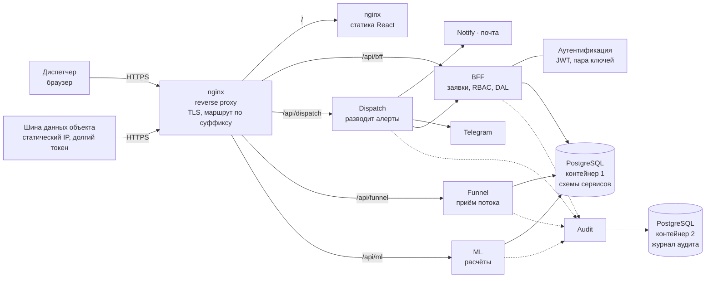

# План проекта Think-Faster

Основан на [ТЗ](../docs/ТЗ.md), [ответах организаторов](../docs/instructions/вопросы-и-ответы.md), схемах [IDEF-0](../docs/common/IDEF-0.png) и [IDEF-1](../docs/common/IDEF-1.png), [структуре бэкенда](../docs/common/структура.md) и разборе датасета в [docs/dataset/](../docs/dataset/).

**Сдача — 29.09.2026.** От 18.09 остаётся 11 дней. Календарь фаз — в [разделе 7](#7-фазы). Редакция от 18.09: переписано под ответы организаторов и структуру бэкенда.

## 1. Что изменилось с первой редакции

| Было 16.09 | Стало 18.09 | Откуда |
|---|---|---|
| Связи «канал → объект» нет, раскладываем по пикетам | Связь есть: [справочник каналов](../docs/dataset/справочник_каналов_датчиков.csv) с полем `ид_объект`, [справочник объектов](../docs/dataset/справочник_объектов_диспетчер.csv) с иерархией | [ответ 4](../docs/instructions/вопросы-и-ответы.md) |
| Тег инженерной системы = участок (гипотеза) | Тег избыточен, работаем по `ид_объект` | [ответ 9](../docs/instructions/вопросы-и-ответы.md) |
| 2021 год аномален, причина неизвестна | Параллельно работали две системы мониторинга — год исключаем из обучения | [ответ 6](../docs/instructions/вопросы-и-ответы.md) |
| Журнал ОДС и реестр оборудования ждём от организаторов | Их не будет никогда — разметку строим сами, наработку на отказ берём из открытых источников | [ответы 12–13](../docs/instructions/вопросы-и-ответы.md) |
| Роли: диспетчер, аналитик, руководитель, техперсонал | Три уровня: техник → диспетчер района → центральный диспетчер ОДС, область видимости по дереву объектов | [ответ 15](../docs/instructions/вопросы-и-ответы.md) |
| Precision 0,7 / Recall 0,5 обязательны, горизонт 24 ч жёсткий | Пороги и горизонт свои, с обоснованием; горизонт настраивается в админке | [ответы 2, 22](../docs/instructions/вопросы-и-ответы.md) |
| Координат нет, карта под вопросом | Московская система координат наружу не выдаётся; для MVP разрешено сгенерировать линейные объекты, пикет = 10 м | [ответ 19](../docs/instructions/вопросы-и-ответы.md) |
| Бэкенд — один монолит на FastAPI | Сервисный контур из [структуры бэкенда](../docs/common/структура.md): два nginx, BFF, dispatch, funnel, ML, notify, telegram, audit | встреча 18.09 |
| Доступ — JWT + RBAC «как-нибудь» | Расписано: пара ключей X.509, токен доступа 10 мин + обновления сутки, проверка подписи в каждом сервисе, технические учётки | встреча 18.09 |
| Поток СМВУ недоступен, нужен проигрыватель журнала | Стенд эмулятора готов: [think-test/emulator](https://github.com/Think-Faster/think-test/tree/main/emulator) — ускорение времени, ручные значения, залипание, отключение, замыкание | 17–18.09 |
| Обезличивание данных на нашей стороне | Данные уже обезличены, делать ничего не нужно | [ответ 11](../docs/instructions/вопросы-и-ответы.md) |
| Стенд для обучения и демо дадут организаторы | Ресурсов и стендов нет, разворачиваем у себя; эксперты разворачивают пакет на своих | [ответ 28](../docs/instructions/вопросы-и-ответы.md) |

## 2. Сервисный контур

Подробно — в [docs/common/структура.md](../docs/common/структура.md) и на [схеме](../docs/common/структура-схема.svg). Коротко для планирования:

Что из этого следует для работ:

- **Периметр закрывает Гриша** — reverse proxy, TLS, firewall; наружу открыт один порт.
- **Аутентификация — отдельная задача фазы 1**, а не «потом прикрутим»: без публичного ключа сервисы не поднимутся.
- **Миграции живут в отдельном контейнере** под административной учёткой; рабочий контейнер ходит в базу под RW. Это меняет `docker compose`: на сервис два контейнера.
- **Аудит обязателен** — он закрывает требование журналирования действий ([§11](../docs/ТЗ.md#28-нефункциональные-требования-11)), а не только безопасность.
- **Эмулятор играет роль шины данных объекта**: ходит в `/api/funnel` с долгим токеном. Отдельного протокола придумывать не нужно.

## 3. Модули IDEF-1 и сервисы

Названия из [IDEF-1](../docs/common/IDEF-1.png) остаются языком документации, сервисы — языком развёртывания. Соответствие:

| Блок IDEF-1 | Где живёт | Что делает | Требование ТЗ |
|---|---|---|---|
| Анализ данных в автоматическом режиме | `funnel` + `analyzer` внутри него | приём потока, нормализация, эпизоды, отсев шума, пороги | [§6, §7](../docs/ТЗ.md#23-общие-требования-к-сервису-6) |
| Прогнозирование происшествия | `ml` | признаки, модель, вероятность + горизонт + локация + тип | [§6](../docs/ТЗ.md#23-общие-требования-к-сервису-6), [§9](../docs/ТЗ.md#25-производительность-и-качество-прогнозирования-9) |
| Верификация | `bff` + фронт | дашборд, карта, журнал прогнозов, заявка и решение диспетчера | [§10](../docs/ТЗ.md#26-пользовательский-интерфейс-10), [§12](../docs/ТЗ.md#7-пользовательские-сценарии-12) |
| Дообучение модели | `ml` + выгрузка из `bff` | разметка из решений, версии моделей, ретроспектива | [§8](../docs/ТЗ.md#4-по-согласованию-с-заказчиком) |
| — | `dispatch` | разводит алерты: заявка в BFF, письмо, телеграм | [§10](../docs/ТЗ.md#26-пользовательский-интерфейс-10) |
| — | `notify`, `telegram` | доставка оповещений группе адресатов | [§10](../docs/ТЗ.md#26-пользовательский-интерфейс-10) |
| — | `audit` | журнал действий пользователей и отказов | [§11](../docs/ТЗ.md#28-нефункциональные-требования-11) |

## 4. Стек

| Слой | Выбор | Почему |
|---|---|---|
| Хранилище | **PostgreSQL 16**, два контейнера: общий и отдельный под аудит; партиции по месяцам, BRIN по времени | [§11](../docs/ТЗ.md#28-нефункциональные-требования-11) требует PostgreSQL 12+; журнал растёт на 4–5 млн строк в месяц; отдельный аудит — решение от 18.09 |
| Контуры данных | схемы `ops` (30 суток), `archive` (вся история), `marts` (витрины) внутри общего контейнера | [§13](../docs/ТЗ.md#29-важные-аспекты-обработки-данных-13) прямо требует разделения. Как это сходится со схемами по сервисам — [раздел 12](#12-ещё-не-решено) |
| Права в базе | RW-группа для рабочих контейнеров, административная учётка только для миграций | решение от 18.09 |
| Аналитика оффлайн | **DuckDB + Parquet** | 313 млн строк грузятся за ~40 с, ретропрогоны в PostgreSQL заняли бы часы. Витрины из DuckDB кладём в `marts` |
| Периметр | **nginx** ×2: статика фронта и reverse proxy с TLS | решение от 18.09 |
| BFF и сервисный контур | **C#** | решение Гриши от 18.09; он же его и пишет |
| ML-сервис | **Python 3.12 + FastAPI + Pydantic v2** | один язык с аналитикой и моделью, OpenAPI из коробки ([§17–18](../docs/ТЗ.md#8-критерии-оценки)) |
| Загрузка и обработка данных | **Python**: pandas/DuckDB, скрипты в репозитории | алгоритм обработки и флаги уже описаны в [README](../README.md) |
| Доступ | **JWT**: токен доступа 10 мин, обновления сутки, подпись приватным ключом X.509, проверка публичным в каждом сервисе | [структура бэкенда](../docs/common/структура.md) |
| Роли | **RBAC** трёх уровней: техник, диспетчер района, центральный диспетчер; область видимости — дерево объектов; ABAC — задел | [ответ 15](../docs/instructions/вопросы-и-ответы.md), встреча 18.09 |
| Каталог | адаптер под **LDAP / Active Directory** | [§11](../docs/ТЗ.md#28-нефункциональные-требования-11), [ответ 15](../docs/instructions/вопросы-и-ответы.md). На хакатоне — интерфейс и заглушка |
| Очередь и кэш | **Kafka** — поток показаний и прогнозы (`tf.ingest.*`, `tf.forecast.results`), **RabbitMQ** — команды модели и уведомления (`tf.model.commands`, `tf.notifications`), **Redis** — кэш и поток аудита | развёрнуты в `think-infra` вместе с учётками и правами сервисов; `funnel` принимает поток HTTP-ручкой и пишет в Kafka ([INTEGRATION §13](../ML/INTEGRATION.md), Н17 от 27.09) |
| Планировщик | **APScheduler** в процессе воркера | почасовой скоринг; Celery добавит брокер ради одной задачи |
| Модель | **LightGBM** (+ CatBoost для сравнения), scikit-learn для метрик | табличные признаки по окнам, обучение минуты, объяснимость через важность признаков |
| Правила | **SQL + Python**, параметры в конфиге и в админке | пороги должно быть видно и можно крутить ([§18](../docs/ТЗ.md#82-финальная-экспертиза-18)) |
| Фронтенд | **React 18 + TypeScript + Vite**, статика отдаётся nginx | Chrome и Яндекс.Браузер ([§11](../docs/ТЗ.md#28-нефункциональные-требования-11)) |
| Графики | **Apache ECharts** | плотные временные ряды, зум по времени, русская локаль |
| Карта | **MapLibre GL JS** + GeoJSON, объекты как `LineString` по пикетам (1 пикет = 10 м) | [§7](../docs/ТЗ.md#24-требования-к-обработке-данных-7) требует GeoJSON и WKT; координаты генерируем сами ([ответ 19](../docs/instructions/вопросы-и-ответы.md)) |
| Второй вид карты | развёртка коллектора в прямую линию с пикетами 1, 2, 3 | прямая рекомендация эксперта: спираль коллектора на карте нечитаема |
| Оповещения | WebSocket на фронт + почта + телеграм через `dispatch` | «в режиме реального времени» ([§10](../docs/ТЗ.md#26-пользовательский-интерфейс-10)); сверх минимума — но объясняем зачем ([ответ 17](../docs/instructions/вопросы-и-ответы.md)) |
| Источник потока | стенд эмулятора на Django — [think-test/emulator](https://github.com/Think-Faster/think-test/tree/main/emulator) | живого доступа к СМВУ нет; стенд умеет ускорение времени, ручные значения и сбои |
| Упаковка | Docker Compose, Linux-хост; на сервис рабочий и миграционный контейнеры | [§11](../docs/ТЗ.md#28-нефункциональные-требования-11); эксперты разворачивают пакет у себя ([ответ 28](../docs/instructions/вопросы-и-ответы.md)) |
| Документация | один файл [docs/документация.md](../docs/документация.md), для сдачи из него собирается `.docx` | [§14](../docs/ТЗ.md#210-требования-к-решению-14), [§19](../docs/ТЗ.md#9-что-сдаём-19) требуют полную сопроводительную документацию; правило «без доп. файлов документации» соблюдено — всё в одном файле (Н18 от 27.09) |

**Что сознательно не берём:** Airflow, Kubernetes, feature store, MLflow. Версии моделей — `manifest.json` и файлы моделей в образе ML, рабочая точка — `settings/operating.json`, переключение версий — командой `model.switch` ([INTEGRATION §6, §13.3](../ML/INTEGRATION.md)). Секреты — в **Vault** (`think-infra/hashicorp`).

## 5. Что изменилось в данных

1. **Связь «канал → объект» есть.** Работаем по `ид_объект` и иерархии объектов, а не по префиксу тега. Пикеты из названий датчиков остаются только для геометрии.
2. **2021 год исключаем** из обучения и из статистики в презентации — в нём параллельно работали две системы мониторинга. В документации пишем, почему.
3. **Подтверждений инцидента по-прежнему нет и не будет.** Разметка строится косвенно: след выезда бригады — «охрана снята → двери → движение» в том же объекте после тревоги ([случай 1](../docs/dataset/анализ.md)).
4. **Журнал событийный, а не временной ряд.** Газ пишет каждые 7 с, температура — раз в 1,5 ч, дискретные каналы — при смене состояния. Признаки считаем по окнам с явной обработкой «канал молчит».
5. **Флаг `тревожное` — ненадёжная разметка**: «Обнаружен дым» помечен тревогой в 7% случаев в 2023 г. и в 100% в 2026 г. В обучении не используем.

## 6. Разметка и модель

**Уровень 1 — правила** (детерминированно, алгоритм описан в [README](../README.md)):
- свёртка строк в эпизоды, схлопывание массовых событий ([Н2](../docs/dataset/анализ.md#кандидаты-в-шум), [Н7](../docs/dataset/анализ.md#кандидаты-в-шум), [Н8](../docs/dataset/анализ.md#кандидаты-в-шум));
- отсев шума Н1–Н9 с пометкой, **без удаления** данных;
- превышение порогов: группы A (подтверждено), B (превышение без записи), C (запись без превышения);
- **насос-мигалка** — включился, выключился, включился: по словам эксперта, яркий признак протечки в соседнем коллекторе ([ответ 21](../docs/instructions/вопросы-и-ответы.md));
- **последовательность проникновения** — дверь → объёмный датчик → движение; объёмный датчик в середине коллектора без люков и вентшахт — кандидат в ложные ([ответ 20](../docs/instructions/вопросы-и-ответы.md)).

**Уровень 2 — модель:**
- задача: вероятность инцидента по объекту на горизонте 24 ч (горизонт настраивается), с типом: пожар / подтопление / отказ оборудования / отказ датчика / проникновение;
- отдельная модель отказа датчика: доля дребезга, заглушки, молчание, рост «Неисправен»;
- признаки: счётчики событий по типам в окнах 1 ч / 6 ч / 24 ч / 7 сут, доля тревог, дребезг, динамика температуры и газа, режим охраны, погода, время суток, сезон, календарные точки (длинные праздники, 9 мая — для нарушителей);
- разметка: эпизод **подтверждён**, если после него есть след выезда бригады, иначе кандидат в ложные;
- валидация по времени: обучение ≤ 2024 **без 2021 года**, проверка 2025, тест 2026 (янв–июн). Метрики: Precision, Recall, PR-AUC, распределение времени упреждения. Пороги — свои, с обоснованием в записке.

**Уровень 3 — рекомендации:** уровень риска и тип → рекомендация по ТО со ссылкой на правило. Агрегируем по инженерным системам: пожарная — через температуру, в том числе наружную; водоудаление — через сезонность; нарушители — через календарь ([ответ 23](../docs/instructions/вопросы-и-ответы.md)).

## 7. Фазы

Каждая фаза — **вертикальный срез**: данные → расчёт → API → экран. Между фазами чекпойнт: если срез не работает целиком, следующую не начинаем.

| Фаза | Дни | Срез | Чекпойнт |
|---|---|---|---|
| **Ф1. Вертикаль и контур** | 18–19.09 | журнал → PostgreSQL → API за токеном → страница журнала | данные видны в браузере, вход по логину и паролю, токен проверяется |
| **Ф2. Анализатор** | 20–21.09 | эпизоды и отсев шума → витрина → лента инцидентов | лента показывает свёрнутые эпизоды, а не 50 строк на один скачок питания |
| **Ф3. Прогноз** | 22–24.09 | признаки → модель → прогноз → панель риска, карта, оповещение | прогноз с вероятностью, горизонтом, локацией и типом виден на дашборде и приходит в оповещении |
| **Ф4. Заявки и роли** | 25–26.09 | алерт → заявка → решение диспетчера → выгрузка разметки | контур замкнут, права трёх уровней разграничены, действия пишутся в аудит |
| **Ф5. Доказательства** | 27.09 | ретропрогон на 2026 → экран достоверности, настраиваемые параметры | прогноз против факта показан в цифрах и на графике |
| **Ф6. Сдача** | 28–29.09 | документация, презентация, видео, развёрнутый стенд | демо проходит от начала до конца на чистой машине |

Порядок обязателен: Ф3 без Ф2 будет учиться на шуме, Ф5 без Ф4 нечем подтверждать.

**Резерва нет, и он уже потрачен.** Ф1 должна была закрыться 18.09, кода приложения в репозитории пока нет — поэтому Ф5 сжата до одного дня. Если Ф3 не закрыта к вечеру 24.09, модель урезается до правил из Ф2 с честными метриками, и дальше идём по плану.

**Ссылку на решение прикрепляем 28.09**, не дожидаясь дедлайна: поздняя загрузка видна по истории репозитория и идёт в минус ([ответ 30](../docs/instructions/вопросы-и-ответы.md)).

**Загрузка полной истории** (2019–2026, 313,5 млн строк) идёт в фоне с первого дня Ф1: пока грузится, команда работает на 2026 годе.

## 8. Чем закрываем критерии

Эксперты проверяют по порядку: пакет и документация → соответствие ТЗ → обязательные требования → сценарии → понятность интерфейса → дополнительные возможности ([ответ 26](../docs/instructions/вопросы-и-ответы.md)). Отсюда приоритеты.

| Критерий ([§17–18](../docs/ТЗ.md#8-критерии-оценки)) | Чем закрываем |
|---|---|
| Пакет разворачивается на чужом стенде | `docker compose up` на чистой машине, инструкция проверена посторонним человеком |
| Обязательные требования: роли | три уровня доступа, дерево объектов, журнал действий в аудите |
| Сценарии из ТЗ | уведомление → карточка → решение с причиной, пройдено от начала до конца |
| Проверка работы расчётов | воспроизводимые SQL и скрипты, один запуск — те же числа |
| Достоверность прогнозирования | Ф5: ретропрогон на 2026 г., сравнение прогноза с фактом |
| Рекомендации против реальных | таблица «риск → рекомендация» со ссылкой на правило |
| Настраиваемые параметры | пороги, горизонт, чувствительность, окно сопоставления — в админке и в конфиге |
| Объективность диаграмм | ECharts, единые шкалы, подписи с единицами, никаких 3D и обрезанных осей |
| Скорость работы | прогноз ≤ 300 с на объект, поток ≤ 300 с, 20 пользователей — замеряем и пишем цифры |
| Интеграция в другие системы | REST + OpenAPI, JSON и XML, GeoJSON, только чтение источников |
| Понятность интерфейса | проверяем на человеке вне команды: прошёл сценарий, не читая инструкцию |
| Сверх пакета | видеопрезентация решения и демо-стенд по ссылке ([ответ 29](../docs/instructions/вопросы-и-ответы.md)) |

## 9. Риски

| Риск | Что делаем |
|---|---|
| Кода приложения ещё нет, а осталось 11 дней | Ф1 закрываем вдвоём: Гриша — контур и API, Гера — база и загрузчик; всё, что не вертикаль, ждёт |
| Сервисный контур на C# знает только Гриша | ML, загрузка и аналитика на Python не зависят от него; если Гриша встанет — BFF режем до одного сервиса, контур безопасности оставляем как описано |
| Контур из семи сервисов разворачивается дольше, чем один | компоновка проверяется на чистой машине в Ф1, а не в Ф6; иначе в день сдачи это уже не починить |
| Нет подтверждённых инцидентов — разметка косвенная | честно пишем в документации и в питче; показываем, как решение диспетчера замыкает контур дообучения |
| Организаторы не дают ни стендов, ни ресурсов | разворачиваем у себя, пакет и инструкция — главный артефакт; плюс демо-стенд по ссылке как страховка |
| Вся история в PostgreSQL — десятки гигабайт | партиции по месяцам и загрузка через `COPY`, в фоне с первого дня. Не влезем в диск — старые годы остаются внешними Parquet, свежие в `ops` |
| Модель хуже простых правил | правила — baseline, его и показываем, если модель не обгонит. Сравнение обязательно в отчёте |
| Погода нужна по ТЗ, но не входит в первую модель | добавляем на Ф5 из открытого архива (Open-Meteo) и показываем прирост точности в цифрах |
| Гриша тянет и контур, и вёрстку | Даша отдаёт макеты на фазу вперёд; если Гриша не успевает, экраны беру я |

## 10. Принятые решения

| Вопрос | Решение | Дата |
|---|---|---|
| Срок сдачи | **29.09.2026**, ссылку прикрепляем 28.09 | 16.09, уточнено 18.09 |
| Структура бэкенда | сервисный контур по [схеме](../docs/common/структура-схема.svg): два nginx, BFF, dispatch, funnel, ML, notify, telegram, audit | 18.09 |
| Аутентификация | JWT, пара ключей X.509, токен доступа 10 мин, обновления сутки, проверка подписи в каждом сервисе | 18.09 |
| Технические учётки | своя на каждый сервис, который ходит в соседние; токены долгие, около года | 18.09 |
| Базы данных | два контейнера PostgreSQL: аудит отдельно, остальное вместе | 18.09 |
| Миграции | отдельный контейнер, запускается вручную под административной учёткой | 18.09 |
| Приём данных | шина на стороне объекта ходит в `/api/funnel` с долгим токеном; у нас её играет стенд эмулятора | 18.09 |
| Уведомления | всей группе адресатов сразу, почта и телеграм; «кто на смене» система не знает | 18.09 |
| Работа с заявкой | кто первым взял в работу, тот и ведёт | 18.09, совпало с [ответом 16](../docs/instructions/вопросы-и-ответы.md) |
| Роли | техник, диспетчер района, центральный диспетчер ОДС | 18.09 |
| 2021 год | исключаем из обучения, причину пишем в документацию | 18.09 |
| Карта | генерируем линейные объекты по пикетам (10 м) плюс развёртка коллектора в прямую | 18.09 |
| Объём в PostgreSQL | вся история 2019–2026, загрузка в фоне с первого дня Ф1 | 16.09 |
| LDAP | заглушка с описанным интерфейсом, реальную интеграцию не делаем | 16.09 |
| Дообучение | выгрузка разметки обязательно, кнопка «переобучить» — если останется время на Ф5 | 16.09, подтверждено [ответом 24](../docs/instructions/вопросы-и-ответы.md) |
| Код и прототип | код на GitHub, сервер на Yandex Cloud | 16.09 |
| Интерфейс | Даша рисует макеты, Гриша верстает и подключает API | 16.09 |
| Погода | в первую модель не берём, добавляем на Ф5 и показываем прирост в цифрах | 16.09 |
| Роль Александра | закрывает то, что провисает: код, данные, документация, проверка за командой | 16.09 |

## 11. Что проверяем на данных

Часть гипотез подтверждена экспертами на разборе, остальные проверяем сами. Непроверенное честно помечаем в документации — раздел «Чего мы не знаем».

| Гипотеза | Статус | Как проверяем |
|---|---|---|
| След выезда бригады = подтверждение инцидента | наша, экспертами не подтверждалась | доля эпизодов со следом по типам, ручная проверка 20 случаев |
| Насос включается и выключается подряд = протечка рядом | **подтверждена экспертом** | найти такие серии в истории, сверить с событиями «Затоплен» на соседних объектах |
| Дверь → объёмный датчик → движение = реальное проникновение | **подтверждена экспертом** | доля таких последовательностей среди тревог охранной подсистемы |
| Массовый дым — это ТО, а не пожар ([Н8](../docs/dataset/анализ.md#кандидаты-в-шум)) | наша | время суток, параллельные УИР-Р и двери, регулярность по календарю |
| «Затоплен» после скачка питания — побочный эффект ([Н7](../docs/dataset/анализ.md#кандидаты-в-шум)) | наша | доля «Затоплен» в пределах минуты после события питания против фона |
| Температура выше 100 °C = пожар | **эксперт предостерёг**: может быть сварка или капля металла | сверять с длительностью и соседними каналами, не делать одиночное превышение тревогой |
| Флаг тревоги меняет смысл по годам | посчитано | от 7% до 100% у «Обнаружен дым». В обучении не используем |

## 12. Ещё не решено

1. **Схемы в общей базе.** По ТЗ нужны контуры `ops` / `archive` / `marts` ([§13](../docs/ТЗ.md#29-важные-аспекты-обработки-данных-13)), по схеме бэкенда — четыре схемы по числу сервисов. Свести в одну раскладку до начала миграций.
2. **Кто пишет сервисы на C#** кроме Гриши и что делаем, если он не успевает.
3. **CI** — инструкция по SourceCraft удалена 17.09, замена не выбрана.
4. **Кредиты Yandex Cloud** — есть ли и на чьём аккаунте поднимаем стенд.
5. **Политика кук** для токенов — срок хранения и флаги.
6. **Права технических учёток** между сервисами — разграничить до Ф4.

Задачи по фазам — в [todo.md](todo.md).
