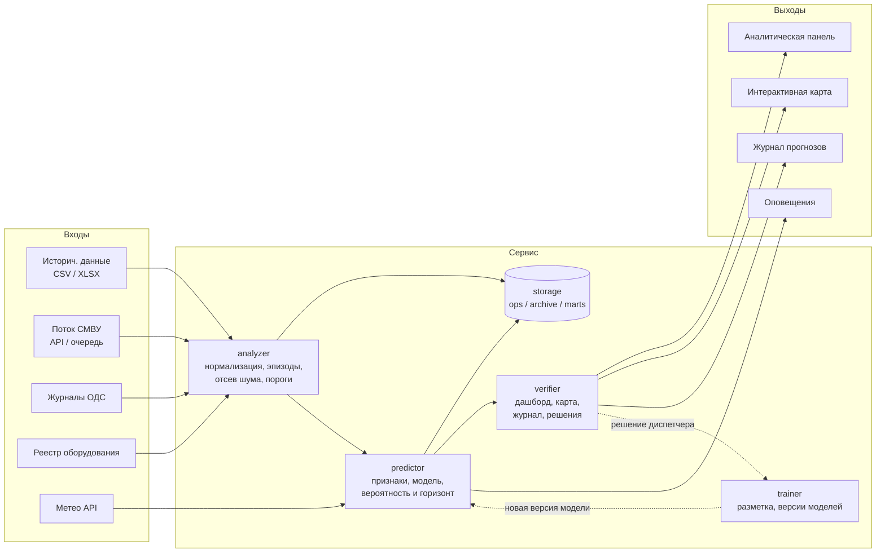

# План проекта Think-Faster

Основан на [ТЗ](../docs/ТЗ.md), схемах [IDEF-0](../docs/common/IDEF-0.png) и [IDEF-1](../docs/common/IDEF-1.png), разборе датасета в [docs/dataset/](../docs/dataset/).

**Сдача — 29.09.2026.** От 16.09 остаётся 13 дней. Календарь фаз — в [разделе 6](#6-фазы).

## 1. От схем к модулям

На IDEF-0 сервис — один блок: входы (исторические CSV/XLSX, поток СМВУ, журналы ОДС, реестр оборудования), управление (метеоданные, нормативная документация), выходы (дашборд, карта, журнал прогнозов, оповещения), механизмы (диспетчер, руководители, аналитик, техперсонал).

IDEF-1 раскрывает его в четыре функции. **Называем модули по этим блокам** — тогда код, документация и диаграммы говорят об одном и том же.

| Блок IDEF-1 | Модуль | Что делает | Требование ТЗ |
|---|---|---|---|
| Анализ данных в автоматическом режиме | `analyzer` | приём и нормализация данных, эпизоды, отсев шума, превышения порогов | [§6, §7](../docs/ТЗ.md#23-общие-требования-к-сервису-6) |
| Прогнозирование происшествия в коллекторе | `predictor` | признаки, модель, вероятность + горизонт + локация + тип | [§6](../docs/ТЗ.md#23-общие-требования-к-сервису-6), [§9](../docs/ТЗ.md#25-производительность-и-качество-прогнозирования-9) |
| Верификация | `verifier` | дашборд, карта, журнал прогнозов, решение диспетчера с причиной из справочника | [§10](../docs/ТЗ.md#26-пользовательский-интерфейс-10), [§12](../docs/ТЗ.md#7-пользовательские-сценарии-12) |
| Дообучение модели | `trainer` | сбор разметки из решений, версии моделей, ретроспективная проверка | [§8](../docs/ТЗ.md#4-по-согласованию-с-заказчиком) — по согласованию, но журнал решений обязателен |

Общие части: `gateway` — REST API и WebSocket, `storage` — три контура хранения ([§13](../docs/ТЗ.md#29-важные-аспекты-обработки-данных-13)), `notifier` — оповещения.

## 2. Что уже готово

- [ТЗ](../docs/ТЗ.md) разобрано: обязательные, побочные, по согласованию, запреты, критерии оценки.
- Датасет загружен и разобран: [описание](../docs/dataset/описание.md), [анализ](../docs/dataset/анализ.md), [запросы](../docs/dataset/запросы.sql). 313,5 млн строк за 2019 — 30.06.2026, 12 627 каналов.
- Схемы IDEF-0 и IDEF-1.
- Листы задач на первый день: [TF-1](TF-1.md) … [TF-4](TF-4.md).

## 3. Что данные меняют в плане

Четыре факта из [анализа](../docs/dataset/анализ.md) определяют архитектуру:

1. **Журнал событийный, а не временной ряд.** Газ пишет каждые 7 с, температура — раз в 1,5 ч, дискретные каналы — при смене состояния. Значит признаки считаются по окнам с явной обработкой «канал молчит», а не по равномерной сетке.
2. **Флаг `тревожное` — ненадёжная разметка.** «Обнаружен дым» помечен тревогой в 7% случаев в 2023 г. и в 100% в 2026 г. Обучать на флаге нельзя — нужна своя разметка.
3. **Подтверждений инцидента в данных нет.** Нет нарядов и решений диспетчера. Разметку строим косвенно: по **следу выезда бригады** — «охрана снята → двери → движение» в том же префиксе после тревоги ([случай 1](../docs/dataset/анализ.md)). Это наша гипотеза, проверяем её на данных — как именно, в [разделе 10](#10-что-следует-из-отказа-от-вопросов-экспертам).
4. **Связи «канал → объект» в выгрузке нет**, координат тоже. Организаторы дополнили данные — ждём файл от капитана. Карта — **схема точек с коллекторами**: точки объектов, соединённые линиями коллекторов, риск цветом. Пока файла нет, точки раскладываем по пикетам из названий датчиков (`ПК289+3`), потом заменяем на настоящие.

## 4. Стек

| Слой | Выбор | Почему |
|---|---|---|
| Хранилище | **PostgreSQL 16**, декларативные партиции по месяцам, BRIN по времени | [§11](../docs/ТЗ.md#28-нефункциональные-требования-11) требует PostgreSQL 12+. Партиции — потому что журнал растёт на 4–5 млн строк в месяц |
| Контуры | схемы `ops` (30 суток), `archive` (вся история), `marts` (витрины) | [§13](../docs/ТЗ.md#29-важные-аспекты-обработки-данных-13) прямо требует разделения |
| Аналитика оффлайн | **DuckDB + Parquet** | 313 млн строк грузятся за ~40 с, ретропрогоны и подбор порогов в PostgreSQL заняли бы часы. Витрины из DuckDB кладём в `marts` |
| Бэкенд | **Python 3.12 + FastAPI + Pydantic v2 + SQLAlchemy 2 + Alembic** | OpenAPI из коробки — прямо в критерий «возможность интеграции в любые другие системы» ([§17–18](../docs/ТЗ.md#8-критерии-оценки)). Один язык с аналитикой — модель не переписываем |
| Очередь и кэш | **Redis Streams + pub/sub** | поток СМВУ и оповещения в реальном времени. Kafka для 20 пользователей — лишняя инфраструктура |
| Планировщик | **APScheduler** в процессе воркера | почасовой скоринг. Celery добавит брокер и воркеры ради одной задачи |
| Модель | **LightGBM** (+ CatBoost для сравнения), scikit-learn для метрик | табличные признаки по окнам, обучение минуты, объяснимость через важность признаков. Нейросети на таких данных не дадут выигрыша и не объяснят прогноз диспетчеру |
| Правила | **SQL + Python**, параметры в конфиге | отсев шума и пороги — детерминированные, их должно быть видно и можно крутить ([§18](../docs/ТЗ.md#82-финальная-экспертиза-18): «дополнительные настраиваемые параметры») |
| Фронтенд | **React 18 + TypeScript + Vite** | Chrome и Яндекс.Браузер ([§11](../docs/ТЗ.md#28-нефункциональные-требования-11)) |
| Графики | **Apache ECharts** | плотные временные ряды, зум по времени, русская локаль. Критерий «объективность диаграмм» — про читаемость |
| Карта | **MapLibre GL JS** + GeoJSON | ТЗ требует GeoJSON и WKT ([§7](../docs/ТЗ.md#24-требования-к-обработке-данных-7)). Без координат — схема коллектора по пикетам, с возможностью подложить реальную геометрию |
| Оповещения | **WebSocket** (FastAPI) поверх Redis pub/sub | «в режиме реального времени» ([§10](../docs/ТЗ.md#26-пользовательский-интерфейс-10)) |
| Доступ | JWT + RBAC (диспетчер, аналитик, руководитель, техперсонал), адаптер под LDAP | [§11](../docs/ТЗ.md#28-нефункциональные-требования-11). LDAP на хакатоне — интерфейс и заглушка, не реальная интеграция |
| Упаковка | Docker Compose, nginx, Linux-хост | [§11](../docs/ТЗ.md#28-нефункциональные-требования-11): серверная часть на Linux |
| CI | SourceCraft | [инструкция](../docs/SourceCraft.md) |
| Документация | Markdown в репозитории → PDF через Pandoc в конце | [§14](../docs/ТЗ.md#210-требования-к-решению-14), [§19](../docs/ТЗ.md#9-что-сдаём-19): сдаём .docx / .pdf |

**Что сознательно не берём:** Kafka, Airflow, Kubernetes, feature store, MLflow. На горизонте хакатона они съедят время и не добавят баллов ни по одному критерию. Версии моделей храним таблицей в PostgreSQL и файлами в `models/`.

## 5. Разметка и модель

Три уровня, каждый проверяем отдельно.

**Уровень 1 — правила** (`analyzer`, детерминированно):
- свёртка строк в эпизоды; схлопывание массовых событий в одно ([Н2](../docs/dataset/анализ.md#кандидаты-в-шум), [Н7](../docs/dataset/анализ.md#кандидаты-в-шум), [Н8](../docs/dataset/анализ.md#кандидаты-в-шум));
- отсев шума Н1–Н9 с пометкой, **без удаления** данных;
- превышение порогов: группы A (подтверждено), B (превышение без записи), C (запись без превышения).

**Уровень 2 — модель** (`predictor`):
- задача: вероятность инцидента по объекту (префиксу тега) на горизонте 24 ч, с типом: пожар / подтопление / отказ оборудования / отказ датчика / проникновение;
- отдельная модель отказа датчика: признаки деградации — доля дребезга, заглушки, молчание, рост «Неисправен»;
- признаки: счётчики событий по типам в окнах 1 ч / 6 ч / 24 ч / 7 сут, доля тревог, дребезг, изменения температуры и газа, режим охраны, погода, время суток и сезон;
- разметка: эпизод считается **подтверждённым**, если после него есть след выезда бригады, иначе кандидат в ложные;
- валидация по времени: обучение ≤ 2024, проверка 2025, тест 2026 (янв–июн). Метрики: Precision, Recall, PR-AUC, распределение времени упреждения.

**Уровень 3 — рекомендации** (`predictor` + справочник): уровень риска и тип → рекомендация по ТО, со ссылкой на правило. Никаких свободных формулировок — таблица соответствий, чтобы эксперты могли сверить с реальными регламентами ([§18](../docs/ТЗ.md#82-финальная-экспертиза-18)).

## 6. Фазы

Каждая фаза — **вертикальный срез**: данные → расчёт → API → экран. Между фазами чекпойнт: если срез не работает целиком, следующую не начинаем.

| Фаза | Дни | Срез | Результат | Чекпойнт |
|---|---|---|---|---|
| **Ф0. Данные** (идёт) | 15–16.09 | разбор данных и первые алгоритмы | [TF-1](TF-1.md), [TF-3](TF-3.md) | правила шума описаны и посчитаны, пороги есть |
| **Ф1. Тонкая вертикаль** | 17–18.09 | журнал → PostgreSQL → `GET /events` → страница журнала | схема БД, загрузчик, API, первая страница | данные видны в браузере из PostgreSQL |
| **Ф2. Анализатор** | 19–20.09 | эпизоды и отсев шума → витрина → `GET /incidents` → лента инцидентов | `analyzer` | лента показывает свёрнутые эпизоды, а не 50 строк на один скачок питания |
| **Ф3. Прогноз** | 21–23.09 | признаки → модель → `GET /forecasts` → панель риска + карта + оповещение | `predictor`, `notifier` | прогноз с вероятностью, горизонтом, локацией и типом виден на дашборде, приходит в WebSocket |
| **Ф4. Верификация** | 24–25.09 | решение диспетчера с причиной → журнал → выгрузка разметки | `verifier`, справочник причин | решение сохраняется и попадает в обучающую выборку |
| **Ф5. Доказательства** | 26–27.09 | ретропрогон на 2026 → страница метрик, настраиваемые параметры | бэктест, экран «Достоверность» | прогноз против факта показан в цифрах и на графике |
| **Ф6. Сдача** | 28–29.09 | документация, презентация, развёрнутый прототип по ссылке | 4 ссылки из [§19](../docs/ТЗ.md#9-что-сдаём-19) | демо проходит от начала до конца на чистой машине |

Порядок обязателен: Ф3 без Ф2 будет учиться на шуме, Ф5 без Ф4 нечем подтверждать.

**Резерва нет.** 13 дней при семи фазах означает: если Ф3 не закрыта к вечеру 23.09, модель урезается до правил из Ф2, и дальше идём по плану. Прогноз на правилах с честными метриками лучше, чем недоделанная модель без них.

**Загрузка полной истории** (2019–2026, 313,5 млн строк) стартует в первый день Ф1 в фоне и не блокирует остальное: пока грузится, команда работает на 2026 годе.

## 7. Чем закрываем критерии

| Критерий ([§17–18](../docs/ТЗ.md#8-критерии-оценки)) | Чем закрываем |
|---|---|
| Проверка работы расчётов | воспроизводимые SQL и скрипты в репозитории, один запуск — те же числа |
| Достоверность прогнозирования | Ф5: ретропрогон на 2026 г., сравнение прогноза с фактом |
| Рекомендации против реальных | таблица соответствий «риск → рекомендация» со ссылкой на правило |
| Настраиваемые параметры | пороги, горизонт, чувствительность, окно сопоставления — в UI и в конфиге |
| Объективность диаграмм | ECharts, единые шкалы, подписи с единицами, никаких 3D и обрезанных осей |
| Скорость работы | прогноз ≤ 300 с на объект, поток ≤ 300 с, 20 пользователей — замеряем и пишем цифры |
| Интеграция в другие системы | REST + OpenAPI, JSON и XML, GeoJSON, только чтение источников |
| Качество кода | типизация, тесты на правила и алгоритмы, линтер в CI |
| Документация | Ф6, требования [§14](../docs/ТЗ.md#210-требования-к-решению-14) |

## 8. Риски

| Риск | Что делаем |
|---|---|
| Нет подтверждённых инцидентов — разметка косвенная | честно пишем в документации и в питче; показываем, как решение диспетчера замыкает контур дообучения |
| Нет связи «канал → объект» и координат | ждём дополненный датасет от организаторов ([Ф1-0](todo.md)); если связи нет и там — раскладываем объекты по пикетам сами |
| Вся история в PostgreSQL — это десятки гигабайт и долгая загрузка | партиции по месяцам и загрузка через `COPY`; грузим в фоне с первого дня, не дожидаясь готовности API. Если не влезем в диск — старые годы остаются в `archive` как внешние Parquet-таблицы, свежие в `ops` |
| Модель хуже простых правил | правила — это baseline, его и показываем, если модель не обгонит. Сравнение обязательно в отчёте |
| Поток СМВУ недоступен | проигрыватель журнала 2026 г. с ускорением — тот же интерфейс, что у реального потока |
| Гриша один тянет и сервер, и вёрстку — узкое место на Ф3 | Даша отдаёт макеты на фазу вперёд; если Гриша не успевает, экраны беру я |
| Погода нужна по ТЗ, но не входит в первую модель | добавляем на Ф5 из открытого архива (Open-Meteo) и показываем прирост точности в цифрах |
| Спросить экспертов нельзя — гипотезы остаются гипотезами | проверяем на данных по таблице в [разделе 10](#10-что-следует-из-отказа-от-вопросов-экспертам), непроверенное честно помечаем в документации |

## 9. Принятые решения

| Вопрос | Решение | Дата |
|---|---|---|
| Срок сдачи | **29.09.2026** | 16.09 |
| Карта | схема точек с коллекторами; организаторы дополнили данные, файл ждём от капитана | 16.09 |
| Объём в PostgreSQL | **вся история 2019–2026**, загрузка в фоне с первого дня Ф1 | 16.09 |
| Роль Александра | закрывает то, что провисает: код, данные, документация, проверка за командой | 16.09 |
| LDAP | заглушка с описанным интерфейсом, реальную интеграцию не делаем | 16.09, по умолчанию |
| Дообучение ([§8](../docs/ТЗ.md#4-по-согласованию-с-заказчиком)) | выгрузка разметки обязательно; кнопка «переобучить» — если остаётся время на Ф5 | 16.09, по умолчанию |
| Код и прототип | код на GitHub, сервер на Yandex Cloud | 16.09 |
| Интерфейс | Даша рисует макеты, Гриша верстает и подключает API | 16.09 |
| Погода | в первую модель **не берём**; добавляем на Ф5 и показываем прирост в цифрах | 16.09 |
| Эксперты | вопросов не задаём, все гипотезы проверяем на данных сами | 16.09 |

## 10. Что следует из отказа от вопросов экспертам

Спросить не у кого, значит каждая гипотеза либо проверяется на данных, либо честно помечается в документации как непроверенная. Это не слабость решения, если сказано прямо, — эксперты на питче отличают «мы не знаем» от «мы не заметили».

Проверяем сами:

| Гипотеза | Как проверяем на данных |
|---|---|
| След выезда бригады = подтверждение инцидента | доля эпизодов со следом по типам; ручная проверка 20 случаев; сравнение с эпизодами без следа |
| Массовый дым — это ТО, а не пожар ([Н8](../docs/dataset/анализ.md#кандидаты-в-шум)) | время суток, параллельные УИР-Р и двери, регулярность по календарю |
| «Затоплен» после скачка питания — побочный эффект ([Н7](../docs/dataset/анализ.md#кандидаты-в-шум)) | доля «Затоплен» в пределах минуты после события питания против фона |
| Префикс тега = участок | совпадение пикетов в названиях каналов одного префикса |
| Флаг тревоги меняет смысл по годам | уже посчитано: от 7% до 100% у «Обнаружен дым». В обучении не используем |

В документации заводим раздел «Чего мы не знаем» — туда идут [10 открытых вопросов](../docs/dataset/анализ.md#открытые-вопросы) с пометкой, что проверено на данных, а что осталось гипотезой.

## 11. Ещё не решено

1. **Поток СМВУ** — подтвердить, что живого доступа нет и делаем проигрыватель журнала 2026 г.
2. **Кредиты Yandex Cloud** — есть ли, и на чьём аккаунте поднимаем сервер.
3. **План в репозиторий** — заливать отдельной веткой или держим локально.

Задачи по фазам — в [todo.md](todo.md).
