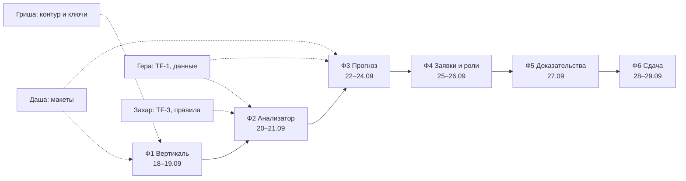

# Задачи по фазам

Общая картина — в [plan.md](plan.md), устройство бэкенда — в [структуре](../docs/common/структура.md). Исполнители: Гера — данные, Захар — алгоритмы, Гриша — инфраструктура и API, Даша — дизайн и интерфейс, Александр — координация, документация, сдача.

Каждая задача: что сделать → **готово, когда** → **как проверить**. Задача не закрыта, пока проверка не пройдена.

Редакция от 18.09: переписано под ответы организаторов и схему бэкенда. Что снято с плана — [в конце](#снято-с-плана).

---

## Ф1. Вертикаль и контур · 18–19.09

Цель фазы: данные из файла доезжают до экрана в браузере, вход по логину и паролю, токен проверяется. Ничего умного, только сквозной путь за периметром.

### Ф1-1 · Гриша · Каркас окружения
Docker Compose по [схеме контура](../docs/common/структура-схема.svg): два nginx (статика и reverse proxy с TLS), postgres ×2 (общий и аудит), redis, сервисы-заглушки за суффиксами `/api/bff`, `/api/dispatch`, `/api/funnel`, `/api/ml`.
- **Готово, когда** `docker compose up` на чистой машине поднимает всё, наружу открыт один порт, `GET /api/bff/health` отвечает 200 через прокси.
- **Проверить:** клонировать репозиторий в новую папку, запустить, открыть `/api/bff/health`; убедиться, что порты сервисов снаружи закрыты.

### Ф1-2 · Гриша · Аутентификация и ключи
Пара ключей X.509, выпуск токена доступа (10 мин) и обновления (сутки), ручка публичного ключа, проверка подписи в каждом сервисе при старте и на каждом запросе.
- **Готово, когда** без токена сервис отвечает 401, с просроченным — 401, обновление выдаёт новый токен, публичный ключ забирается один раз при старте.
- **Проверить:** дождаться истечения токена и повторить запрос; перезапустить сервис с недоступной ручкой ключа — он должен не подняться, а не работать без проверки.

### Ф1-3 · Гера · Схема БД и миграции
Таблицы `channel`, `object`, `journal` (партиции по месяцам, BRIN по времени), `channel_type`. Миграции запускаются **отдельным контейнером** под административной учёткой, рабочий контейнер ходит под RW.
- **Зависит от:** [TF-1](TF-1.md) шаг 1 (структура и связи).
- **Готово, когда** миграции накатываются с нуля и откатываются, рабочая учётка не может изменить схему.
- **Проверить:** прогнать миграции на пустой базе и откатить; из-под рабочей учётки выполнить `CREATE TABLE` и получить отказ.

### Ф1-4 · Гера · Загрузчик исторических данных
Импорт CSV и XLSX ([§7](../docs/ТЗ.md#24-требования-к-обработке-данных-7)) с разбором обоих форматов журнала — годового и примера ([различия](../docs/dataset/описание.md#годовые-журналы-и-пример-отличаются-форматом)), с обоими десятичными разделителями.
- **Готово, когда** загружена **вся история 2019–2026** (313,5 млн строк), число строк по годам совпадает с [таблицей](../docs/dataset/описание.md#объём-по-годам), битые даты попадают в отчёт загрузки, а не теряются молча.
- **Порядок:** сначала 2026 г. — на нём работает команда, остальные годы догружаются в фоне и не блокируют Ф1.
- **Проверить:** `SELECT count(*)` по годам против таблицы; загрузить `журнал_событий_пример.csv` тем же загрузчиком; записать занятое место на диске.

### Ф1-5 · Гера · Справочники и дерево объектов
Загрузить [справочник каналов](../docs/dataset/справочник_каналов_датчиков.csv) со связью `ид_объект` и [справочник объектов](../docs/dataset/справочник_объектов_диспетчер.csv) с иерархией; связать журнал с объектами.
- **Готово, когда** у каждого канала в базе есть объект, а у объекта — путь по дереву до корня.
- **Проверить:** посчитать каналы без объекта — их должно быть 0 либо список с объяснением; выбрать объект среднего уровня и получить все его каналы одним запросом.

### Ф1-6 · Гриша · Каркас BFF
Ручки `GET /api/bff/channels`, `GET /api/bff/events` с фильтрами по времени, каналу, типу, объекту и пагинацией. JSON и XML ([§7](../docs/ТЗ.md#24-требования-к-обработке-данных-7)), OpenAPI.
- **Готово, когда** описание API открывается, запросы отвечают за < 1 с на странице в 100 записей, без токена — 401.
- **Проверить:** запрос с фильтром по дате и объекту; запрос с `Accept: application/xml`; запрос без токена.

### Ф1-7 · Захар · Приёмник потока
Сервис `funnel`: приём пакетов от шины объекта по долгому токену, проверка токена, нормализация и запись в журнал.
- **Источник для тестов** — [стенд эмулятора](https://github.com/Think-Faster/think-test/tree/main/emulator): ускорение времени, ручные значения, залипание, отключение, замыкание.
- **Готово, когда** эмулятор льёт поток, события появляются в базе и в ленте, чужой токен отвергается.
- **Проверить:** прогнать час модельного времени на ускорении; выключить эмулятор — сервис не падает, а помечает канал молчащим.

### Ф1-8 · Даша · Макет дашборда и карточки объекта
Экраны: список объектов по дереву, лента событий, карточка объекта. Плотная таблица, без декора.
- **Готово, когда** макет покрывает роли из [ответа 15](../docs/instructions/вопросы-и-ответы.md): техник, диспетчер района, центральный диспетчер.
- **Проверить:** пройти по макету сценарий «пришло оповещение → открыл объект → увидел историю» и не упереться в отсутствующий экран.

> ✅ **Чекпойнт Ф1 (вечер 19.09).** Открыли браузер, вошли по логину и паролю, увидели реальные события из базы, поток от эмулятора идёт. Если нет — Ф2 не начинаем, доделываем вертикаль.

---

## Ф2. Анализатор · 20–21.09

Цель фазы: сырой журнал превращается в осмысленные эпизоды, шум помечен, лента читается человеком.

### Ф2-1 · Захар · Свёртка событий в эпизоды
Строки одного канала и соседних каналов схлопываются в эпизод по окну времени; массовые события ([Н2](../docs/dataset/анализ.md#кандидаты-в-шум), [Н7](../docs/dataset/анализ.md#кандидаты-в-шум), [Н8](../docs/dataset/анализ.md#кандидаты-в-шум)) не разваливаются на сотни записей.
- **Зависит от:** [TF-3](TF-3.md).
- **Готово, когда** на сутках 2026 г. число эпизодов меньше числа строк минимум на порядок и ни один реальный случай не потерян.
- **Проверить:** взять известный день со скачком питания — должен получиться один эпизод, а не 50 строк.

### Ф2-2 · Захар · Отсев шума Н1–Н9
Каждое правило помечает эпизод флагом с причиной. **Данные не удаляются никогда** — только помечаются.
- **Готово, когда** у каждого отсеянного эпизода видна причина и правило, а доля шума посчитана по типам.
- **Проверить:** выключить отсев — числа в ленте возвращаются к исходным; ни одна строка журнала не исчезла из базы.

### Ф2-3 · Захар · Пороги и группы A / B / C
Сопоставление значений с аварийными порогами по [TF-3](TF-3.md): A — превышение с записью, B — превышение без записи, C — запись без превышения.
- **Готово, когда** по каждой группе есть число случаев за 2026 г. и объяснение расхождений B и C.
- **Проверить:** выборочно 10 случаев из B и C разобрать вручную по журналу.

### Ф2-4 · Захар · Правила-признаки от экспертов
Насос-«мигалка» (включился → выключился → включился) и последовательность проникновения (дверь → объёмный датчик → движение) как отдельные детекторы ([ответы 20–21](../docs/instructions/вопросы-и-ответы.md)).
- **Готово, когда** оба правила находят случаи в истории, и по каждому есть частота и примеры.
- **Проверить:** для насоса — сверить со срабатываниями «Затоплен» на соседних объектах; для проникновения — с режимом охраны и временем суток.

### Ф2-5 · Гера · Витрина `marts`
Агрегаты по объекту и часу: счётчики событий по типам, доля тревог, дребезг, молчание канала. Считается в DuckDB, кладётся в PostgreSQL.
- **Готово, когда** витрина пересчитывается одной командой и покрывает всю историю, кроме 2021 г.
- **Проверить:** пересчитать дважды — числа совпадают; в витрине нет 2021 года, и это видно в её описании.

### Ф2-6 · Гриша + Даша · Лента инцидентов
Экран: эпизоды с типом, объектом, временем, уровнем, фильтрами и переходом в карточку объекта. Шум скрыт, но включается галочкой.
- **Готово, когда** диспетчер видит за смену обозримый список, а не поток строк.
- **Проверить:** показать человеку вне команды — он должен назвать три самых важных события за сутки, не спрашивая команду.

> ✅ **Чекпойнт Ф2 (вечер 21.09).** Лента показывает свёрнутые эпизоды с причинами, доля шума посчитана и обоснована.

---

## Ф3. Прогноз · 22–24.09

Цель фазы: сервис выдаёт вероятность инцидента с горизонтом, локацией и типом, и это видно на дашборде и в оповещении.

### Ф3-1 · Гера · Витрина признаков
Окна 1 ч / 6 ч / 24 ч / 7 сут по объекту: счётчики по типам, доля тревог, дребезг, динамика температуры и газа, режим охраны, время суток, сезон, календарные точки (длинные праздники, 9 мая).
- **2021 год исключён** из выборки, причина записана в документацию.
- **Готово, когда** витрина строится за один прогон по всей истории и не содержит признаков из будущего.
- **Проверить:** для случайных 10 объекто-часов пересчитать признаки вручную по журналу.

### Ф3-2 · Захар · Разметка по следу выезда
Эпизод считается подтверждённым, если после него в том же объекте есть «охрана снята → двери → движение» в пределах окна сопоставления.
- **Готово, когда** известна доля подтверждённых эпизодов по типам и окно сопоставления обосновано числами.
- **Проверить:** 20 подтверждённых случаев разобрать вручную; доля ложных подтверждений записана честно.

### Ф3-3 · Захар · Модель
LightGBM на витрине признаков: вероятность инцидента на настраиваемом горизонте плюс тип (пожар / подтопление / отказ оборудования / отказ датчика / проникновение). Отдельная модель отказа датчика.
- **Валидация по времени:** обучение ≤ 2024 без 2021 г., проверка 2025, тест 2026.
- **Готово, когда** посчитаны Precision, Recall, PR-AUC и распределение времени упреждения, и модель сравнена с правилами из Ф2 как с baseline.
- **Проверить:** если модель не обгоняет правила — так и записать, в демо идут правила.

### Ф3-4 · Гриша · Сервис `/api/ml`
FastAPI: расчёт по расписанию и по запросу, ответ с вероятностью, горизонтом, типом, объектом и списком признаков, повлиявших на решение.
- **Готово, когда** расчёт по объекту укладывается в 300 с ([§9](../docs/ТЗ.md#25-производительность-и-качество-прогнозирования-9)) и ходит в базу под технической учёткой.
- **Проверить:** замерить время на самом «шумном» объекте; вызвать ручку без токена техучётки — отказ.

### Ф3-5 · Даша + Гриша · Панель риска
Дашборд: объекты по уровню риска, вероятность, горизонт, тип, признаки-основания, история по объекту.
- **Готово, когда** по карточке понятно, **почему** сервис так решил, без чтения кода.
- **Проверить:** дать карточку человеку вне команды — он должен пересказать причину тревоги своими словами.

### Ф3-6 · Гриша · Карта
Объекты как `LineString` по пикетам (1 пикет = 10 м), GeoJSON и WKT ([§7](../docs/ТЗ.md#24-требования-к-обработке-данных-7)); второй вид — развёртка коллектора в прямую линию с номерами пикетов.
- **Координаты генерируем сами** ([ответ 19](../docs/instructions/вопросы-и-ответы.md)), в интерфейсе и документации это оговорено.
- **Готово, когда** оба вида показывают один и тот же объект и подсвечивают место тревоги.
- **Проверить:** найти на карте объект по номеру пикета из названия датчика.

### Ф3-7 · Гриша · Оповещения
`dispatch` разводит алерт: заявка в BFF, письмо через `notify`, сообщение в Telegram, событие в WebSocket на открытый дашборд. Адресаты — вся группа сразу.
- **Готово, когда** одно срабатывание доходит по всем четырём каналам и не дублируется при повторе.
- **Проверить:** прогнать тревогу с эмулятора и получить письмо, сообщение и всплывающее уведомление на экране.

> ✅ **Чекпойнт Ф3 (вечер 24.09).** Прогноз с вероятностью, горизонтом, локацией и типом виден на дашборде и приходит оповещением. Если нет — модель урезается до правил Ф2 с честными метриками, и идём дальше по плану.

---

## Ф4. Заявки и роли · 25–26.09

Цель фазы: контур замыкается — тревога превращается в заявку, диспетчер выносит решение, решение становится разметкой, действия пишутся в аудит.

### Ф4-1 · Гриша · Заявки
Заявка — единица работы: создаётся из алерта, имеет исполнителя, статус и решение. **Кто первым взял в работу, тот и ведёт** ([ответ 16](../docs/instructions/вопросы-и-ответы.md)).
- **Готово, когда** двое не могут взять одну заявку: второму приходит отказ с указанием, кто уже работает.
- **Проверить:** нажать «взять в работу» из двух браузеров одновременно.

### Ф4-2 · Гриша · Роли и область видимости
Три уровня: техник, диспетчер района, центральный диспетчер ОДС. Видимость — по поддереву объектов. Адаптер каталога LDAP / AD с заглушкой и описанным интерфейсом.
- **Готово, когда** техник не видит чужой район ни на экране, ни через прямой запрос к API.
- **Проверить:** под техником запросить объект соседнего района по идентификатору — 403, и отказ записан в аудит.

### Ф4-3 · Гриша · Аудит
Сервис `audit` со своей базой: кто, когда, что запросил, что изменил, какие отказы доступа были. Пишут все сервисы контура.
- **Готово, когда** вход, просмотр объекта, взятие заявки и решение по ней видны в журнале аудита ([§11](../docs/ТЗ.md#28-нефункциональные-требования-11)).
- **Проверить:** пройти сценарий диспетчера и найти в аудите все его шаги; убедиться, что рабочая учётка не может править журнал.

### Ф4-4 · Гера · Технические учётные записи
Своя учётка на каждый сервис, который ходит в соседние; токены долгие, права ограничены нужными ручками и схемами.
- **Готово, когда** ни один сервис не ходит в чужую схему и не использует административную учётку.
- **Проверить:** из-под учётки `ml` попробовать записать в схему заявок — отказ.

### Ф4-5 · Захар · Выгрузка разметки для дообучения
Решения диспетчеров («подтверждено», «ложное», причина) выгружаются в обучающую выборку.
- **Готово, когда** выгрузка воспроизводима и видно, сколько примеров добавилось за период.
- **Проверить:** отметить 5 заявок ложными, выгрузить, найти их в выборке с правильной меткой.

### Ф4-6 · Даша · Экран заявки
Карточка заявки: что произошло, почему сервис так решил, кто ведёт, кнопки решения с обязательной причиной.
- **Готово, когда** сценарий из [§12 ТЗ](../docs/ТЗ.md#7-пользовательские-сценарии-12) проходится от уведомления до закрытия заявки.
- **Проверить:** пройти сценарий с человеком вне команды, без подсказок.

> ✅ **Чекпойнт Ф4 (вечер 26.09).** Контур замкнут: тревога → заявка → решение → разметка, права разграничены, действия в аудите.

---

## Ф5. Доказательства · 27.09

Цель фазы: есть чем ответить на вопрос «почему мы вам верим». День один, поэтому Ф5-1 и Ф5-2 обязательны, остальное — по остатку времени.

### Ф5-1 · Захар · Ретропрогон
Прогон модели по 2026 г. как если бы она работала в реальном времени.
- **Готово, когда** для каждого дня есть прогнозы и факт, посчитаны Precision, Recall, среднее время упреждения.
- **Проверить:** никаких признаков из будущего — проверка независимо, вторым человеком.

### Ф5-2 · Даша + Гриша · Экран «Достоверность»
Прогноз против факта: график, матрица ошибок, время упреждения, срез по типам. Пороги — свои, рядом написано, почему именно такие ([ответ 2](../docs/instructions/вопросы-и-ответы.md)).
- **Готово, когда** эксперт видит по экрану, где сервис прав, а где ошибается, без объяснений от команды.
- **Проверить:** показать человеку вне команды и попросить пересказать.

### Ф5-3 · Гриша · Настраиваемые параметры
Пороги риска, горизонт прогноза, чувствительность правил, окно сопоставления — в интерфейсе, с немедленным пересчётом ленты.
- **Готово, когда** изменение порога видно на экране и сохраняется, а горизонт не зашит в код.
- **Проверить:** поднять порог — число оповещений падает, и это видно на экране достоверности.

### Ф5-4 · Захар · Рекомендации по ТО
Таблица «тип и уровень риска → рекомендация» со ссылкой на правило. Наработка на отказ — из открытых источников, источник указан ([ответ 13](../docs/instructions/вопросы-и-ответы.md)).
- **Готово, когда** видно, из какого признака и правила выведена каждая рекомендация.
- **Проверить:** 10 рекомендаций сверить со здравым смыслом эксплуатации и с источником наработки.

### Ф5-5 · Захар · Погода как дополнительные признаки
Архив погоды по Москве (Open-Meteo) за период данных: температура, осадки, давление. Добавить в витрину признаков и переобучить.
- **Делается только после Ф5-1**, иначе не с чем сравнивать.
- **Готово, когда** известен прирост Precision и Recall с погодой и без неё, отдельно по подтоплениям и по пожарной подсистеме.
- **Проверить:** если прироста нет — так и написать в документации, признаки не тащить ради галочки.

> ✅ **Чекпойнт Ф5 (вечер 27.09).** Достоверность показана в цифрах и на графике, параметры крутятся из интерфейса.

---

## Ф6. Сдача · 28–29.09

Эксперты смотрят в таком порядке: пакет и документация → соответствие ТЗ → обязательные требования → сценарии → интерфейс → дополнительные возможности ([ответ 26](../docs/instructions/вопросы-и-ответы.md)). Поэтому пакет важнее последней фичи.

### Ф6-1 · Гриша · Развёртывание и пакет
Прототип по ссылке, Linux, TLS, резервное копирование базы. Пакет разворачивается на чужой машине — организаторы стендов не дают, эксперты поднимают его у себя ([ответ 28](../docs/instructions/вопросы-и-ответы.md)).
- **Готово, когда** ссылка открывается со стороннего устройства, а `docker compose up` поднимает всё на чистой машине без правок в коде.
- **Проверить:** развернуть с нуля по своей же инструкции руками человека, который этого не делал.

### Ф6-2 · Александр · Сопроводительная документация
Методы обработки данных, ограничения, сборка и установка, функциональная и компонентная архитектура, перечень библиотек ([§14](../docs/ТЗ.md#210-требования-к-решению-14)). Markdown → PDF.
- **Обязательно внутри:** почему исключён 2021 год, откуда взялись координаты, как построена косвенная разметка, какие пороги выбраны и почему.
- **Готово, когда** человек со стороны собирает проект по документу без вопросов.
- **Проверить:** дать инструкцию тому, кто не участвовал в разработке.

### Ф6-3 · Даша + Александр · Презентация
pptx или pdf ([§15](../docs/ТЗ.md#211-презентация-15)): проблема, данные, решение, метрики, демо, команда.
- **Готово, когда** укладывается в регламент питча и каждая цифра подтверждена расчётом в репозитории.
- **Проверить:** прогон вслух с таймером.

### Ф6-4 · Даша + Гриша · Видео и демо-стенд
Видеопрезентация решения и работающий стенд по ссылке — прямая рекомендация организаторов сверх обязательного пакета ([ответ 29](../docs/instructions/вопросы-и-ответы.md)).
- **Готово, когда** на видео показан сквозной сценарий от тревоги до закрытия заявки, а стенд открывается по ссылке без логина из инструкции.
- **Проверить:** посмотреть запись целиком и открыть стенд в режиме инкогнито с телефона.

### Ф6-5 · Александр · Чек-лист сдачи
Четыре ссылки из [§19](../docs/ТЗ.md#9-что-сдаём-19): репозиторий, презентация, прототип, документация.
- **Ссылку прикрепляем 28.09**, не в день дедлайна: поздняя загрузка видна по истории репозитория ([ответ 30](../docs/instructions/вопросы-и-ответы.md)).
- **Готово, когда** все четыре открываются в режиме инкогнито.
- **Проверить:** пройти по списку 28.09 и ещё раз утром 29.09.

---

## Снято с плана

| Что | Почему |
|---|---|
| Ждать дополненные данные от организаторов | Пришли: связь «канал → объект» есть в справочнике |
| Разбирать тег инженерной системы как участок | Тег избыточен, работаем по `ид_объект` ([ответ 9](../docs/instructions/вопросы-и-ответы.md)) |
| Ждать журнал ОДС и реестр оборудования | Их не будет никогда ([ответы 12–13](../docs/instructions/вопросы-и-ответы.md)) |
| Обезличивание персональных данных | Данные уже обезличены, делать нечего ([ответ 11](../docs/instructions/вопросы-и-ответы.md)) |
| Мобильное приложение | Убрано из минимальных требований, осталось опциональным ([ответ 18](../docs/instructions/вопросы-и-ответы.md)) |
| Роли «аналитик» и «руководитель» | Заменены тремя уровнями из [ответа 15](../docs/instructions/вопросы-и-ответы.md) |
| Обучение на 2021 годе | Год аномален: работали две системы мониторинга ([ответ 6](../docs/instructions/вопросы-и-ответы.md)) |

---

## Порядок и параллельность

Даша работает с опережением на фазу: макеты Ф3 нужны, когда команда ещё в Ф2. Гера уходит вперёд по данным, Захар подтягивает алгоритмы, Гриша держит контур. Резерва нет — всё, что не вертикаль текущей фазы, ждёт.
