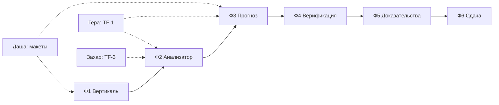

# Задачи по фазам

Общая картина — в [plan.md](plan.md). Исполнители: Гера — данные, Захар — алгоритмы, Гриша — инфраструктура и API, Даша — дизайн и интерфейс, Александр — координация, документация, сдача.

Каждая задача: что сделать → **готово, когда** → **как проверить**. Задача не закрыта, пока проверка не пройдена.

---

## Ф1. Тонкая вертикаль · 17–18.09

Цель фазы: данные из файла доезжают до экрана в браузере. Ничего умного, только сквозной путь.

### Ф1-0 · Александр · Принять дополненные данные
Организаторы дополнили датасет — по словам капитана, там схема точек с коллекторами. Забрать файл, разобрать, дописать в [docs/dataset/](../docs/dataset/).
- **Готово, когда** понятно, есть ли связь «канал → объект» и координаты, и что из этого можно показать на карте.
- **Проверить:** сопоставить хотя бы 20 каналов с объектами; если связь не находится — сразу сказать команде, карта остаётся схемой по пикетам.

### Ф1-1 · Гриша · Каркас окружения
Docker Compose: postgres 16, redis, api, web, nginx. Makefile или скрипт на одну команду.
- **Готово, когда** `docker compose up` на чистой машине поднимает всё, `GET /health` отвечает 200.
- **Проверить:** клонировать репозиторий в новую папку, запустить, открыть `/health`.

### Ф1-2 · Захар · Схема БД и миграции
Схемы `ops`, `archive`, `marts`. Таблицы: `channel`, `object`, `journal` (партиции по месяцам, BRIN по времени), `channel_type`. Alembic.
- **Зависит от:** [TF-1](TF-1.md) шаг 1 (структура и связи).
- **Готово, когда** миграции накатываются с нуля и откатываются, поля совпадают с описанием Геры.
- **Проверить:** `alembic upgrade head` на пустой базе, затем `downgrade base` без ошибок.

### Ф1-3 · Захар · Загрузчик исторических данных
Импорт CSV и XLSX ([§7](../docs/ТЗ.md#24-требования-к-обработке-данных-7)) с разбором обоих форматов журнала — годового и примера ([различия](../docs/dataset/описание.md#годовые-журналы-и-пример-отличаются-форматом)), с обоими десятичными разделителями.
- **Готово, когда** загружена **вся история 2019–2026** (313,5 млн строк), число строк по каждому году совпадает с [таблицей по годам](../docs/dataset/описание.md#объём-по-годам), битые даты не теряются молча, а попадают в отчёт загрузки.
- **Порядок:** сначала 2026 г. — на нём работает команда, остальные годы догружаются в фоне и не блокируют Ф1.
- **Проверить:** `SELECT count(*)` по годам против таблицы; загрузить `журнал_событий_пример.csv` тем же загрузчиком; записать занятое место на диске.

### Ф1-4 · Гриша · Каркас API
FastAPI, OpenAPI, `GET /api/v1/channels`, `GET /api/v1/events` с фильтрами по времени, каналу, типу и пагинацией. JSON и XML ([§7](../docs/ТЗ.md#24-требования-к-обработке-данных-7)).
- **Готово, когда** `/docs` открывается, запросы отвечают за < 1 с на странице в 100 записей.
- **Проверить:** curl с фильтром по дате и каналу; запрос с `Accept: application/xml`.

### Ф1-5 · Даша · Макет дашборда
Экраны: панель риска, карта, журнал прогнозов, карточка объекта, журнал событий. По референсам из [TF-2](TF-2.md).
- **Готово, когда** у каждого экрана есть состояние «пусто», «загрузка», «ошибка», и определены цвета уровней риска.
- **Проверить:** пройти по макету сценарий из [§12](../docs/ТЗ.md#7-пользовательские-сценарии-12) — уведомление → верификация → решение — без разрывов.

### Ф1-6 · Гриша · Страница журнала событий
React + TS + Vite, таблица событий с фильтрами, данные из API.
- **Готово, когда** таблица показывает реальные события из PostgreSQL, фильтры работают.
- **Проверить:** открыть в Chrome и Яндекс.Браузере ([§11](../docs/ТЗ.md#28-нефункциональные-требования-11)).

> ✅ **Чекпойнт Ф1.** Данные из файла видны в браузере. Замерить: время загрузки года, время ответа API. Дальше не идём, пока это не так.

---

## Ф2. Анализатор · 19–20.09

Цель: превратить 313 млн строк в обозримый список событий.

### Ф2-1 · Захар · Свёртка в эпизоды
Строки одного канала с одним значением и паузой ≤ N сворачиваются в эпизод. N — параметр.
- **Готово, когда** таблица `marts.episode` заполнена за 2026 г., числа сходятся с [таблицей инцидентов по годам](../docs/dataset/анализ.md#инциденты-по-годам).
- **Проверить:** расхождение с анализом не больше 1%, иначе разобрать причину.

### Ф2-2 · Захар · Правила отсева шума
Реализация Н1–Н9 из [TF-1](TF-1.md) шаг 4. Каждое правило — функция с параметрами, метка в отдельном поле, данные не удаляются.
- **Зависит от:** карточки шумов Геры.
- **Готово, когда** по каждому правилу посчитан масштаб на всей истории и сходится с заявленным у Геры.
- **Проверить:** юнит-тесты на подготовленных примерах — дребезг, массовое «Неопределен», скачок питания.

### Ф2-3 · Захар · Схлопывание массовых событий
Пачка событий одного префикса в одно окно — один инцидент со списком каналов ([Н2](../docs/dataset/анализ.md#кандидаты-в-шум), [Н7](../docs/dataset/анализ.md#кандидаты-в-шум), [Н8](../docs/dataset/анализ.md#кандидаты-в-шум)).
- **Готово, когда** [случай 3](../docs/dataset/анализ.md#случай-3-скачок-питания-645-16092025) (16.09.2025, префикс 645) превращается в **одно** событие «скачок питания» с 50+ каналами внутри.
- **Проверить:** прогнать три случая из анализа, сравнить с описанием вручную.

### Ф2-4 · Гера · След выезда бригады
Правило: после тревоги в том же префиксе идёт «охрана снята» → двери → движение. Это косвенное подтверждение реакции.
- **Готово, когда** правило описано, посчитано на всей истории, известна доля эпизодов со следом по типам.
- **Проверить:** [случай 1](../docs/dataset/анализ.md#случай-1-затопление-889-05052024) правилом распознаётся; вручную проверить 10 срабатываний и 10 несрабатываний.

### Ф2-5 · Гриша · Лента инцидентов
`GET /api/v1/incidents` + экран: свёрнутые события, метка шума, фильтры по типу и объекту.
- **Готово, когда** на экране за сутки десятки строк, а не десятки тысяч.
- **Проверить:** открыть 16.09.2025 — увидеть один скачок питания, а не 50 тревог.

> ✅ **Чекпойнт Ф2.** Шум отделён от событий, цифры совпадают с анализом, лента читается. Записать долю отсеянного — это число пойдёт в презентацию.

---

## Ф3. Прогноз · 21–23.09

### Ф3-1 · Захар · Витрина признаков
Окна 1 ч / 6 ч / 24 ч / 7 сут по объекту (префиксу): счётчики по типам событий, доля тревог, дребезг, динамика температуры и газа, режим охраны, время суток, сезон.
- **Готово, когда** витрина считается за 2019–2026 воспроизводимо и документирована по полям.
- **Проверить:** пересчёт даёт те же числа; пропуски данных не превращаются в нули молча.

### Ф3-2 · Гера · Разметка обучающей выборки
Целевая переменная: инцидент типа T в следующие 24 ч по объекту. Подтверждённые — со следом выезда (Ф2-4), шумовые — исключены.
- **Готово, когда** известны размеры классов по типам и годам, дисбаланс описан.
- **Проверить:** выборочно 20 положительных примеров глазами — это действительно похоже на инцидент.

### Ф3-3 · Захар · Модель
LightGBM, разбиение по времени: обучение ≤ 2024, проверка 2025, тест 2026. Baseline — правила из Ф2.
- **Готово, когда** есть Precision, Recall, PR-AUC и распределение времени упреждения по типам, и сравнение с baseline.
- **Проверить:** обучение с нуля одной командой даёт те же метрики (± шум); модель не видит будущего — проверить утечку по времени.

### Ф3-4 · Захар · Отдельная модель отказа датчика
Признаки деградации канала: рост «Неисправен», дребезг, заглушки, молчание.
- **Готово, когда** для каналов, отказавших в 2026 г., измерено, за сколько часов модель поднимала риск.
- **Проверить:** проверка на каналах, которые не отказывали, — ложных тревог не больше заданной доли.

### Ф3-5 · Гриша · API прогнозов и оповещений
`GET /api/v1/forecasts` (вероятность, горизонт, локация, тип, вклад признаков), WebSocket для критических.
- **Готово, когда** прогноз по одному объекту отдаётся за < 300 с ([§11](../docs/ТЗ.md#28-нефункциональные-требования-11)) — фактически доли секунды, замерить и записать.
- **Проверить:** нагрузка 20 параллельных пользователей без деградации.

### Ф3-6 · Даша + Гриша · Панель риска и карта
Список объектов по уровню риска, карточка объекта с графиком и вкладом признаков, карта — схема точек с коллекторами, всплывающее оповещение.
- **Готово, когда** диспетчер видит вероятность, горизонт и локацию на одном экране ([§12](../docs/ТЗ.md#7-пользовательские-сценарии-12), шаг 3).
- **Проверить:** пройти сценарий пожара и подтопления от уведомления до карточки объекта.

> ✅ **Чекпойнт Ф3.** Прогноз работает целиком: от данных до оповещения на экране. Зафиксировать метрики — они идут в питч.

---

## Ф4. Верификация · 24–25.09

### Ф4-1 · Гера + Александр · Справочник причин
Причины решения: подтверждено, ложное срабатывание (по видам шума), плановые работы, неисправность датчика, другое.
- **Готово, когда** список согласован командой и покрывает случаи из [анализа](../docs/dataset/анализ.md#кандидаты-в-шум).
- **Проверить:** разложить три случая из анализа по причинам — подходит без «другое».

### Ф4-2 · Гриша · Фиксация решения
`POST /api/v1/decisions`: решение, причина из справочника, комментарий, автор, время. Запись в журнал прогнозов.
- **Готово, когда** решение видно в журнале и связано с прогнозом ([§12](../docs/ТЗ.md#7-пользовательские-сценарии-12), шаги 5–6).
- **Проверить:** решение сохраняется, повторное открытие показывает историю.

### Ф4-3 · Гриша · Роли и журналирование
RBAC: диспетчер, аналитик, руководитель, техперсонал. Журнал действий пользователей ([§11](../docs/ТЗ.md#28-нефункциональные-требования-11)). Адаптер LDAP — интерфейс и заглушка.
- **Готово, когда** права разграничены и каждое действие пишется в журнал.
- **Проверить:** под ролью диспетчера недоступны настройки модели.

### Ф4-4 · Захар · Выгрузка разметки
Решения диспетчеров выгружаются в обучающую выборку — контур дообучения из [IDEF-1](../docs/common/IDEF-1.png).
- **Готово, когда** выгрузка формируется одной командой и совместима с Ф3-2.
- **Проверить:** добавить 10 решений вручную, увидеть их в выгрузке.

> ✅ **Чекпойнт Ф4.** Контур замкнут: прогноз → решение → разметка.

---

## Ф5. Доказательства · 26–27.09

### Ф5-1 · Захар · Ретропрогон
Прогон модели по 2026 г. как если бы она работала в реальном времени.
- **Готово, когда** для каждого дня есть прогнозы и факт, посчитаны Precision, Recall, среднее время упреждения.
- **Проверить:** никаких признаков из будущего — проверка независимо, вторым человеком.

### Ф5-2 · Даша + Гриша · Экран «Достоверность»
Прогноз против факта: график, матрица ошибок, время упреждения, срез по типам.
- **Готово, когда** эксперт видит по экрану, где сервис прав, а где ошибается, без объяснений от команды.
- **Проверить:** показать человеку вне команды и попросить пересказать.

### Ф5-3 · Гриша · Настраиваемые параметры
Пороги риска, горизонт, чувствительность правил, окно сопоставления — в интерфейсе, с немедленным пересчётом ленты.
- **Готово, когда** изменение порога видно на экране и сохраняется.
- **Проверить:** поднять порог — число оповещений падает, и это видно на экране достоверности.

### Ф5-4 · Захар · Рекомендации по ТО
Таблица «тип и уровень риска → рекомендация», со ссылкой на правило.
- **Готово, когда** каждая рекомендация объяснима: видно, из какого признака и правила она выведена.
- **Проверить:** 10 рекомендаций сверить с регламентом или со здравым смыслом эксплуатации.

### Ф5-5 · Захар · Погода как дополнительные признаки
Архив погоды по Москве (Open-Meteo) за период данных: температура, осадки, давление. Добавить в витрину признаков и переобучить.
- **Делается только после Ф5-1**, иначе не с чем сравнивать.
- **Готово, когда** известен прирост Precision и Recall с погодой и без неё, отдельно по подтоплениям.
- **Проверить:** если прироста нет — так и написать в документации, признаки не тащить ради галочки.

> ✅ **Чекпойнт Ф5.** Есть чем ответить на вопрос «а почему мы вам верим».

---

## Ф6. Сдача · 28–29.09

### Ф6-1 · Гриша · Развёртывание
Прототип по ссылке, Linux, TLS, резервное копирование базы.
- **Готово, когда** ссылка открывается со стороннего устройства.
- **Проверить:** развернуть с нуля по своей же инструкции.

### Ф6-2 · Александр · Сопроводительная документация
Методы обработки данных, ограничения, сборка и установка, функциональная и компонентная архитектура, перечень библиотек ([§14](../docs/ТЗ.md#210-требования-к-решению-14)). Markdown → PDF.
- **Готово, когда** человек со стороны собирает проект по документу без вопросов.
- **Проверить:** дать инструкцию тому, кто не участвовал в разработке.

### Ф6-3 · Даша + Александр · Презентация
pptx или pdf ([§15](../docs/ТЗ.md#211-презентация-15)): проблема, данные, решение, метрики, демо, команда.
- **Готово, когда** укладывается в регламент питча и каждая цифра подтверждена расчётом в репозитории.
- **Проверить:** прогон вслух с таймером.

### Ф6-4 · Александр · Чек-лист сдачи
Четыре ссылки из [§19](../docs/ТЗ.md#9-что-сдаём-19): репозиторий, презентация, прототип, документация.
- **Готово, когда** все четыре открываются в режиме инкогнито.
- **Проверить:** пройти по списку за день до дедлайна, а не в день сдачи.

---

## Порядок и параллельность

Даша работает с опережением на фазу: макеты Ф3 нужны, когда команда ещё в Ф2. Гера уходит вперёд по данным, Захар подтягивает алгоритмы, Гриша держит каркас.
